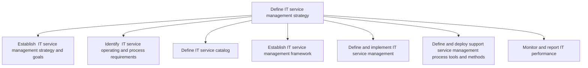
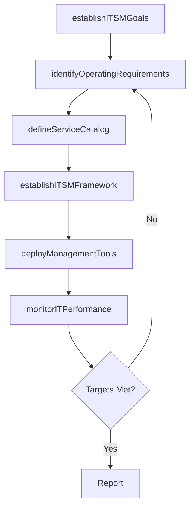

# Define IT service management strategy

> Business-as-Code definition for IT service management strategy. Models the process of establishing ITSM goals, identifying service requirements, defining the service catalog, deploying management frameworks and tools, and monitoring IT performance.

## Overview

Defining perspective, position, plans, and patterns needed to execute designing, delivering, managing, and improving the way information technology is used within an organization.

## Process Hierarchy



## GraphDL

```yaml
define:
  object: IT Service Management Strategy
  actor: ITServiceManagementDirector
  result: ITSMStrategyFramework
```

## Actions

| Action | Description |
|--------|-------------|
| establishITSMGoals | Define IT service management strategic goals and objectives |
| identifyOperatingRequirements | Determine service operating and process requirements |
| defineServiceCatalog | Create and structure the IT service catalog |
| establishITSMFramework | Build the IT service management framework and operating model |
| deployManagementTools | Select and deploy ITSM process tools and methods |
| monitorITPerformance | Track and report IT service management performance |

## Events

| Event | Description |
|-------|-------------|
| itsmGoalsEstablished | IT service management goals defined and approved |
| operatingRequirementsIdentified | Service operating requirements documented |
| serviceCatalogDefined | IT service catalog created and published |
| itsmFrameworkEstablished | ITSM framework deployed across the organization |
| managementToolsDeployed | ITSM tools selected, configured, and operational |
| itPerformanceMonitored | IT performance metrics collected and reported |

## Searches

| Search | Description |
|--------|-------------|
| getITSMStrategy | Retrieve the current ITSM strategy and goals |
| getServiceCatalog | Get the IT service catalog with service definitions |
| findITSMProcesses | List ITSM processes by maturity level or domain |
| getITPerformanceReport | Retrieve IT performance metrics for a given period |

## Process Flow



## RACI Matrix

| Activity | Responsible | Accountable | Consulted | Informed |
|----------|-------------|-------------|-----------|----------|
| establishITSMGoals | ITServiceManagementDirector | CIO | BusinessUnitLeaders | ITOperations |
| defineServiceCatalog | ServiceCatalogManager | ITServiceManagementDirector | ITServiceOwners | EndUsers |
| establishITSMFramework | ITSMProcessManager | ITServiceManagementDirector | EnterpriseArchitect | ITOperations |
| monitorITPerformance | ITPerformanceAnalyst | ITServiceManagementDirector | Finance | CIO |

## Sub-Processes

| ID | Name | Description |
|----|------|-------------|
| 8.2.4.1 | Establish  IT service management strategy and goals | Implementing strategy for designing, delivering, managing, and improving the way information technol |
| 8.2.4.2 | Identify  IT service operating and process requirements | Identifying operating and process requirement for designing, delivering, managing, and improving the |
| 8.2.4.3 | Define IT service catalog | Create and design an organized and curated collection of all IT-related services that can be perform |
| 8.2.4.4 | Establish IT service management framework | Create a layered structure for IT service management framework ensuring right processes, people, and |
| 8.2.4.5 | Define and implement IT service management | Defining and implementing activities involved in designing, creating, delivering, supporting, and ma |
| 8.2.4.6 | Define and deploy support service management process tools and methods | Establishing services for providing support to users of IT services and solutions. Define the pletho |
| 8.2.4.7 | Monitor and report IT performance | Supervising, analyzing, and reporting performance of information technology to ensure they are on-co |

## Related Processes

| Process | Relationship |
|---------|-------------|
| 8.2.1 Define business technology and governance strategy | Upstream - governance strategy shapes ITSM direction |
| 8.1.5 Develop and manage IT service levels | Downstream - ITSM strategy enables SLA management |
| 8.7 Create and manage support services/solutions | Downstream - ITSM framework governs support operations |

## Related Departments

| Department | Role |
|-----------|------|
| IT Service Management | Primary owner of ITSM strategy and framework |
| IT Operations | Implements ITSM processes and tools |
| Change Management | Supports ITSM process adoption |
| Vendor Management | Manages ITSM tool vendor relationships |

## Related Occupations

| Occupation | Involvement |
|-----------|-------------|
| IT Service Management Director | Sets ITSM strategic direction |
| ITSM Process Manager | Designs and implements service management processes |
| IT Performance Analyst | Monitors and reports on service management effectiveness |

## KPIs

| KPI | Description | Unit |
|-----|-------------|------|
| ITSM Process Maturity | Average maturity level across ITSM processes | Level (1-5) |
| Service Catalog Coverage | Percentage of IT services documented in the catalog | % |
| Tool Adoption Rate | Percentage of IT staff actively using ITSM tools | % |
| Process Compliance | Percentage of IT activities following ITSM processes | % |

## Usage

```typescript
import { defineITServiceManagementStrategy } from '@headlessly/define-it-service-management-strategy'

const itsm = defineITServiceManagementStrategy()

// Establish ITSM goals
const goals = await itsm.establishITSMGoals({
  framework: 'ITIL-4',
  maturityTarget: 4,
  timeline: '18-months'
})

// Define the IT service catalog
const catalog = await itsm.defineServiceCatalog({
  categories: ['infrastructure', 'applications', 'security', 'end-user'],
  includeRetired: false
})
```
