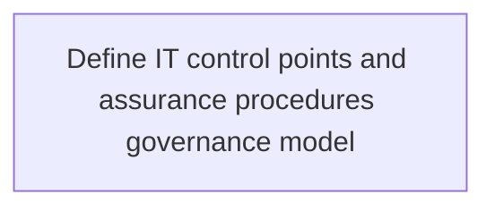
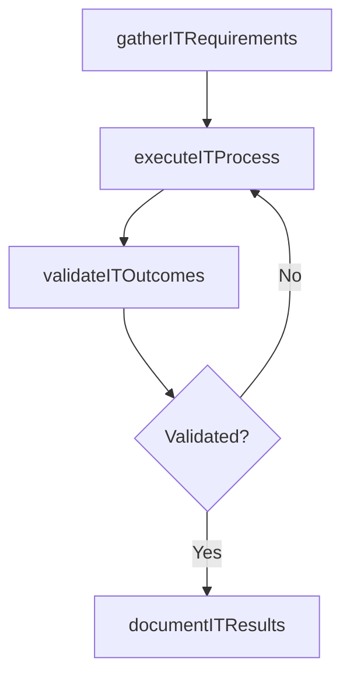

# Define IT control points and assurance procedures governance model

> Business-as-Code definition for define it control points and assurance procedures governance model. Models the process of establishing a governance model with its own structure and functions from where full or partial control can be exercised.

## Overview

Establishing a governance model with its own structure and functions from where full or partial control can be exercised over the entire IT management system. Specify evaluation and quality control procedures in the structure.

## Process Hierarchy



## GraphDL

```yaml
define:
  object: IT Control Points And Assurance Procedures Governance Model
  actor: EnterpriseArchitect
  result: DefineItControlPointsAndAssuranceProceduresGovernanceModel
```

## Actions

| Action | Description |
|--------|-------------|
| gatherITRequirements | Collect requirements and inputs for define it control points and assurance procedures governance model |
| executeITProcess | Perform the core activities of define it control points and assurance procedures governance model |
| validateITOutcomes | Verify that outcomes meet defined criteria and standards |
| documentITResults | Record findings and results for stakeholder review |

## Events

| Event | Description |
|-------|-------------|
| itRequirementsGathered | Requirements for define it control points and assurance procedures governance model collected |
| itProcessExecuted | Core activities of define it control points and assurance procedures governance model completed |
| itOutcomesValidated | Outcomes verified against defined criteria |
| itResultsDocumented | Results recorded and distributed to stakeholders |

## Searches

| Search | Description |
|--------|-------------|
| getITStatus | Retrieve current status of define it control points and assurance procedures governance model |
| findITRecords | List records related to define it control points and assurance procedures governance model by date or status |
| getITReport | Retrieve summary report for define it control points and assurance procedures governance model |

## Process Flow



## RACI Matrix

| Activity | Responsible | Accountable | Consulted | Informed |
|----------|-------------|-------------|-----------|----------|
| gatherITRequirements | EnterpriseArchitect | ITPortfolioManager | BusinessUnitLeaders | CIO |
| executeITProcess | EnterpriseArchitect | ITPortfolioManager | ITOperations | ITServiceManager |
| validateITOutcomes | EnterpriseArchitect | ITPortfolioManager | QualityAssurance | ITServiceManager |

## Related Processes

| Process | Relationship |
|---------|-------------|
| 8.2.5 Parent process | Parent - provides context and governance |
| 8.2.5.3 Sibling activity | Parallel - complementary activity in the same process |

## Related Departments

| Department | Role |
|-----------|------|
| IT Strategy and Planning | Owns strategy and governance activities |
| Enterprise Architecture | Provides technical architecture guidance |
| Finance | Validates budgets and investment models |

## Related Occupations

| Occupation | Involvement |
|-----------|-------------|
| IT Strategy Analyst | Conducts strategic research and analysis |
| Enterprise Architect | Designs technology architecture |

## KPIs

| KPI | Description | Unit |
|-----|-------------|------|
| Completion Rate | Percentage of define it control points and assurance procedures governance model activities completed on schedule | % |
| Quality Score | Quality assessment score for define it control points and assurance procedures governance model outputs | Score (1-10) |
| Cycle Time | Average time to complete define it control points and assurance procedures governance model | Days |

## Usage

```typescript
import { defineItControlPointsAndAssuranceProceduresGovernanceModel } from '@headlessly/define-it-control-points-and-assurance-procedures-governance-model'

const process = defineItControlPointsAndAssuranceProceduresGovernanceModel()

// Execute the core process
const result = await process.executeITProcess({
  scope: 'department',
  priority: 'high'
})

// Validate outcomes
const validation = await process.validateITOutcomes({
  criteria: 'standard',
  period: 'Q4-2025'
})
```
