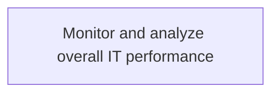
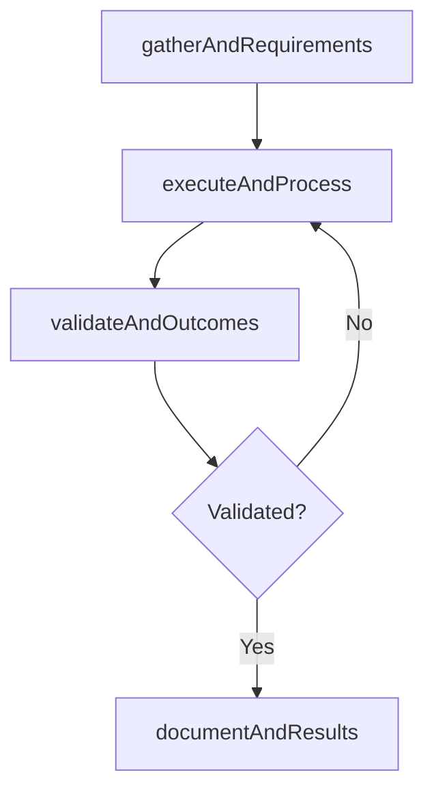

# Monitor and analyze overall IT performance

> Business-as-Code definition for monitor and analyze overall it performance. Models the process of monitoring and analyzing information technology performance measures to ensure timely completion, and that quality assur.

## Overview

Monitoring and analyzing information technology performance measures to ensure timely completion, and that quality assurance is met at all steps of IT services.

## Process Hierarchy



## GraphDL

```yaml
monitor:
  object: And Analyze Overall IT Performance
  actor: ITInnovationLead
  result: MonitorAndAnalyzeOverallItPerformance
```

## Actions

| Action | Description |
|--------|-------------|
| gatherAndRequirements | Collect requirements and inputs for monitor and analyze overall it performance |
| executeAndProcess | Perform the core activities of monitor and analyze overall it performance |
| validateAndOutcomes | Verify that outcomes meet defined criteria and standards |
| documentAndResults | Record findings and results for stakeholder review |

## Events

| Event | Description |
|-------|-------------|
| andRequirementsGathered | Requirements for monitor and analyze overall it performance collected |
| andProcessExecuted | Core activities of monitor and analyze overall it performance completed |
| andOutcomesValidated | Outcomes verified against defined criteria |
| andResultsDocumented | Results recorded and distributed to stakeholders |

## Searches

| Search | Description |
|--------|-------------|
| getAndStatus | Retrieve current status of monitor and analyze overall it performance |
| findAndRecords | List records related to monitor and analyze overall it performance by date or status |
| getAndReport | Retrieve summary report for monitor and analyze overall it performance |

## Process Flow



## RACI Matrix

| Activity | Responsible | Accountable | Consulted | Informed |
|----------|-------------|-------------|-----------|----------|
| gatherAndRequirements | ITInnovationLead | ITStrategyAnalyst | BusinessUnitLeaders | CIO |
| executeAndProcess | ITInnovationLead | ITStrategyAnalyst | ITOperations | ITServiceManager |
| validateAndOutcomes | ITInnovationLead | ITStrategyAnalyst | QualityAssurance | ITServiceManager |

## Related Processes

| Process | Relationship |
|---------|-------------|
| 8.2.5 Parent process | Parent - provides context and governance |
| 8.2.5.4 Sibling activity | Parallel - complementary activity in the same process |

## Related Departments

| Department | Role |
|-----------|------|
| IT Strategy and Planning | Owns strategy and governance activities |
| Enterprise Architecture | Provides technical architecture guidance |
| Finance | Validates budgets and investment models |

## Related Occupations

| Occupation | Involvement |
|-----------|-------------|
| IT Strategy Analyst | Conducts strategic research and analysis |
| Enterprise Architect | Designs technology architecture |

## KPIs

| KPI | Description | Unit |
|-----|-------------|------|
| Completion Rate | Percentage of monitor and analyze overall it performance activities completed on schedule | % |
| Quality Score | Quality assessment score for monitor and analyze overall it performance outputs | Score (1-10) |
| Cycle Time | Average time to complete monitor and analyze overall it performance | Days |

## Usage

```typescript
import { monitorAndAnalyzeOverallItPerformance } from '@headlessly/monitor-and-analyze-overall-it-performance'

const process = monitorAndAnalyzeOverallItPerformance()

// Execute the core process
const result = await process.executeAndProcess({
  scope: 'department',
  priority: 'high'
})

// Validate outcomes
const validation = await process.validateAndOutcomes({
  criteria: 'standard',
  period: 'Q4-2025'
})
```
