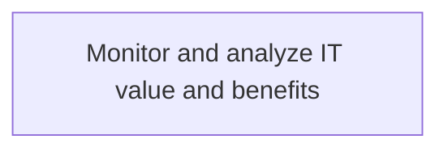
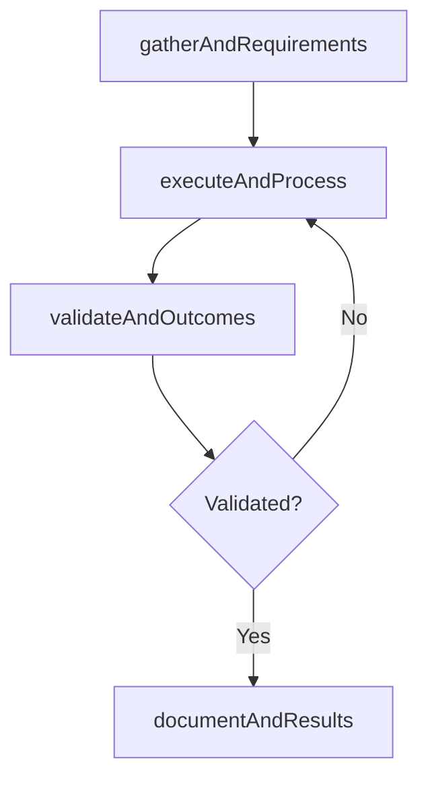

# Monitor and analyze IT value and benefits

> Business-as-Code definition for monitor and analyze it value and benefits. Models the process of examining and analyzing the value and benefits of it service management to ensure benefits outweigh incurred costs.

## Overview

Examining and analyzing the value and benefits of IT service management to ensure benefits outweigh incurred costs.

## Process Hierarchy



## GraphDL

```yaml
monitor:
  object: And Analyze IT Value And Benefits
  actor: ITInnovationLead
  result: MonitorAndAnalyzeItValueAndBenefits
```

## Actions

| Action | Description |
|--------|-------------|
| gatherAndRequirements | Collect requirements and inputs for monitor and analyze it value and benefits |
| executeAndProcess | Perform the core activities of monitor and analyze it value and benefits |
| validateAndOutcomes | Verify that outcomes meet defined criteria and standards |
| documentAndResults | Record findings and results for stakeholder review |

## Events

| Event | Description |
|-------|-------------|
| andRequirementsGathered | Requirements for monitor and analyze it value and benefits collected |
| andProcessExecuted | Core activities of monitor and analyze it value and benefits completed |
| andOutcomesValidated | Outcomes verified against defined criteria |
| andResultsDocumented | Results recorded and distributed to stakeholders |

## Searches

| Search | Description |
|--------|-------------|
| getAndStatus | Retrieve current status of monitor and analyze it value and benefits |
| findAndRecords | List records related to monitor and analyze it value and benefits by date or status |
| getAndReport | Retrieve summary report for monitor and analyze it value and benefits |

## Process Flow



## RACI Matrix

| Activity | Responsible | Accountable | Consulted | Informed |
|----------|-------------|-------------|-----------|----------|
| gatherAndRequirements | ITInnovationLead | ITStrategyAnalyst | BusinessUnitLeaders | CIO |
| executeAndProcess | ITInnovationLead | ITStrategyAnalyst | ITOperations | ITServiceManager |
| validateAndOutcomes | ITInnovationLead | ITStrategyAnalyst | QualityAssurance | ITServiceManager |

## Related Processes

| Process | Relationship |
|---------|-------------|
| 8.2.5 Parent process | Parent - provides context and governance |
| 8.2.5.6 Sibling activity | Parallel - complementary activity in the same process |

## Related Departments

| Department | Role |
|-----------|------|
| IT Strategy and Planning | Owns strategy and governance activities |
| Enterprise Architecture | Provides technical architecture guidance |
| Finance | Validates budgets and investment models |

## Related Occupations

| Occupation | Involvement |
|-----------|-------------|
| IT Strategy Analyst | Conducts strategic research and analysis |
| Enterprise Architect | Designs technology architecture |

## KPIs

| KPI | Description | Unit |
|-----|-------------|------|
| Completion Rate | Percentage of monitor and analyze it value and benefits activities completed on schedule | % |
| Quality Score | Quality assessment score for monitor and analyze it value and benefits outputs | Score (1-10) |
| Cycle Time | Average time to complete monitor and analyze it value and benefits | Days |

## Usage

```typescript
import { monitorAndAnalyzeItValueAndBenefits } from '@headlessly/monitor-and-analyze-it-value-and-benefits'

const process = monitorAndAnalyzeItValueAndBenefits()

// Execute the core process
const result = await process.executeAndProcess({
  scope: 'department',
  priority: 'high'
})

// Validate outcomes
const validation = await process.validateAndOutcomes({
  criteria: 'standard',
  period: 'Q4-2025'
})
```
