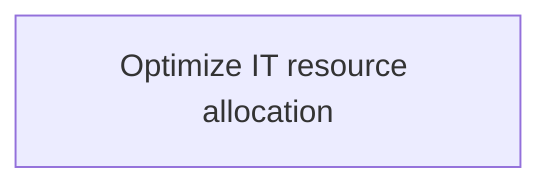
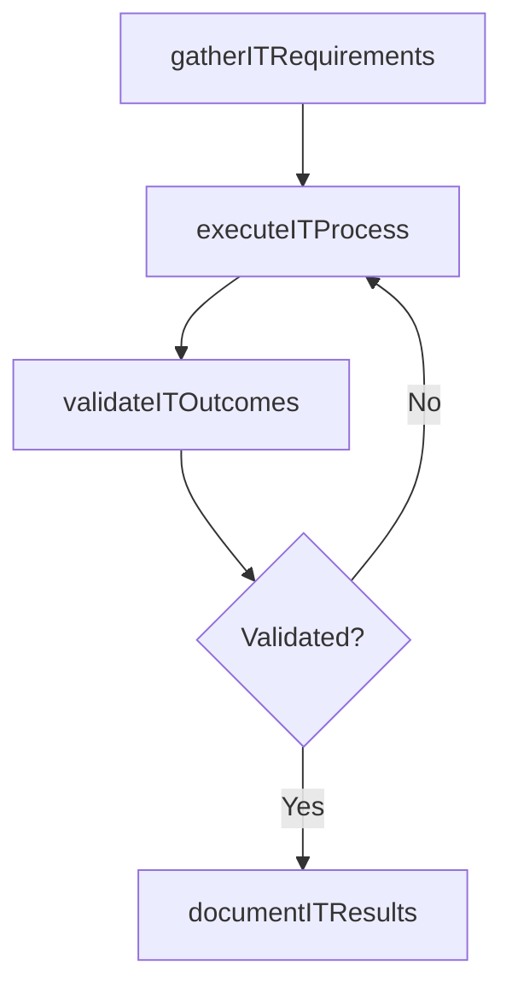

# Optimize IT resource allocation

> Business-as-Code definition for optimize it resource allocation. Models the process of create process to assign and manage it assets that support organization's strategic goals.

## Overview

Create process to assign and manage IT assets that support organization's strategic goals.

## Process Hierarchy



## GraphDL

```yaml
optimize:
  object: IT Resource Allocation
  actor: EnterpriseArchitect
  result: OptimizeItResourceAllocation
```

## Actions

| Action | Description |
|--------|-------------|
| gatherITRequirements | Collect requirements and inputs for optimize it resource allocation |
| executeITProcess | Perform the core activities of optimize it resource allocation |
| validateITOutcomes | Verify that outcomes meet defined criteria and standards |
| documentITResults | Record findings and results for stakeholder review |

## Events

| Event | Description |
|-------|-------------|
| itRequirementsGathered | Requirements for optimize it resource allocation collected |
| itProcessExecuted | Core activities of optimize it resource allocation completed |
| itOutcomesValidated | Outcomes verified against defined criteria |
| itResultsDocumented | Results recorded and distributed to stakeholders |

## Searches

| Search | Description |
|--------|-------------|
| getITStatus | Retrieve current status of optimize it resource allocation |
| findITRecords | List records related to optimize it resource allocation by date or status |
| getITReport | Retrieve summary report for optimize it resource allocation |

## Process Flow



## RACI Matrix

| Activity | Responsible | Accountable | Consulted | Informed |
|----------|-------------|-------------|-----------|----------|
| gatherITRequirements | EnterpriseArchitect | ITPortfolioManager | BusinessUnitLeaders | CIO |
| executeITProcess | EnterpriseArchitect | ITPortfolioManager | ITOperations | ITServiceManager |
| validateITOutcomes | EnterpriseArchitect | ITPortfolioManager | QualityAssurance | ITServiceManager |

## Related Processes

| Process | Relationship |
|---------|-------------|
| 8.2.5 Parent process | Parent - provides context and governance |
| 8.2.5.7 Sibling activity | Parallel - complementary activity in the same process |

## Related Departments

| Department | Role |
|-----------|------|
| IT Strategy and Planning | Owns strategy and governance activities |
| Enterprise Architecture | Provides technical architecture guidance |
| Finance | Validates budgets and investment models |

## Related Occupations

| Occupation | Involvement |
|-----------|-------------|
| IT Strategy Analyst | Conducts strategic research and analysis |
| Enterprise Architect | Designs technology architecture |

## KPIs

| KPI | Description | Unit |
|-----|-------------|------|
| Completion Rate | Percentage of optimize it resource allocation activities completed on schedule | % |
| Quality Score | Quality assessment score for optimize it resource allocation outputs | Score (1-10) |
| Cycle Time | Average time to complete optimize it resource allocation | Days |

## Usage

```typescript
import { optimizeItResourceAllocation } from '@headlessly/optimize-it-resource-allocation'

const process = optimizeItResourceAllocation()

// Execute the core process
const result = await process.executeITProcess({
  scope: 'department',
  priority: 'high'
})

// Validate outcomes
const validation = await process.validateITOutcomes({
  criteria: 'standard',
  period: 'Q4-2025'
})
```
