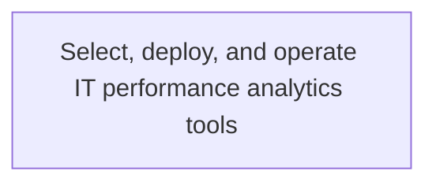
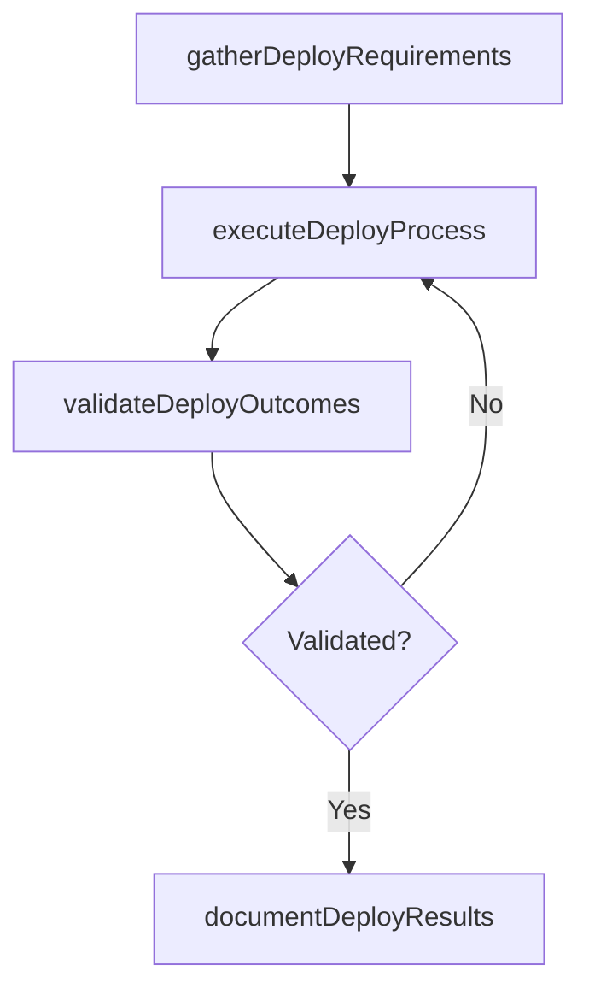

# Select, deploy, and operate IT performance analytics tools

> Business-as-Code definition for select, deploy, and operate it performance analytics tools. Models the process of select, establish, and operate analytics tool to analyze data and extract actionable and commercially relevant informati.

## Overview

Select, establish, and operate analytics tool to analyze data and extract actionable and commercially relevant information on IT performance to evaluate or increase performance.

## Process Hierarchy



## GraphDL

```yaml
select,:
  object: Deploy, And Operate IT Performance Analytics Tools
  actor: ITStrategyAnalyst
  result: SelectDeployAndOperateItPerformanceAnalyticsTools
```

## Actions

| Action | Description |
|--------|-------------|
| gatherDeployRequirements | Collect requirements and inputs for select, deploy, and operate it performance analytics tools |
| executeDeployProcess | Perform the core activities of select, deploy, and operate it performance analytics tools |
| validateDeployOutcomes | Verify that outcomes meet defined criteria and standards |
| documentDeployResults | Record findings and results for stakeholder review |

## Events

| Event | Description |
|-------|-------------|
| deployRequirementsGathered | Requirements for select, deploy, and operate it performance analytics tools collected |
| deployProcessExecuted | Core activities of select, deploy, and operate it performance analytics tools completed |
| deployOutcomesValidated | Outcomes verified against defined criteria |
| deployResultsDocumented | Results recorded and distributed to stakeholders |

## Searches

| Search | Description |
|--------|-------------|
| getDeployStatus | Retrieve current status of select, deploy, and operate it performance analytics tools |
| findDeployRecords | List records related to select, deploy, and operate it performance analytics tools by date or status |
| getDeployReport | Retrieve summary report for select, deploy, and operate it performance analytics tools |

## Process Flow



## RACI Matrix

| Activity | Responsible | Accountable | Consulted | Informed |
|----------|-------------|-------------|-----------|----------|
| gatherDeployRequirements | ITStrategyAnalyst | EnterpriseArchitect | BusinessUnitLeaders | CIO |
| executeDeployProcess | ITStrategyAnalyst | EnterpriseArchitect | ITOperations | ITServiceManager |
| validateDeployOutcomes | ITStrategyAnalyst | EnterpriseArchitect | QualityAssurance | ITServiceManager |

## Related Processes

| Process | Relationship |
|---------|-------------|
| 8.2.5 Parent process | Parent - provides context and governance |
| 8.2.5.10 Sibling activity | Parallel - complementary activity in the same process |

## Related Departments

| Department | Role |
|-----------|------|
| IT Strategy and Planning | Owns strategy and governance activities |
| Enterprise Architecture | Provides technical architecture guidance |
| Finance | Validates budgets and investment models |

## Related Occupations

| Occupation | Involvement |
|-----------|-------------|
| IT Strategy Analyst | Conducts strategic research and analysis |
| Enterprise Architect | Designs technology architecture |

## KPIs

| KPI | Description | Unit |
|-----|-------------|------|
| Completion Rate | Percentage of select, deploy, and operate it performance analytics tools activities completed on schedule | % |
| Quality Score | Quality assessment score for select, deploy, and operate it performance analytics tools outputs | Score (1-10) |
| Cycle Time | Average time to complete select, deploy, and operate it performance analytics tools | Days |

## Usage

```typescript
import { selectDeployAndOperateItPerformanceAnalyticsTools } from '@headlessly/select-deploy-and-operate-it-performance-analytics-tools'

const process = selectDeployAndOperateItPerformanceAnalyticsTools()

// Execute the core process
const result = await process.executeDeployProcess({
  scope: 'department',
  priority: 'high'
})

// Validate outcomes
const validation = await process.validateDeployOutcomes({
  criteria: 'standard',
  period: 'Q4-2025'
})
```
