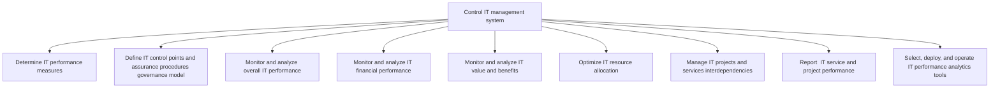
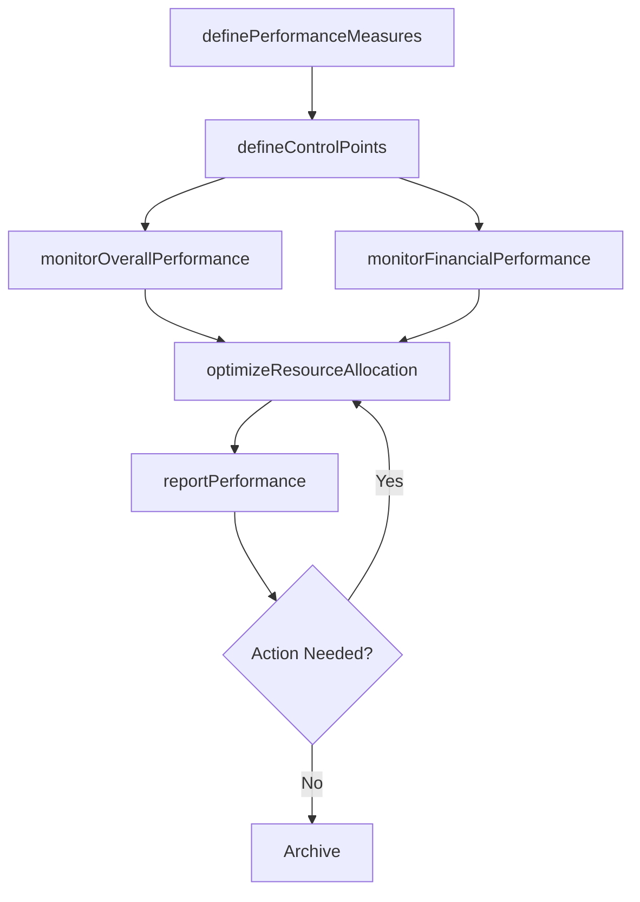

# Control IT management system

> Business-as-Code definition for IT management system control. Models the process of defining performance measures, establishing governance controls, monitoring financial and operational IT performance, optimizing resource allocation, and reporting outcomes.

## Overview

Regulating the IT management system through performance measures, governance, analysis, and monitoring through a variety of analytic tools. Evaluate IT finances, resource, services, projects, and value for report out.

## Process Hierarchy



## GraphDL

```yaml
control:
  object: IT Management System
  actor: ITGovernanceManager
  result: ITPerformanceDashboard
```

## Actions

| Action | Description |
|--------|-------------|
| definePerformanceMeasures | Establish KPIs and metrics for IT management evaluation |
| defineControlPoints | Set up governance control points and assurance procedures |
| monitorOverallPerformance | Track and analyze overall IT operational performance |
| monitorFinancialPerformance | Analyze IT financial performance against budgets and forecasts |
| optimizeResourceAllocation | Rebalance IT resources to maximize strategic value |
| reportPerformance | Compile and distribute IT service and project performance reports |

## Events

| Event | Description |
|-------|-------------|
| performanceMeasuresDefined | IT performance KPIs established and baselined |
| controlPointsDefined | Governance control points and assurance procedures documented |
| overallPerformanceMonitored | IT operational performance review completed |
| financialPerformanceMonitored | IT financial performance analysis delivered |
| resourceAllocationOptimized | IT resource allocation rebalanced |
| performanceReported | IT performance report published to stakeholders |

## Searches

| Search | Description |
|--------|-------------|
| getITPerformanceDashboard | Retrieve aggregated IT performance metrics |
| getITFinancials | Get IT financial performance data by period or category |
| findResourceAllocations | List IT resource allocations by project or team |
| getPerformanceReports | Retrieve historical IT performance reports |

## Process Flow



## RACI Matrix

| Activity | Responsible | Accountable | Consulted | Informed |
|----------|-------------|-------------|-----------|----------|
| definePerformanceMeasures | ITGovernanceManager | CIO | Finance | ITDirectors |
| monitorOverallPerformance | ITPerformanceAnalyst | ITGovernanceManager | ITOperations | CIO |
| monitorFinancialPerformance | ITFinancialAnalyst | ITGovernanceManager | Finance | CIO |
| optimizeResourceAllocation | ITGovernanceManager | CIO | ITDirectors | ProjectManagers |
| reportPerformance | ITPerformanceAnalyst | CIO | ITGovernanceManager | Board |

## Sub-Processes

| ID | Name | Description |
|----|------|-------------|
| 8.2.5.1 | Determine IT performance measures | Determining measures for evaluating the performance of IT services in the organization. Establish ke |
| 8.2.5.2 | Define IT control points and assurance procedures governance model | Establishing a governance model with its own structure and functions from where full or partial cont |
| 8.2.5.3 | Monitor and analyze overall IT performance | Monitoring and analyzing information technology performance measures to ensure timely completion, an |
| 8.2.5.4 | Monitor and analyze IT financial performance | Checking and analyzing predetermined financial targets and timelines of IT management system. Monito |
| 8.2.5.5 | Monitor and analyze IT value and benefits | Examining and analyzing the value and benefits of IT service management to ensure benefits outweigh  |
| 8.2.5.6 | Optimize IT resource allocation | Create process to assign and manage IT assets that support organization's strategic goals. |
| 8.2.5.7 | Manage IT projects and services interdependencies | Manage capabilities required for the successful delivery of information technology projects, which,  |
| 8.2.5.8 | Report  IT service and project performance | Process of collecting, analyzing, and reporting information regarding the performance of IT services |
| 8.2.5.9 | Select, deploy, and operate IT performance analytics tools | Select, establish, and operate analytics tool to analyze data and extract actionable and commerciall |

## Related Processes

| Process | Relationship |
|---------|-------------|
| 8.2.2 Manage IT portfolio strategy | Upstream - portfolio decisions set control baselines |
| 8.2.6 Manage IT value portfolio | Downstream - performance data feeds value assessment |
| 8.1.7 Analyze service performance | Parallel - operational performance data complements management controls |

## Related Departments

| Department | Role |
|-----------|------|
| IT Governance | Primary owner of management system controls |
| Finance | Provides financial performance data and budget oversight |
| IT Operations | Reports operational performance metrics |
| Internal Audit | Validates control effectiveness |

## Related Occupations

| Occupation | Involvement |
|-----------|-------------|
| IT Governance Manager | Leads management system control activities |
| IT Financial Analyst | Monitors IT financial performance |
| IT Performance Analyst | Tracks and reports operational metrics |

## KPIs

| KPI | Description | Unit |
|-----|-------------|------|
| IT Budget Variance | Deviation of actual IT spend from approved budget | % |
| Resource Utilization Rate | Percentage of IT resources actively allocated to projects | % |
| Governance Control Effectiveness | Percentage of control points operating as designed | % |
| Report Timeliness | Percentage of performance reports delivered on schedule | % |

## Usage

```typescript
import { controlITManagementSystem } from '@headlessly/control-it-management-system'

const controls = controlITManagementSystem()

// Monitor overall IT performance
const dashboard = await controls.monitorOverallPerformance({
  period: 'Q4-2025',
  metrics: ['uptime', 'incident-rate', 'project-delivery', 'budget-variance']
})

// Optimize resource allocation
const optimization = await controls.optimizeResourceAllocation({
  constraints: { maxHeadcount: 150, budget: 5000000 },
  priorities: ['digital-transformation', 'security-hardening']
})
```
