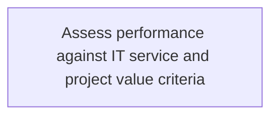
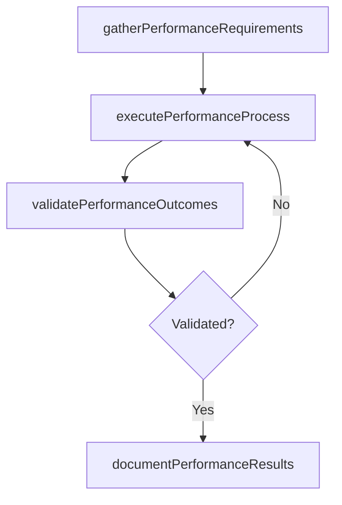

# Assess performance against IT service and project value criteria

> Business-as-Code definition for assess performance against it service and project value criteria. Models the process of process of evaluating performance to collect and analyze it services and projects. ensure expected it service and projec.

## Overview

Process of evaluating performance to collect and analyze IT services and projects. Ensure expected IT service and project value based on established criteria.

## Process Hierarchy



## GraphDL

```yaml
assess:
  object: Performance Against IT Service And Project Value Criteria
  actor: ITInnovationLead
  result: AssessPerformanceAgainstItServiceAndProjectValueCriteria
```

## Actions

| Action | Description |
|--------|-------------|
| gatherPerformanceRequirements | Collect requirements and inputs for assess performance against it service and project value criteria |
| executePerformanceProcess | Perform the core activities of assess performance against it service and project value criteria |
| validatePerformanceOutcomes | Verify that outcomes meet defined criteria and standards |
| documentPerformanceResults | Record findings and results for stakeholder review |

## Events

| Event | Description |
|-------|-------------|
| performanceRequirementsGathered | Requirements for assess performance against it service and project value criteria collected |
| performanceProcessExecuted | Core activities of assess performance against it service and project value criteria completed |
| performanceOutcomesValidated | Outcomes verified against defined criteria |
| performanceResultsDocumented | Results recorded and distributed to stakeholders |

## Searches

| Search | Description |
|--------|-------------|
| getPerformanceStatus | Retrieve current status of assess performance against it service and project value criteria |
| findPerformanceRecords | List records related to assess performance against it service and project value criteria by date or status |
| getPerformanceReport | Retrieve summary report for assess performance against it service and project value criteria |

## Process Flow



## RACI Matrix

| Activity | Responsible | Accountable | Consulted | Informed |
|----------|-------------|-------------|-----------|----------|
| gatherPerformanceRequirements | ITInnovationLead | ITStrategyAnalyst | BusinessUnitLeaders | CIO |
| executePerformanceProcess | ITInnovationLead | ITStrategyAnalyst | ITOperations | ITServiceManager |
| validatePerformanceOutcomes | ITInnovationLead | ITStrategyAnalyst | QualityAssurance | ITServiceManager |

## Related Processes

| Process | Relationship |
|---------|-------------|
| 8.2.6 Parent process | Parent - provides context and governance |
| 8.2.6.2 Sibling activity | Parallel - complementary activity in the same process |

## Related Departments

| Department | Role |
|-----------|------|
| IT Strategy and Planning | Owns strategy and governance activities |
| Enterprise Architecture | Provides technical architecture guidance |
| Finance | Validates budgets and investment models |

## Related Occupations

| Occupation | Involvement |
|-----------|-------------|
| IT Strategy Analyst | Conducts strategic research and analysis |
| Enterprise Architect | Designs technology architecture |

## KPIs

| KPI | Description | Unit |
|-----|-------------|------|
| Completion Rate | Percentage of assess performance against it service and project value criteria activities completed on schedule | % |
| Quality Score | Quality assessment score for assess performance against it service and project value criteria outputs | Score (1-10) |
| Cycle Time | Average time to complete assess performance against it service and project value criteria | Days |

## Usage

```typescript
import { assessPerformanceAgainstItServiceAndProjectValueCriteria } from '@headlessly/assess-performance-against-it-service-and-project-value-criteria'

const process = assessPerformanceAgainstItServiceAndProjectValueCriteria()

// Execute the core process
const result = await process.executePerformanceProcess({
  scope: 'department',
  priority: 'high'
})

// Validate outcomes
const validation = await process.validatePerformanceOutcomes({
  criteria: 'standard',
  period: 'Q4-2025'
})
```
