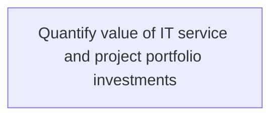
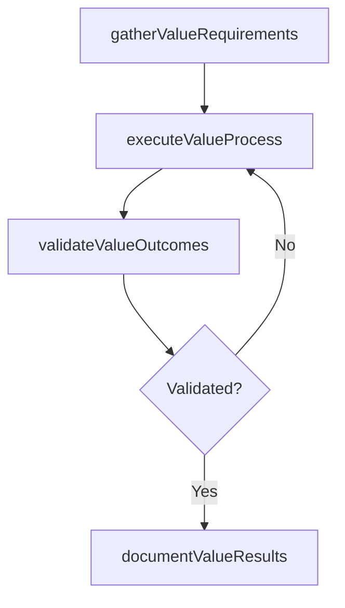

# Quantify value of IT service and project portfolio investments

> Business-as-Code definition for quantify value of it service and project portfolio investments. Models the process of evaluate the value of the investments, projects, and activities of it function by assigning it a quantifiable value with.

## Overview

Evaluate the value of the investments, projects, and activities of IT function by assigning it a quantifiable value with a profitable return to business operations.

## Process Hierarchy



## GraphDL

```yaml
quantify:
  object: Value Of IT Service And Project Portfolio Investments
  actor: ITPortfolioManager
  result: QuantifyValueOfItServiceAndProjectPortfolioInvestments
```

## Actions

| Action | Description |
|--------|-------------|
| gatherValueRequirements | Collect requirements and inputs for quantify value of it service and project portfolio investments |
| executeValueProcess | Perform the core activities of quantify value of it service and project portfolio investments |
| validateValueOutcomes | Verify that outcomes meet defined criteria and standards |
| documentValueResults | Record findings and results for stakeholder review |

## Events

| Event | Description |
|-------|-------------|
| valueRequirementsGathered | Requirements for quantify value of it service and project portfolio investments collected |
| valueProcessExecuted | Core activities of quantify value of it service and project portfolio investments completed |
| valueOutcomesValidated | Outcomes verified against defined criteria |
| valueResultsDocumented | Results recorded and distributed to stakeholders |

## Searches

| Search | Description |
|--------|-------------|
| getValueStatus | Retrieve current status of quantify value of it service and project portfolio investments |
| findValueRecords | List records related to quantify value of it service and project portfolio investments by date or status |
| getValueReport | Retrieve summary report for quantify value of it service and project portfolio investments |

## Process Flow



## RACI Matrix

| Activity | Responsible | Accountable | Consulted | Informed |
|----------|-------------|-------------|-----------|----------|
| gatherValueRequirements | ITPortfolioManager | ITInnovationLead | BusinessUnitLeaders | CIO |
| executeValueProcess | ITPortfolioManager | ITInnovationLead | ITOperations | ITServiceManager |
| validateValueOutcomes | ITPortfolioManager | ITInnovationLead | QualityAssurance | ITServiceManager |

## Related Processes

| Process | Relationship |
|---------|-------------|
| 8.2.6 Parent process | Parent - provides context and governance |
| 8.2.6.3 Sibling activity | Parallel - complementary activity in the same process |

## Related Departments

| Department | Role |
|-----------|------|
| IT Strategy and Planning | Owns strategy and governance activities |
| Enterprise Architecture | Provides technical architecture guidance |
| Finance | Validates budgets and investment models |

## Related Occupations

| Occupation | Involvement |
|-----------|-------------|
| IT Strategy Analyst | Conducts strategic research and analysis |
| Enterprise Architect | Designs technology architecture |

## KPIs

| KPI | Description | Unit |
|-----|-------------|------|
| Completion Rate | Percentage of quantify value of it service and project portfolio investments activities completed on schedule | % |
| Quality Score | Quality assessment score for quantify value of it service and project portfolio investments outputs | Score (1-10) |
| Cycle Time | Average time to complete quantify value of it service and project portfolio investments | Days |

## Usage

```typescript
import { quantifyValueOfItServiceAndProjectPortfolioInvestments } from '@headlessly/quantify-value-of-it-service-and-project-portfolio-investments'

const process = quantifyValueOfItServiceAndProjectPortfolioInvestments()

// Execute the core process
const result = await process.executeValueProcess({
  scope: 'department',
  priority: 'high'
})

// Validate outcomes
const validation = await process.validateValueOutcomes({
  criteria: 'standard',
  period: 'Q4-2025'
})
```
