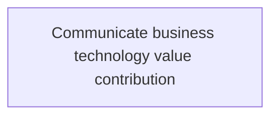
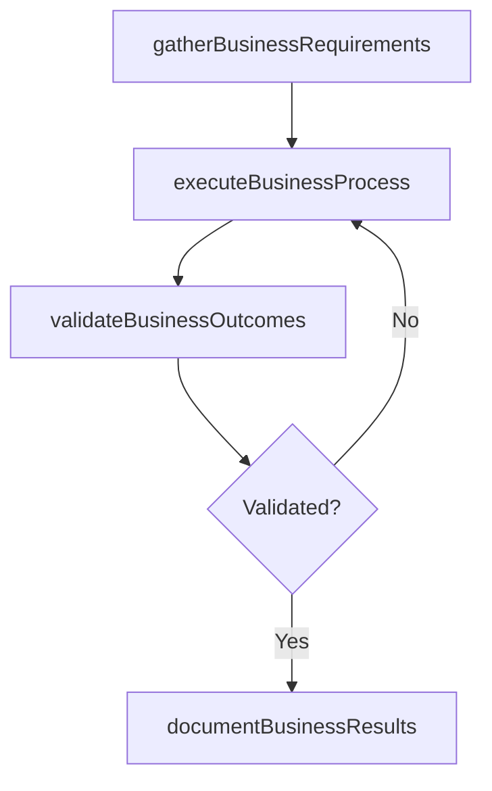

# Communicate business technology value contribution

> Business-as-Code definition for communicate business technology value contribution. Models the process of conveying the value addition through adopting technology targeting towards integrated profitable business operations.

## Overview

Conveying the value addition through adopting technology targeting towards integrated profitable business operations.

## Process Hierarchy



## GraphDL

```yaml
communicate:
  object: Business Technology Value Contribution
  actor: ITInnovationLead
  result: CommunicateBusinessTechnologyValueContribution
```

## Actions

| Action | Description |
|--------|-------------|
| gatherBusinessRequirements | Collect requirements and inputs for communicate business technology value contribution |
| executeBusinessProcess | Perform the core activities of communicate business technology value contribution |
| validateBusinessOutcomes | Verify that outcomes meet defined criteria and standards |
| documentBusinessResults | Record findings and results for stakeholder review |

## Events

| Event | Description |
|-------|-------------|
| businessRequirementsGathered | Requirements for communicate business technology value contribution collected |
| businessProcessExecuted | Core activities of communicate business technology value contribution completed |
| businessOutcomesValidated | Outcomes verified against defined criteria |
| businessResultsDocumented | Results recorded and distributed to stakeholders |

## Searches

| Search | Description |
|--------|-------------|
| getBusinessStatus | Retrieve current status of communicate business technology value contribution |
| findBusinessRecords | List records related to communicate business technology value contribution by date or status |
| getBusinessReport | Retrieve summary report for communicate business technology value contribution |

## Process Flow



## RACI Matrix

| Activity | Responsible | Accountable | Consulted | Informed |
|----------|-------------|-------------|-----------|----------|
| gatherBusinessRequirements | ITInnovationLead | ITStrategyAnalyst | BusinessUnitLeaders | CIO |
| executeBusinessProcess | ITInnovationLead | ITStrategyAnalyst | ITOperations | ITServiceManager |
| validateBusinessOutcomes | ITInnovationLead | ITStrategyAnalyst | QualityAssurance | ITServiceManager |

## Related Processes

| Process | Relationship |
|---------|-------------|
| 8.2.6 Parent process | Parent - provides context and governance |
| 8.2.6.4 Sibling activity | Parallel - complementary activity in the same process |

## Related Departments

| Department | Role |
|-----------|------|
| IT Strategy and Planning | Owns strategy and governance activities |
| Enterprise Architecture | Provides technical architecture guidance |
| Finance | Validates budgets and investment models |

## Related Occupations

| Occupation | Involvement |
|-----------|-------------|
| IT Strategy Analyst | Conducts strategic research and analysis |
| Enterprise Architect | Designs technology architecture |

## KPIs

| KPI | Description | Unit |
|-----|-------------|------|
| Completion Rate | Percentage of communicate business technology value contribution activities completed on schedule | % |
| Quality Score | Quality assessment score for communicate business technology value contribution outputs | Score (1-10) |
| Cycle Time | Average time to complete communicate business technology value contribution | Days |

## Usage

```typescript
import { communicateBusinessTechnologyValueContribution } from '@headlessly/communicate-business-technology-value-contribution'

const process = communicateBusinessTechnologyValueContribution()

// Execute the core process
const result = await process.executeBusinessProcess({
  scope: 'department',
  priority: 'high'
})

// Validate outcomes
const validation = await process.validateBusinessOutcomes({
  criteria: 'standard',
  period: 'Q4-2025'
})
```
