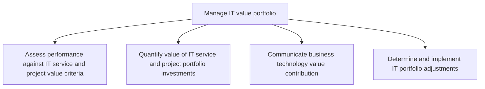
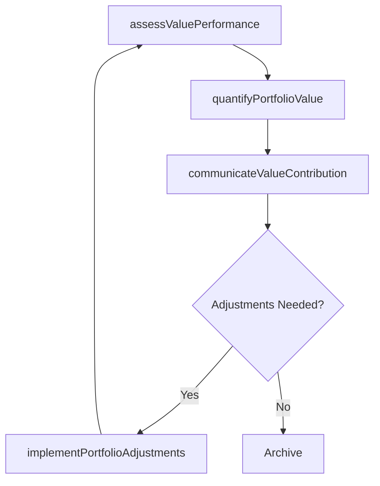

# Manage IT value portfolio

> Business-as-Code definition for IT value portfolio management. Models the process of assessing IT investments against value criteria, quantifying portfolio value, communicating technology contributions, and implementing portfolio adjustments.

## Overview

Creating and establishing the value portfolio. Defining, analyzing, and examining the value of projects, investments, and activities of the IT function.

## Process Hierarchy



## GraphDL

```yaml
manage:
  object: IT Value Portfolio
  actor: ITValueManager
  result: ITValueReport
```

## Actions

| Action | Description |
|--------|-------------|
| assessValuePerformance | Evaluate IT services and projects against defined value criteria |
| quantifyPortfolioValue | Calculate the financial and strategic value of IT portfolio investments |
| communicateValueContribution | Present technology value contribution to business stakeholders |
| implementPortfolioAdjustments | Execute changes to the IT portfolio based on value assessment findings |

## Events

| Event | Description |
|-------|-------------|
| valuePerformanceAssessed | IT services and projects evaluated against value criteria |
| portfolioValueQuantified | IT portfolio investment value calculated and documented |
| valueContributionCommunicated | Technology value contribution presented to stakeholders |
| portfolioAdjustmentsImplemented | IT portfolio changes executed based on value analysis |

## Searches

| Search | Description |
|--------|-------------|
| getValueScorecard | Retrieve IT value scorecard with metrics by project or service |
| findUnderperformingInvestments | List IT investments below target value thresholds |
| getValueTrends | Get value realization trends over multiple periods |

## Process Flow



## RACI Matrix

| Activity | Responsible | Accountable | Consulted | Informed |
|----------|-------------|-------------|-----------|----------|
| assessValuePerformance | ITValueManager | CIO | ITPortfolioManager | Finance |
| quantifyPortfolioValue | ITFinancialAnalyst | ITValueManager | Finance | CIO |
| communicateValueContribution | ITValueManager | CIO | BusinessUnitLeaders | Board |
| implementPortfolioAdjustments | ITPortfolioManager | CIO | ITValueManager | ProjectManagers |

## Sub-Processes

| ID | Name | Description |
|----|------|-------------|
| 8.2.6.1 | Assess performance against IT service and project value criteria | Process of evaluating performance to collect and analyze IT services and projects. Ensure expected I |
| 8.2.6.2 | Quantify value of IT service and project portfolio investments | Evaluate the value of the investments, projects, and activities of IT function by assigning it a qua |
| 8.2.6.3 | Communicate business technology value contribution | Conveying the value addition through adopting technology targeting towards integrated profitable bus |
| 8.2.6.4 | Determine and implement IT portfolio adjustments | Determining and implementing IT investments, projects, and activities based on trending technologica |

## Related Processes

| Process | Relationship |
|---------|-------------|
| 8.2.2 Manage IT portfolio strategy | Upstream - portfolio strategy sets investment criteria |
| 8.2.5 Control IT management system | Upstream - performance data informs value assessment |
| 8.2.1 Define business technology and governance strategy | Parallel - governance framework defines value measurement approach |

## Related Departments

| Department | Role |
|-----------|------|
| IT Value Management | Primary owner of value portfolio assessment and reporting |
| Finance | Validates financial value calculations and ROI models |
| Executive Leadership | Consumers of value contribution reports |
| IT Portfolio Management | Implements portfolio adjustments based on value findings |

## Related Occupations

| Occupation | Involvement |
|-----------|-------------|
| IT Value Manager | Leads value assessment and stakeholder communication |
| IT Financial Analyst | Quantifies portfolio investment value |
| IT Portfolio Manager | Implements portfolio adjustments |

## KPIs

| KPI | Description | Unit |
|-----|-------------|------|
| Portfolio Value Realization | Percentage of planned IT value actually realized | % |
| IT Investment ROI | Average return on investment across the IT portfolio | % |
| Value Communication Frequency | Number of value reports delivered to stakeholders per year | Count/Year |
| Portfolio Adjustment Rate | Percentage of portfolio adjusted per review cycle | % |

## Usage

```typescript
import { manageITValuePortfolio } from '@headlessly/manage-it-value-portfolio'

const valuePortfolio = manageITValuePortfolio()

// Assess value performance of IT investments
const assessment = await valuePortfolio.assessValuePerformance({
  period: 'FY-2025',
  criteria: ['revenue-impact', 'cost-avoidance', 'productivity-gain']
})

// Communicate value contribution to stakeholders
const report = await valuePortfolio.communicateValueContribution({
  audience: 'board-of-directors',
  format: 'executive-summary',
  highlights: assessment.topContributors
})
```
