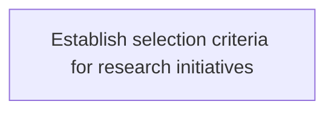
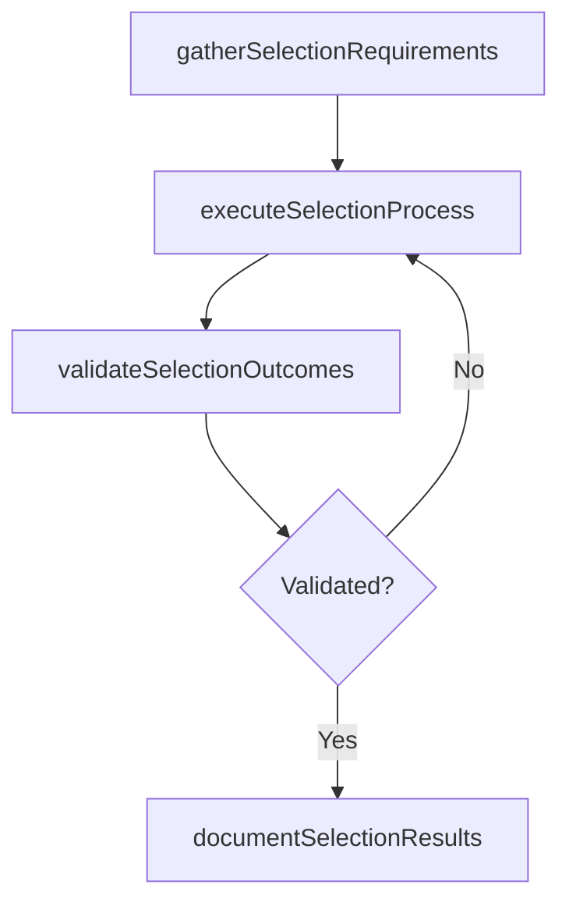

# Establish selection criteria for research initiatives

> Business-as-Code definition for establish selection criteria for research initiatives. Models the process of establishing the standard for selecting it research initiatives to align with organizational criteria for implementing f.

## Overview

Establishing the standard for selecting IT research initiatives to align with organizational criteria for implementing future technologies.

## Process Hierarchy



## GraphDL

```yaml
establish:
  object: Selection Criteria For Research Initiatives
  actor: ITPortfolioManager
  result: EstablishSelectionCriteriaForResearchInitiatives
```

## Actions

| Action | Description |
|--------|-------------|
| gatherSelectionRequirements | Collect requirements and inputs for establish selection criteria for research initiatives |
| executeSelectionProcess | Perform the core activities of establish selection criteria for research initiatives |
| validateSelectionOutcomes | Verify that outcomes meet defined criteria and standards |
| documentSelectionResults | Record findings and results for stakeholder review |

## Events

| Event | Description |
|-------|-------------|
| selectionRequirementsGathered | Requirements for establish selection criteria for research initiatives collected |
| selectionProcessExecuted | Core activities of establish selection criteria for research initiatives completed |
| selectionOutcomesValidated | Outcomes verified against defined criteria |
| selectionResultsDocumented | Results recorded and distributed to stakeholders |

## Searches

| Search | Description |
|--------|-------------|
| getSelectionStatus | Retrieve current status of establish selection criteria for research initiatives |
| findSelectionRecords | List records related to establish selection criteria for research initiatives by date or status |
| getSelectionReport | Retrieve summary report for establish selection criteria for research initiatives |

## Process Flow



## RACI Matrix

| Activity | Responsible | Accountable | Consulted | Informed |
|----------|-------------|-------------|-----------|----------|
| gatherSelectionRequirements | ITPortfolioManager | ITInnovationLead | BusinessUnitLeaders | CIO |
| executeSelectionProcess | ITPortfolioManager | ITInnovationLead | ITOperations | ITServiceManager |
| validateSelectionOutcomes | ITPortfolioManager | ITInnovationLead | QualityAssurance | ITServiceManager |

## Related Processes

| Process | Relationship |
|---------|-------------|
| 8.2.7 Parent process | Parent - provides context and governance |
| 8.2.7.2 Sibling activity | Parallel - complementary activity in the same process |

## Related Departments

| Department | Role |
|-----------|------|
| IT Strategy and Planning | Owns strategy and governance activities |
| Enterprise Architecture | Provides technical architecture guidance |
| Finance | Validates budgets and investment models |

## Related Occupations

| Occupation | Involvement |
|-----------|-------------|
| IT Strategy Analyst | Conducts strategic research and analysis |
| Enterprise Architect | Designs technology architecture |

## KPIs

| KPI | Description | Unit |
|-----|-------------|------|
| Completion Rate | Percentage of establish selection criteria for research initiatives activities completed on schedule | % |
| Quality Score | Quality assessment score for establish selection criteria for research initiatives outputs | Score (1-10) |
| Cycle Time | Average time to complete establish selection criteria for research initiatives | Days |

## Usage

```typescript
import { establishSelectionCriteriaForResearchInitiatives } from '@headlessly/establish-selection-criteria-for-research-initiatives'

const process = establishSelectionCriteriaForResearchInitiatives()

// Execute the core process
const result = await process.executeSelectionProcess({
  scope: 'department',
  priority: 'high'
})

// Validate outcomes
const validation = await process.validateSelectionOutcomes({
  criteria: 'standard',
  period: 'Q4-2025'
})
```
