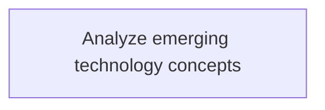
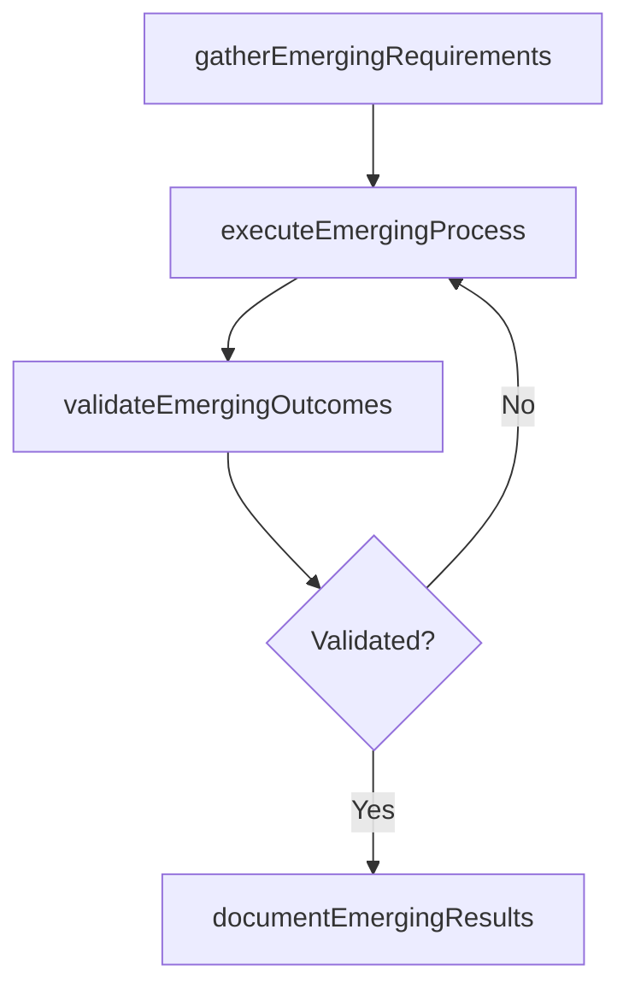

# Analyze emerging technology concepts

> Business-as-Code definition for analyze emerging technology concepts. Models the process of assessing new and future technologies relevant to the organization's vision of its it capabilities.

## Overview

Assessing new and future technologies relevant to the organization's vision of its IT capabilities.

## Process Hierarchy



## GraphDL

```yaml
analyze:
  object: Emerging Technology Concepts
  actor: ITStrategyAnalyst
  result: AnalyzeEmergingTechnologyConcepts
```

## Actions

| Action | Description |
|--------|-------------|
| gatherEmergingRequirements | Collect requirements and inputs for analyze emerging technology concepts |
| executeEmergingProcess | Perform the core activities of analyze emerging technology concepts |
| validateEmergingOutcomes | Verify that outcomes meet defined criteria and standards |
| documentEmergingResults | Record findings and results for stakeholder review |

## Events

| Event | Description |
|-------|-------------|
| emergingRequirementsGathered | Requirements for analyze emerging technology concepts collected |
| emergingProcessExecuted | Core activities of analyze emerging technology concepts completed |
| emergingOutcomesValidated | Outcomes verified against defined criteria |
| emergingResultsDocumented | Results recorded and distributed to stakeholders |

## Searches

| Search | Description |
|--------|-------------|
| getEmergingStatus | Retrieve current status of analyze emerging technology concepts |
| findEmergingRecords | List records related to analyze emerging technology concepts by date or status |
| getEmergingReport | Retrieve summary report for analyze emerging technology concepts |

## Process Flow



## RACI Matrix

| Activity | Responsible | Accountable | Consulted | Informed |
|----------|-------------|-------------|-----------|----------|
| gatherEmergingRequirements | ITStrategyAnalyst | EnterpriseArchitect | BusinessUnitLeaders | CIO |
| executeEmergingProcess | ITStrategyAnalyst | EnterpriseArchitect | ITOperations | ITServiceManager |
| validateEmergingOutcomes | ITStrategyAnalyst | EnterpriseArchitect | QualityAssurance | ITServiceManager |

## Related Processes

| Process | Relationship |
|---------|-------------|
| 8.2.7 Parent process | Parent - provides context and governance |
| 8.2.7.3 Sibling activity | Parallel - complementary activity in the same process |

## Related Departments

| Department | Role |
|-----------|------|
| IT Strategy and Planning | Owns strategy and governance activities |
| Enterprise Architecture | Provides technical architecture guidance |
| Finance | Validates budgets and investment models |

## Related Occupations

| Occupation | Involvement |
|-----------|-------------|
| IT Strategy Analyst | Conducts strategic research and analysis |
| Enterprise Architect | Designs technology architecture |

## KPIs

| KPI | Description | Unit |
|-----|-------------|------|
| Completion Rate | Percentage of analyze emerging technology concepts activities completed on schedule | % |
| Quality Score | Quality assessment score for analyze emerging technology concepts outputs | Score (1-10) |
| Cycle Time | Average time to complete analyze emerging technology concepts | Days |

## Usage

```typescript
import { analyzeEmergingTechnologyConcepts } from '@headlessly/analyze-emerging-technology-concepts'

const process = analyzeEmergingTechnologyConcepts()

// Execute the core process
const result = await process.executeEmergingProcess({
  scope: 'department',
  priority: 'high'
})

// Validate outcomes
const validation = await process.validateEmergingOutcomes({
  criteria: 'standard',
  period: 'Q4-2025'
})
```
