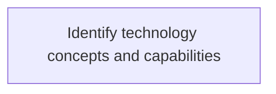
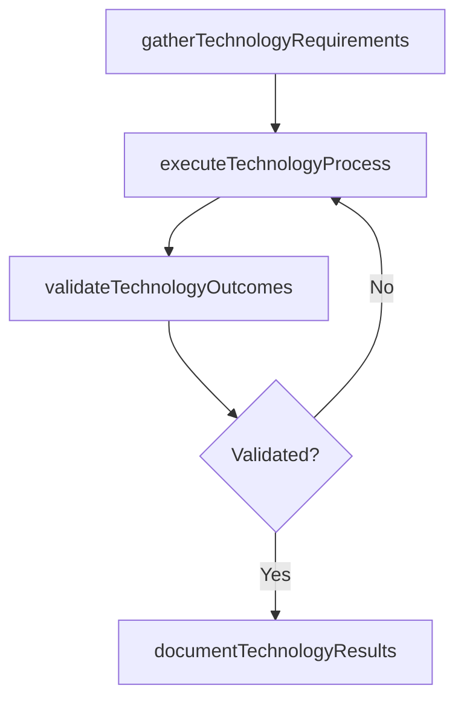

# Identify technology concepts and capabilities

> Business-as-Code definition for identify technology concepts and capabilities. Models the process of identification of conceptual elements that define the benefits of technology to business.

## Overview

Identification of conceptual elements that define the benefits of technology to business.

## Process Hierarchy



## GraphDL

```yaml
identify:
  object: Technology Concepts And Capabilities
  actor: EnterpriseArchitect
  result: IdentifyTechnologyConceptsAndCapabilities
```

## Actions

| Action | Description |
|--------|-------------|
| gatherTechnologyRequirements | Collect requirements and inputs for identify technology concepts and capabilities |
| executeTechnologyProcess | Perform the core activities of identify technology concepts and capabilities |
| validateTechnologyOutcomes | Verify that outcomes meet defined criteria and standards |
| documentTechnologyResults | Record findings and results for stakeholder review |

## Events

| Event | Description |
|-------|-------------|
| technologyRequirementsGathered | Requirements for identify technology concepts and capabilities collected |
| technologyProcessExecuted | Core activities of identify technology concepts and capabilities completed |
| technologyOutcomesValidated | Outcomes verified against defined criteria |
| technologyResultsDocumented | Results recorded and distributed to stakeholders |

## Searches

| Search | Description |
|--------|-------------|
| getTechnologyStatus | Retrieve current status of identify technology concepts and capabilities |
| findTechnologyRecords | List records related to identify technology concepts and capabilities by date or status |
| getTechnologyReport | Retrieve summary report for identify technology concepts and capabilities |

## Process Flow



## RACI Matrix

| Activity | Responsible | Accountable | Consulted | Informed |
|----------|-------------|-------------|-----------|----------|
| gatherTechnologyRequirements | EnterpriseArchitect | ITPortfolioManager | BusinessUnitLeaders | CIO |
| executeTechnologyProcess | EnterpriseArchitect | ITPortfolioManager | ITOperations | ITServiceManager |
| validateTechnologyOutcomes | EnterpriseArchitect | ITPortfolioManager | QualityAssurance | ITServiceManager |

## Related Processes

| Process | Relationship |
|---------|-------------|
| 8.2.7 Parent process | Parent - provides context and governance |
| 8.2.7.4 Sibling activity | Parallel - complementary activity in the same process |

## Related Departments

| Department | Role |
|-----------|------|
| IT Strategy and Planning | Owns strategy and governance activities |
| Enterprise Architecture | Provides technical architecture guidance |
| Finance | Validates budgets and investment models |

## Related Occupations

| Occupation | Involvement |
|-----------|-------------|
| IT Strategy Analyst | Conducts strategic research and analysis |
| Enterprise Architect | Designs technology architecture |

## KPIs

| KPI | Description | Unit |
|-----|-------------|------|
| Completion Rate | Percentage of identify technology concepts and capabilities activities completed on schedule | % |
| Quality Score | Quality assessment score for identify technology concepts and capabilities outputs | Score (1-10) |
| Cycle Time | Average time to complete identify technology concepts and capabilities | Days |

## Usage

```typescript
import { identifyTechnologyConceptsAndCapabilities } from '@headlessly/identify-technology-concepts-and-capabilities'

const process = identifyTechnologyConceptsAndCapabilities()

// Execute the core process
const result = await process.executeTechnologyProcess({
  scope: 'department',
  priority: 'high'
})

// Validate outcomes
const validation = await process.validateTechnologyOutcomes({
  criteria: 'standard',
  period: 'Q4-2025'
})
```
