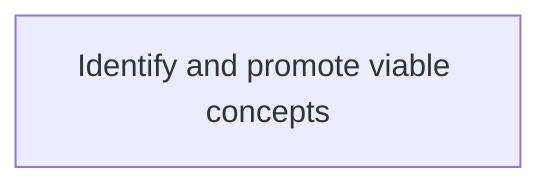
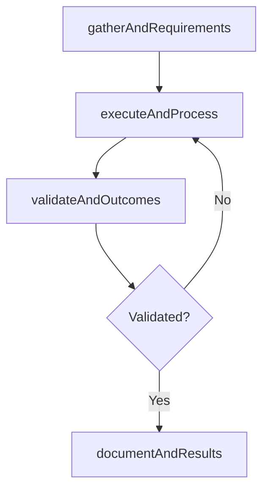

# Identify and promote viable concepts

> Business-as-Code definition for identify and promote viable concepts. Models the process of determine project viability. promote relevant it innovations that meet business objectives.

## Overview

Determine project viability. Promote relevant IT innovations that meet business objectives.

## Process Hierarchy



## GraphDL

```yaml
identify:
  object: And Promote Viable Concepts
  actor: ITInnovationLead
  result: IdentifyAndPromoteViableConcepts
```

## Actions

| Action | Description |
|--------|-------------|
| gatherAndRequirements | Collect requirements and inputs for identify and promote viable concepts |
| executeAndProcess | Perform the core activities of identify and promote viable concepts |
| validateAndOutcomes | Verify that outcomes meet defined criteria and standards |
| documentAndResults | Record findings and results for stakeholder review |

## Events

| Event | Description |
|-------|-------------|
| andRequirementsGathered | Requirements for identify and promote viable concepts collected |
| andProcessExecuted | Core activities of identify and promote viable concepts completed |
| andOutcomesValidated | Outcomes verified against defined criteria |
| andResultsDocumented | Results recorded and distributed to stakeholders |

## Searches

| Search | Description |
|--------|-------------|
| getAndStatus | Retrieve current status of identify and promote viable concepts |
| findAndRecords | List records related to identify and promote viable concepts by date or status |
| getAndReport | Retrieve summary report for identify and promote viable concepts |

## Process Flow



## RACI Matrix

| Activity | Responsible | Accountable | Consulted | Informed |
|----------|-------------|-------------|-----------|----------|
| gatherAndRequirements | ITInnovationLead | ITStrategyAnalyst | BusinessUnitLeaders | CIO |
| executeAndProcess | ITInnovationLead | ITStrategyAnalyst | ITOperations | ITServiceManager |
| validateAndOutcomes | ITInnovationLead | ITStrategyAnalyst | QualityAssurance | ITServiceManager |

## Related Processes

| Process | Relationship |
|---------|-------------|
| 8.2.7 Parent process | Parent - provides context and governance |
| 8.2.7.7 Sibling activity | Parallel - complementary activity in the same process |

## Related Departments

| Department | Role |
|-----------|------|
| IT Strategy and Planning | Owns strategy and governance activities |
| Enterprise Architecture | Provides technical architecture guidance |
| Finance | Validates budgets and investment models |

## Related Occupations

| Occupation | Involvement |
|-----------|-------------|
| IT Strategy Analyst | Conducts strategic research and analysis |
| Enterprise Architect | Designs technology architecture |

## KPIs

| KPI | Description | Unit |
|-----|-------------|------|
| Completion Rate | Percentage of identify and promote viable concepts activities completed on schedule | % |
| Quality Score | Quality assessment score for identify and promote viable concepts outputs | Score (1-10) |
| Cycle Time | Average time to complete identify and promote viable concepts | Days |

## Usage

```typescript
import { identifyAndPromoteViableConcepts } from '@headlessly/identify-and-promote-viable-concepts'

const process = identifyAndPromoteViableConcepts()

// Execute the core process
const result = await process.executeAndProcess({
  scope: 'department',
  priority: 'high'
})

// Validate outcomes
const validation = await process.validateAndOutcomes({
  criteria: 'standard',
  period: 'Q4-2025'
})
```
