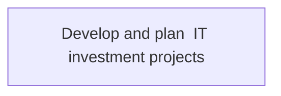
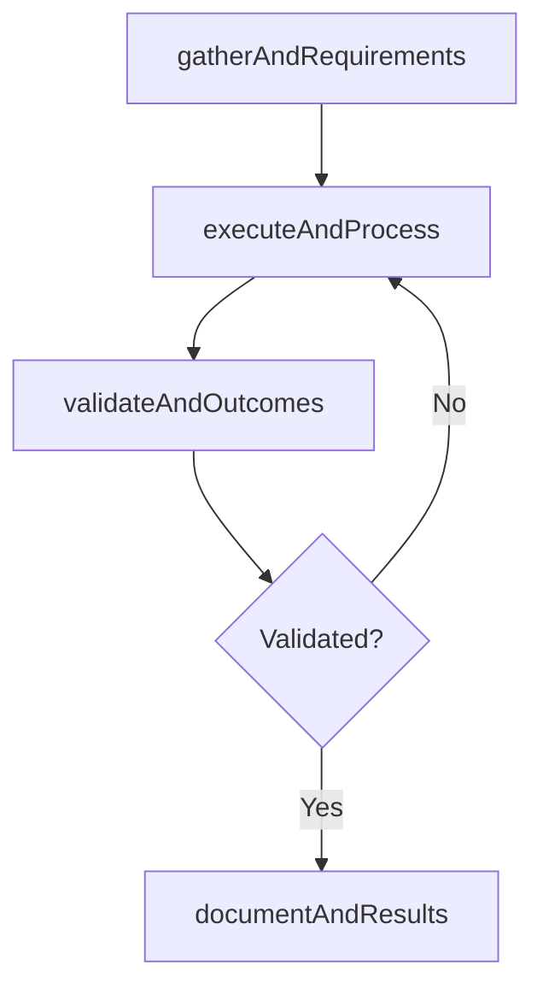

# Develop and plan  IT investment projects

> Business-as-Code definition for develop and plan  it investment projects. Models the process of develop and plan long-term allocation of funds for information technology endeavors to meet business goals.

## Overview

Develop and plan long-term allocation of funds for information technology endeavors to meet business goals.

## Process Hierarchy



## GraphDL

```yaml
develop:
  object: And Plan IT Investment Projects
  actor: ITPortfolioManager
  result: DevelopAndPlanItInvestmentProjects
```

## Actions

| Action | Description |
|--------|-------------|
| gatherAndRequirements | Collect requirements and inputs for develop and plan  it investment projects |
| executeAndProcess | Perform the core activities of develop and plan  it investment projects |
| validateAndOutcomes | Verify that outcomes meet defined criteria and standards |
| documentAndResults | Record findings and results for stakeholder review |

## Events

| Event | Description |
|-------|-------------|
| andRequirementsGathered | Requirements for develop and plan  it investment projects collected |
| andProcessExecuted | Core activities of develop and plan  it investment projects completed |
| andOutcomesValidated | Outcomes verified against defined criteria |
| andResultsDocumented | Results recorded and distributed to stakeholders |

## Searches

| Search | Description |
|--------|-------------|
| getAndStatus | Retrieve current status of develop and plan  it investment projects |
| findAndRecords | List records related to develop and plan  it investment projects by date or status |
| getAndReport | Retrieve summary report for develop and plan  it investment projects |

## Process Flow



## RACI Matrix

| Activity | Responsible | Accountable | Consulted | Informed |
|----------|-------------|-------------|-----------|----------|
| gatherAndRequirements | ITPortfolioManager | ITInnovationLead | BusinessUnitLeaders | CIO |
| executeAndProcess | ITPortfolioManager | ITInnovationLead | ITOperations | ITServiceManager |
| validateAndOutcomes | ITPortfolioManager | ITInnovationLead | QualityAssurance | ITServiceManager |

## Related Processes

| Process | Relationship |
|---------|-------------|
| 8.2.7 Parent process | Parent - provides context and governance |
| 8.2.7.8 Sibling activity | Parallel - complementary activity in the same process |

## Related Departments

| Department | Role |
|-----------|------|
| IT Strategy and Planning | Owns strategy and governance activities |
| Enterprise Architecture | Provides technical architecture guidance |
| Finance | Validates budgets and investment models |

## Related Occupations

| Occupation | Involvement |
|-----------|-------------|
| IT Strategy Analyst | Conducts strategic research and analysis |
| Enterprise Architect | Designs technology architecture |

## KPIs

| KPI | Description | Unit |
|-----|-------------|------|
| Completion Rate | Percentage of develop and plan  it investment projects activities completed on schedule | % |
| Quality Score | Quality assessment score for develop and plan  it investment projects outputs | Score (1-10) |
| Cycle Time | Average time to complete develop and plan  it investment projects | Days |

## Usage

```typescript
import { developAndPlanItInvestmentProjects } from '@headlessly/develop-and-plan-it-investment-projects'

const process = developAndPlanItInvestmentProjects()

// Execute the core process
const result = await process.executeAndProcess({
  scope: 'department',
  priority: 'high'
})

// Validate outcomes
const validation = await process.validateAndOutcomes({
  criteria: 'standard',
  period: 'Q4-2025'
})
```
