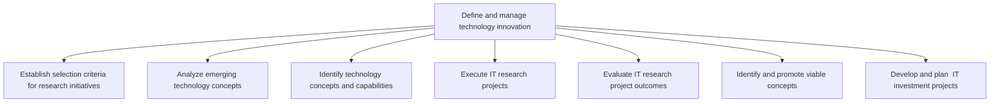
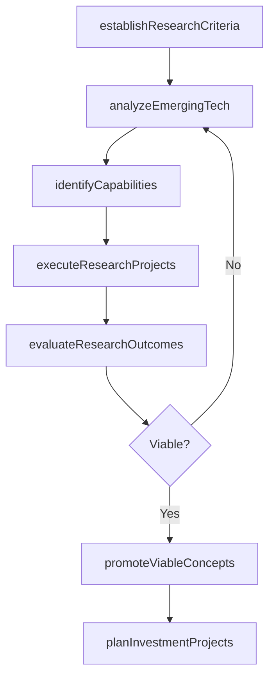

# Define and manage technology innovation

> Business-as-Code definition for technology innovation management. Models the process of establishing research criteria, analyzing emerging technologies, executing research projects, evaluating outcomes, and planning IT innovation investments.

## Overview

Outline and manage the innovation of technology within the organization. Research and understand emerging future technological concepts and capabilities. Plan for IT innovation investments. Plan and execute viable innovation projects.

## Process Hierarchy



## GraphDL

```yaml
define:
  object: And Manage Technology Innovation
  actor: ITInnovationLead
  result: InnovationPipeline
```

## Actions

| Action | Description |
|--------|-------------|
| establishResearchCriteria | Define selection criteria for evaluating research initiatives |
| analyzeEmergingTech | Assess emerging technology concepts for organizational relevance |
| identifyCapabilities | Discover technology concepts that create business value |
| executeResearchProjects | Run IT research and proof-of-concept projects |
| evaluateResearchOutcomes | Assess research project results against defined success criteria |
| promoteViableConcepts | Advance successful innovations into the investment pipeline |
| planInvestmentProjects | Develop and plan IT innovation investment projects |

## Events

| Event | Description |
|-------|-------------|
| researchCriteriaEstablished | Innovation research selection criteria defined |
| emergingTechAnalyzed | Emerging technology assessment completed |
| capabilitiesIdentified | New technology capabilities mapped to business opportunities |
| researchProjectsExecuted | IT research projects completed with findings |
| researchOutcomesEvaluated | Research project outcomes assessed and documented |
| viableConceptsPromoted | Validated innovations advanced to investment stage |
| investmentProjectsPlanned | Innovation investment projects scoped and budgeted |

## Searches

| Search | Description |
|--------|-------------|
| findResearchProjects | List IT research projects by status, domain, or budget |
| getInnovationPipeline | Retrieve the current innovation pipeline with stage details |
| findEmergingTechAssessments | List emerging technology assessments by maturity or relevance |
| getResearchOutcomes | Retrieve research project outcome reports |

## Process Flow



## RACI Matrix

| Activity | Responsible | Accountable | Consulted | Informed |
|----------|-------------|-------------|-----------|----------|
| establishResearchCriteria | ITInnovationLead | CTO | CIO | EnterpriseArchitect |
| analyzeEmergingTech | TechnologyResearcher | ITInnovationLead | EnterpriseArchitect | BusinessUnitLeaders |
| executeResearchProjects | ResearchProjectManager | ITInnovationLead | DevelopmentTeams | CTO |
| promoteViableConcepts | ITInnovationLead | CTO | ITPortfolioManager | CIO |
| planInvestmentProjects | ITPortfolioManager | CIO | Finance | ITInnovationLead |

## Sub-Processes

| ID | Name | Description |
|----|------|-------------|
| 8.2.7.1 | Establish selection criteria for research initiatives | Establishing the standard for selecting IT research initiatives to align with organizational criteri |
| 8.2.7.2 | Analyze emerging technology concepts | Assessing new and future technologies relevant to the organization's vision of its IT capabilities. |
| 8.2.7.3 | Identify technology concepts and capabilities | Identification of conceptual elements that define the benefits of technology to business. |
| 8.2.7.4 | Execute IT research projects | Implement information technology research projects that focus on meeting the goals of the organizati |
| 8.2.7.5 | Evaluate IT research project outcomes | Assessing IT research projects based on defined outcome expectations. |
| 8.2.7.6 | Identify and promote viable concepts | Determine project viability. Promote relevant IT innovations that meet business objectives. |
| 8.2.7.7 | Develop and plan  IT investment projects | Develop and plan long-term allocation of funds for information technology endeavors to meet business |

## Related Processes

| Process | Relationship |
|---------|-------------|
| 8.2.1 Define business technology and governance strategy | Upstream - governance strategy sets innovation direction |
| 8.2.3 Define and maintain enterprise architecture | Parallel - architecture research feeds innovation pipeline |
| 8.2.2 Manage IT portfolio strategy | Downstream - viable innovations enter the investment portfolio |

## Related Departments

| Department | Role |
|-----------|------|
| Innovation Lab | Primary executor of technology research and prototyping |
| Enterprise Architecture | Provides technical assessment and architecture fit analysis |
| IT Portfolio Management | Integrates innovations into the investment portfolio |
| Business Units | Provides business use cases and validates innovation value |

## Related Occupations

| Occupation | Involvement |
|-----------|-------------|
| IT Innovation Lead | Directs the innovation pipeline and research priorities |
| Technology Researcher | Evaluates emerging technologies and runs experiments |
| Research Project Manager | Manages proof-of-concept and pilot projects |

## KPIs

| KPI | Description | Unit |
|-----|-------------|------|
| Innovation Pipeline Size | Number of active innovations across all stages | Count |
| Concept-to-Investment Rate | Percentage of research concepts advancing to investment | % |
| Research Project Success Rate | Percentage of research projects meeting outcome criteria | % |
| Time to Prototype | Average time from concept identification to working prototype | Weeks |

## Usage

```typescript
import { defineAndManageTechnologyInnovation } from '@headlessly/define-and-manage-technology-innovation'

const innovation = defineAndManageTechnologyInnovation()

// Analyze emerging technologies
const assessment = await innovation.analyzeEmergingTech({
  domains: ['generative-ai', 'quantum-computing', 'edge-ml'],
  evaluationCriteria: ['business-relevance', 'technical-maturity', 'cost']
})

// Execute a research project
const project = await innovation.executeResearchProjects({
  concept: 'ai-powered-customer-service',
  duration: '8-weeks',
  budget: 75000,
  successCriteria: { accuracyTarget: 0.92, latencyTarget: '200ms' }
})
```
