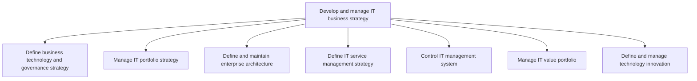
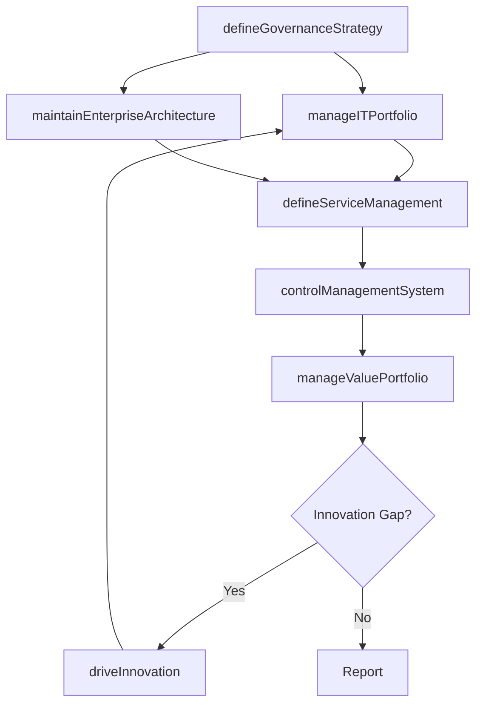

# Develop and manage IT business strategy

> Business-as-Code definition for IT business strategy management. Models the processes of defining technology governance, managing IT portfolios, maintaining enterprise architecture, and driving technology innovation.

## Overview

Handling the business of IT. Create a organization-wide strategy for the IT function. Define the organization's IT architecture. Manage the IT portfolio. Research and innovate in the field of IT. Assess and convey the performance and the value of the IT function.

## Process Hierarchy



## GraphDL

```yaml
develop:
  object: And Manage IT Business Strategy
  actor: ChiefInformationOfficer
  result: ITStrategyPlan
```

## Actions

| Action | Description |
|--------|-------------|
| defineGovernanceStrategy | Establish technology governance principles and decision frameworks |
| manageITPortfolio | Evaluate, prioritize, and balance IT investment portfolio |
| maintainEnterpriseArchitecture | Define and evolve the enterprise technology architecture |
| defineServiceManagement | Establish IT service management strategy and operating model |
| controlManagementSystem | Monitor and govern IT management system performance |
| manageValuePortfolio | Assess and communicate IT value contribution to the business |
| driveInnovation | Research emerging technologies and manage innovation pipeline |

## Events

| Event | Description |
|-------|-------------|
| governanceStrategyDefined | IT governance framework approved and published |
| itPortfolioManaged | IT investment portfolio reviewed and rebalanced |
| enterpriseArchitectureMaintained | Enterprise architecture artifacts updated |
| serviceManagementDefined | IT service management framework established |
| managementSystemControlled | IT management system performance reviewed |
| valuePortfolioManaged | IT value contribution assessed and reported |
| innovationDriven | Technology innovation initiative evaluated or launched |

## Searches

| Search | Description |
|--------|-------------|
| getITStrategyPlan | Retrieve current IT strategy and alignment scorecard |
| findPortfolioInvestments | List IT investments filtered by category, status, or value |
| getArchitectureBlueprint | Retrieve enterprise architecture diagrams and standards |
| findInnovationInitiatives | List technology innovation projects by stage or domain |

## Process Flow



## RACI Matrix

| Activity | Responsible | Accountable | Consulted | Informed |
|----------|-------------|-------------|-----------|----------|
| defineGovernanceStrategy | ITStrategyDirector | CIO | CEO | Board |
| manageITPortfolio | ITPortfolioManager | CIO | Finance | BusinessUnitLeaders |
| maintainEnterpriseArchitecture | EnterpriseArchitect | CTO | ITDirectors | DevelopmentTeams |
| controlManagementSystem | ITGovernanceManager | CIO | InternalAudit | ExecutiveTeam |
| driveInnovation | ITInnovationLead | CTO | BusinessUnitLeaders | CIO |

## Sub-Processes

| ID | Name | Description |
|----|------|-------------|
| 8.2.1 | Define business technology and governance strategy | Defining the need of technology in business and systematic implementation of IT investments. It comp |
| 8.2.2 | Manage IT portfolio strategy | Strategy for systematic management of IT investments, projects, and activities. Analyze and examine  |
| 8.2.3 | Define and maintain enterprise architecture | Outlining and maintaining the organization's IT architecture. Establish the IT architecture definiti |
| 8.2.4 | Define IT service management strategy | Defining perspective, position, plans, and patterns needed to execute designing, delivering, managin |
| 8.2.5 | Control IT management system | Regulating the IT management system through performance measures, governance, analysis, and monitori |
| 8.2.6 | Manage IT value portfolio | Creating and establishing the value portfolio. Defining, analyzing, and examining the value of proje |
| 8.2.7 | Define and manage technology innovation | Outline and manage the innovation of technology within the organization. Research and understand eme |

## Related Processes

| Process | Relationship |
|---------|-------------|
| 8.1 Develop and manage IT customer relationships | Downstream - strategy drives customer engagement priorities |
| 8.3 Develop and manage IT resilience and risk | Parallel - risk considerations shape strategy |
| 1.2 Develop business strategy | Upstream - corporate strategy informs IT strategy |

## Related Departments

| Department | Role |
|-----------|------|
| IT Strategy and Planning | Primary owner of IT business strategy processes |
| Enterprise Architecture | Defines and maintains technology standards and blueprints |
| Finance | Governs IT budgets and validates investment business cases |
| Executive Leadership | Sets strategic direction and approves major IT investments |
| Innovation Lab | Researches emerging technologies and runs proof-of-concept projects |

## Related Occupations

| Occupation | Involvement |
|-----------|-------------|
| Chief Information Officer | Sets IT strategic direction and approves governance frameworks |
| Enterprise Architect | Designs technology architecture and innovation roadmaps |
| IT Portfolio Manager | Manages IT investment portfolio and project prioritization |
| IT Strategy Analyst | Conducts research and analysis to inform strategy decisions |

## KPIs

| KPI | Description | Unit |
|-----|-------------|------|
| IT Strategic Alignment Score | Degree of alignment between IT and business strategy | Score (1-10) |
| Portfolio ROI | Return on investment across the IT project portfolio | % |
| Architecture Compliance | Percentage of projects compliant with enterprise architecture standards | % |
| Innovation Pipeline Value | Estimated value of technology innovation initiatives | Currency |
| IT Budget Variance | Deviation of actual IT spend from approved budget | % |

## Usage

```typescript
import { developAndManageITBusinessStrategy } from '@headlessly/develop-and-manage-it-business-strategy'

const strategy = developAndManageITBusinessStrategy()

// Define governance strategy aligned to corporate goals
const governance = await strategy.defineGovernanceStrategy({
  alignedTo: 'corporate-strategy-2025',
  governanceModel: 'federated',
  reviewCadence: 'quarterly'
})

// Evaluate innovation pipeline
const innovations = await strategy.driveInnovation({
  domain: 'artificial-intelligence',
  stage: 'proof-of-concept',
  maxBudget: 500000
})
```
