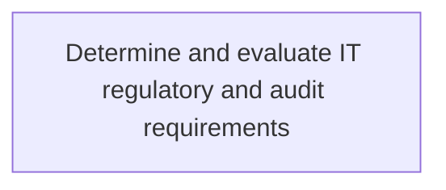
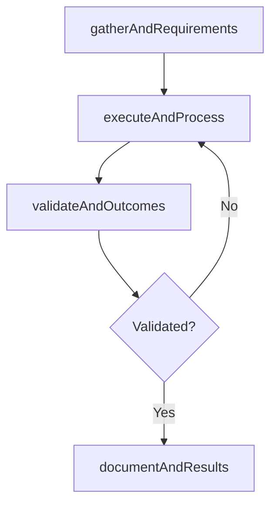

# Determine and evaluate IT regulatory and audit requirements

> Business-as-Code definition for determine and evaluate it regulatory and audit requirements. Models the process of determining and evaluating it regulatory and audit requirements. train employees on regulatory and audit requirements. r.

## Overview

Determining and evaluating IT regulatory and audit requirements. Train employees on regulatory and audit requirements. Records for the appropriate regulatory and audit agencies must be maintained and the new product process must be approved by the appropriate regulatory body before it is published to the organization.

## Process Hierarchy



## GraphDL

```yaml
determine:
  object: And Evaluate IT Regulatory And Audit Requirements
  actor: ITComplianceAnalyst
  result: DetermineAndEvaluateItRegulatoryAndAuditRequirements
```

## Actions

| Action | Description |
|--------|-------------|
| gatherAndRequirements | Collect requirements and inputs for determine and evaluate it regulatory and audit requirements |
| executeAndProcess | Perform the core activities of determine and evaluate it regulatory and audit requirements |
| validateAndOutcomes | Verify that outcomes meet defined criteria and standards |
| documentAndResults | Record findings and results for stakeholder review |

## Events

| Event | Description |
|-------|-------------|
| andRequirementsGathered | Requirements for determine and evaluate it regulatory and audit requirements collected |
| andProcessExecuted | Core activities of determine and evaluate it regulatory and audit requirements completed |
| andOutcomesValidated | Outcomes verified against defined criteria |
| andResultsDocumented | Results recorded and distributed to stakeholders |

## Searches

| Search | Description |
|--------|-------------|
| getAndStatus | Retrieve current status of determine and evaluate it regulatory and audit requirements |
| findAndRecords | List records related to determine and evaluate it regulatory and audit requirements by date or status |
| getAndReport | Retrieve summary report for determine and evaluate it regulatory and audit requirements |

## Process Flow



## RACI Matrix

| Activity | Responsible | Accountable | Consulted | Informed |
|----------|-------------|-------------|-----------|----------|
| gatherAndRequirements | ITComplianceAnalyst | ITSecurityManager | BusinessUnitLeaders | CIO |
| executeAndProcess | ITComplianceAnalyst | ITSecurityManager | ITOperations | ITServiceManager |
| validateAndOutcomes | ITComplianceAnalyst | ITSecurityManager | QualityAssurance | ITServiceManager |

## Related Processes

| Process | Relationship |
|---------|-------------|
| 8.3.1 Parent process | Parent - provides context and governance |
| 8.3.1.2 Sibling activity | Parallel - complementary activity in the same process |

## Related Departments

| Department | Role |
|-----------|------|
| IT Risk and Compliance | Manages risk assessment and compliance |
| IT Security | Implements security controls and monitoring |
| Legal | Advises on regulatory requirements |

## Related Occupations

| Occupation | Involvement |
|-----------|-------------|
| IT Risk Analyst | Assesses and monitors IT risks |
| IT Compliance Analyst | Evaluates regulatory compliance |

## KPIs

| KPI | Description | Unit |
|-----|-------------|------|
| Completion Rate | Percentage of determine and evaluate it regulatory and audit requirements activities completed on schedule | % |
| Quality Score | Quality assessment score for determine and evaluate it regulatory and audit requirements outputs | Score (1-10) |
| Cycle Time | Average time to complete determine and evaluate it regulatory and audit requirements | Days |

## Usage

```typescript
import { determineAndEvaluateItRegulatoryAndAuditRequirements } from '@headlessly/determine-and-evaluate-it-regulatory-and-audit-requirements'

const process = determineAndEvaluateItRegulatoryAndAuditRequirements()

// Execute the core process
const result = await process.executeAndProcess({
  scope: 'department',
  priority: 'high'
})

// Validate outcomes
const validation = await process.validateAndOutcomes({
  criteria: 'standard',
  period: 'Q4-2025'
})
```
