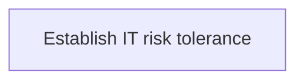
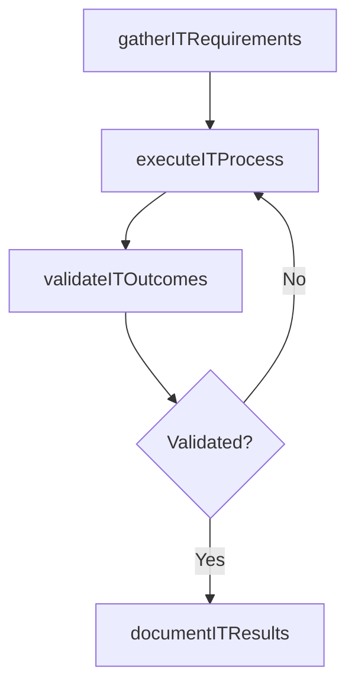

# Establish IT risk tolerance

> Business-as-Code definition for establish it risk tolerance. Models the process of determine the specific maximum risk to take in quantitative terms for each relevant risk sub-category, including strateg.

## Overview

Determine the specific maximum risk to take in quantitative terms for each relevant risk sub-category, including strategic, operational, financial, and compliance risks.

## Process Hierarchy



## GraphDL

```yaml
establish:
  object: IT Risk Tolerance
  actor: ITRiskAnalyst
  result: EstablishItRiskTolerance
```

## Actions

| Action | Description |
|--------|-------------|
| gatherITRequirements | Collect requirements and inputs for establish it risk tolerance |
| executeITProcess | Perform the core activities of establish it risk tolerance |
| validateITOutcomes | Verify that outcomes meet defined criteria and standards |
| documentITResults | Record findings and results for stakeholder review |

## Events

| Event | Description |
|-------|-------------|
| itRequirementsGathered | Requirements for establish it risk tolerance collected |
| itProcessExecuted | Core activities of establish it risk tolerance completed |
| itOutcomesValidated | Outcomes verified against defined criteria |
| itResultsDocumented | Results recorded and distributed to stakeholders |

## Searches

| Search | Description |
|--------|-------------|
| getITStatus | Retrieve current status of establish it risk tolerance |
| findITRecords | List records related to establish it risk tolerance by date or status |
| getITReport | Retrieve summary report for establish it risk tolerance |

## Process Flow



## RACI Matrix

| Activity | Responsible | Accountable | Consulted | Informed |
|----------|-------------|-------------|-----------|----------|
| gatherITRequirements | ITRiskAnalyst | ITComplianceAnalyst | BusinessUnitLeaders | CIO |
| executeITProcess | ITRiskAnalyst | ITComplianceAnalyst | ITOperations | ITServiceManager |
| validateITOutcomes | ITRiskAnalyst | ITComplianceAnalyst | QualityAssurance | ITServiceManager |

## Related Processes

| Process | Relationship |
|---------|-------------|
| 8.3.1 Parent process | Parent - provides context and governance |
| 8.3.1.4 Sibling activity | Parallel - complementary activity in the same process |

## Related Departments

| Department | Role |
|-----------|------|
| IT Risk and Compliance | Manages risk assessment and compliance |
| IT Security | Implements security controls and monitoring |
| Legal | Advises on regulatory requirements |

## Related Occupations

| Occupation | Involvement |
|-----------|-------------|
| IT Risk Analyst | Assesses and monitors IT risks |
| IT Compliance Analyst | Evaluates regulatory compliance |

## KPIs

| KPI | Description | Unit |
|-----|-------------|------|
| Completion Rate | Percentage of establish it risk tolerance activities completed on schedule | % |
| Quality Score | Quality assessment score for establish it risk tolerance outputs | Score (1-10) |
| Cycle Time | Average time to complete establish it risk tolerance | Days |

## Usage

```typescript
import { establishItRiskTolerance } from '@headlessly/establish-it-risk-tolerance'

const process = establishItRiskTolerance()

// Execute the core process
const result = await process.executeITProcess({
  scope: 'department',
  priority: 'high'
})

// Validate outcomes
const validation = await process.validateITOutcomes({
  criteria: 'standard',
  period: 'Q4-2025'
})
```
