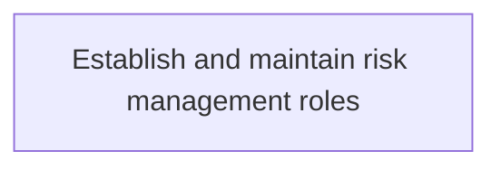
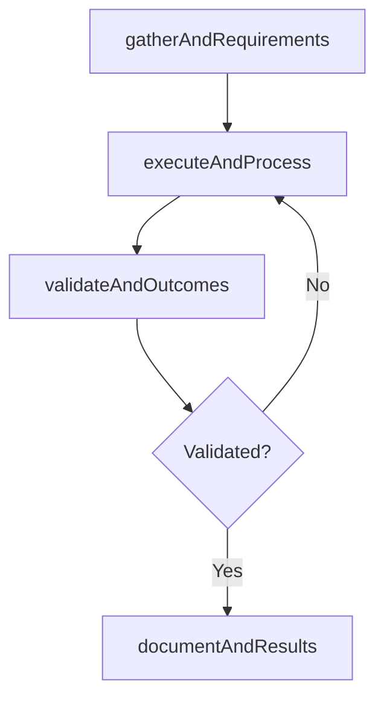

# Establish and maintain risk management roles

> Business-as-Code definition for establish and maintain risk management roles. Models the process of determine and maintain roles that are specialized in each risk areas and coordinating all risk management activities for.

## Overview

Determine and maintain roles that are specialized in each risk areas and coordinating all risk management activities for IT function with due escalation structure.

## Process Hierarchy



## GraphDL

```yaml
establish:
  object: And Maintain Risk Management Roles
  actor: IdentityAccessManager
  result: EstablishAndMaintainRiskManagementRoles
```

## Actions

| Action | Description |
|--------|-------------|
| gatherAndRequirements | Collect requirements and inputs for establish and maintain risk management roles |
| executeAndProcess | Perform the core activities of establish and maintain risk management roles |
| validateAndOutcomes | Verify that outcomes meet defined criteria and standards |
| documentAndResults | Record findings and results for stakeholder review |

## Events

| Event | Description |
|-------|-------------|
| andRequirementsGathered | Requirements for establish and maintain risk management roles collected |
| andProcessExecuted | Core activities of establish and maintain risk management roles completed |
| andOutcomesValidated | Outcomes verified against defined criteria |
| andResultsDocumented | Results recorded and distributed to stakeholders |

## Searches

| Search | Description |
|--------|-------------|
| getAndStatus | Retrieve current status of establish and maintain risk management roles |
| findAndRecords | List records related to establish and maintain risk management roles by date or status |
| getAndReport | Retrieve summary report for establish and maintain risk management roles |

## Process Flow



## RACI Matrix

| Activity | Responsible | Accountable | Consulted | Informed |
|----------|-------------|-------------|-----------|----------|
| gatherAndRequirements | IdentityAccessManager | ITRiskAnalyst | BusinessUnitLeaders | CIO |
| executeAndProcess | IdentityAccessManager | ITRiskAnalyst | ITOperations | ITServiceManager |
| validateAndOutcomes | IdentityAccessManager | ITRiskAnalyst | QualityAssurance | ITServiceManager |

## Related Processes

| Process | Relationship |
|---------|-------------|
| 8.3.1 Parent process | Parent - provides context and governance |
| 8.3.1.6 Sibling activity | Parallel - complementary activity in the same process |

## Related Departments

| Department | Role |
|-----------|------|
| IT Risk and Compliance | Manages risk assessment and compliance |
| IT Security | Implements security controls and monitoring |
| Legal | Advises on regulatory requirements |

## Related Occupations

| Occupation | Involvement |
|-----------|-------------|
| IT Risk Analyst | Assesses and monitors IT risks |
| IT Compliance Analyst | Evaluates regulatory compliance |

## KPIs

| KPI | Description | Unit |
|-----|-------------|------|
| Completion Rate | Percentage of establish and maintain risk management roles activities completed on schedule | % |
| Quality Score | Quality assessment score for establish and maintain risk management roles outputs | Score (1-10) |
| Cycle Time | Average time to complete establish and maintain risk management roles | Days |

## Usage

```typescript
import { establishAndMaintainRiskManagementRoles } from '@headlessly/establish-and-maintain-risk-management-roles'

const process = establishAndMaintainRiskManagementRoles()

// Execute the core process
const result = await process.executeAndProcess({
  scope: 'department',
  priority: 'high'
})

// Validate outcomes
const validation = await process.validateAndOutcomes({
  criteria: 'standard',
  period: 'Q4-2025'
})
```
