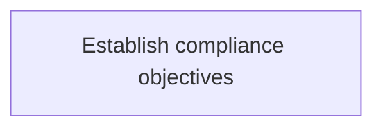
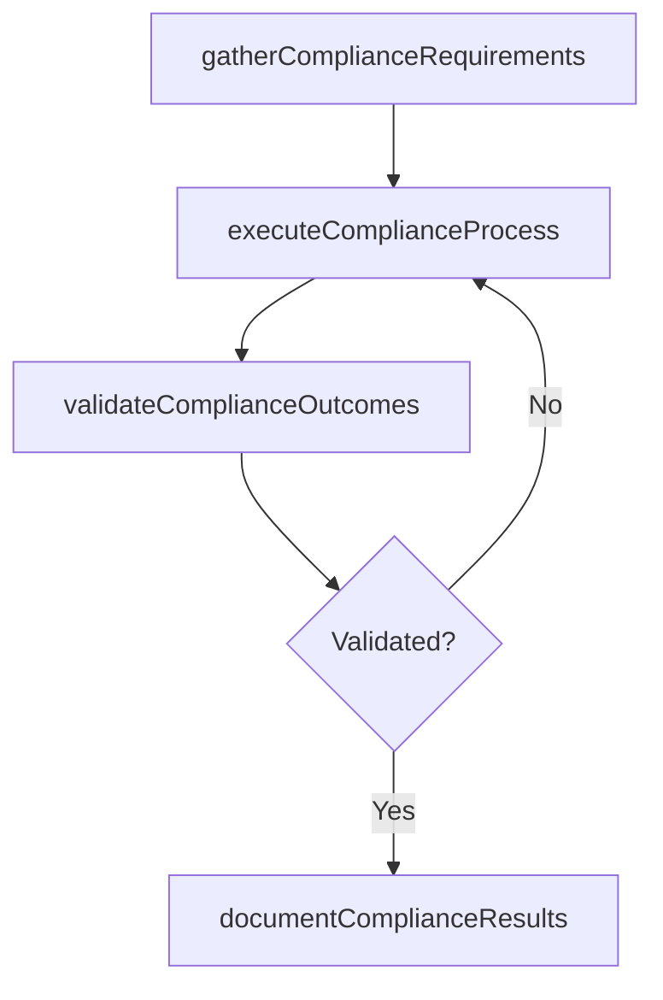

# Establish compliance objectives

> Business-as-Code definition for establish compliance objectives. Models the process of establishing compliance objectives which ensures that the organization has systems of internal controls that adequately .

## Overview

Establishing compliance objectives which ensures that the organization has systems of internal controls that adequately measure and manage IT risk.

## Process Hierarchy



## GraphDL

```yaml
establish:
  object: Compliance Objectives
  actor: ITComplianceAnalyst
  result: EstablishComplianceObjectives
```

## Actions

| Action | Description |
|--------|-------------|
| gatherComplianceRequirements | Collect requirements and inputs for establish compliance objectives |
| executeComplianceProcess | Perform the core activities of establish compliance objectives |
| validateComplianceOutcomes | Verify that outcomes meet defined criteria and standards |
| documentComplianceResults | Record findings and results for stakeholder review |

## Events

| Event | Description |
|-------|-------------|
| complianceRequirementsGathered | Requirements for establish compliance objectives collected |
| complianceProcessExecuted | Core activities of establish compliance objectives completed |
| complianceOutcomesValidated | Outcomes verified against defined criteria |
| complianceResultsDocumented | Results recorded and distributed to stakeholders |

## Searches

| Search | Description |
|--------|-------------|
| getComplianceStatus | Retrieve current status of establish compliance objectives |
| findComplianceRecords | List records related to establish compliance objectives by date or status |
| getComplianceReport | Retrieve summary report for establish compliance objectives |

## Process Flow



## RACI Matrix

| Activity | Responsible | Accountable | Consulted | Informed |
|----------|-------------|-------------|-----------|----------|
| gatherComplianceRequirements | ITComplianceAnalyst | ITSecurityManager | BusinessUnitLeaders | CIO |
| executeComplianceProcess | ITComplianceAnalyst | ITSecurityManager | ITOperations | ITServiceManager |
| validateComplianceOutcomes | ITComplianceAnalyst | ITSecurityManager | QualityAssurance | ITServiceManager |

## Related Processes

| Process | Relationship |
|---------|-------------|
| 8.3.1 Parent process | Parent - provides context and governance |
| 8.3.1.7 Sibling activity | Parallel - complementary activity in the same process |

## Related Departments

| Department | Role |
|-----------|------|
| IT Risk and Compliance | Manages risk assessment and compliance |
| IT Security | Implements security controls and monitoring |
| Legal | Advises on regulatory requirements |

## Related Occupations

| Occupation | Involvement |
|-----------|-------------|
| IT Risk Analyst | Assesses and monitors IT risks |
| IT Compliance Analyst | Evaluates regulatory compliance |

## KPIs

| KPI | Description | Unit |
|-----|-------------|------|
| Completion Rate | Percentage of establish compliance objectives activities completed on schedule | % |
| Quality Score | Quality assessment score for establish compliance objectives outputs | Score (1-10) |
| Cycle Time | Average time to complete establish compliance objectives | Days |

## Usage

```typescript
import { establishComplianceObjectives } from '@headlessly/establish-compliance-objectives'

const process = establishComplianceObjectives()

// Execute the core process
const result = await process.executeComplianceProcess({
  scope: 'department',
  priority: 'high'
})

// Validate outcomes
const validation = await process.validateComplianceOutcomes({
  criteria: 'standard',
  period: 'Q4-2025'
})
```
