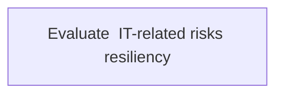
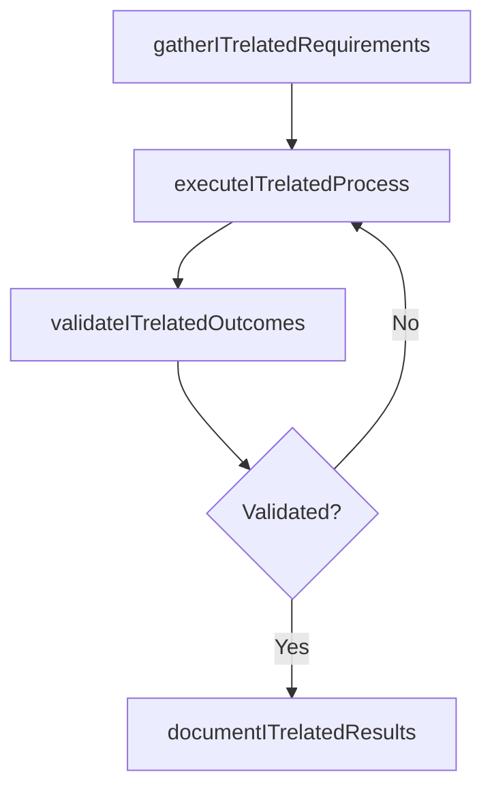

# Evaluate  IT-related risks resiliency

> Business-as-Code definition for evaluate  it-related risks resiliency. Models the process of assess it-related risk resilience strategies to ensure that the organization effectively manages its risk.

## Overview

Assess IT-related risk resilience strategies to ensure that the organization effectively manages its risk.

## Process Hierarchy



## GraphDL

```yaml
evaluate:
  object: IT-related Risks Resiliency
  actor: ITSecurityManager
  result: EvaluateItrelatedRisksResiliency
```

## Actions

| Action | Description |
|--------|-------------|
| gatherITrelatedRequirements | Collect requirements and inputs for evaluate  it-related risks resiliency |
| executeITrelatedProcess | Perform the core activities of evaluate  it-related risks resiliency |
| validateITrelatedOutcomes | Verify that outcomes meet defined criteria and standards |
| documentITrelatedResults | Record findings and results for stakeholder review |

## Events

| Event | Description |
|-------|-------------|
| itrelatedRequirementsGathered | Requirements for evaluate  it-related risks resiliency collected |
| itrelatedProcessExecuted | Core activities of evaluate  it-related risks resiliency completed |
| itrelatedOutcomesValidated | Outcomes verified against defined criteria |
| itrelatedResultsDocumented | Results recorded and distributed to stakeholders |

## Searches

| Search | Description |
|--------|-------------|
| getITrelatedStatus | Retrieve current status of evaluate  it-related risks resiliency |
| findITrelatedRecords | List records related to evaluate  it-related risks resiliency by date or status |
| getITrelatedReport | Retrieve summary report for evaluate  it-related risks resiliency |

## Process Flow



## RACI Matrix

| Activity | Responsible | Accountable | Consulted | Informed |
|----------|-------------|-------------|-----------|----------|
| gatherITrelatedRequirements | ITSecurityManager | IdentityAccessManager | BusinessUnitLeaders | CIO |
| executeITrelatedProcess | ITSecurityManager | IdentityAccessManager | ITOperations | ITServiceManager |
| validateITrelatedOutcomes | ITSecurityManager | IdentityAccessManager | QualityAssurance | ITServiceManager |

## Related Processes

| Process | Relationship |
|---------|-------------|
| 8.3.1 Parent process | Parent - provides context and governance |
| 8.3.1.10 Sibling activity | Parallel - complementary activity in the same process |

## Related Departments

| Department | Role |
|-----------|------|
| IT Risk and Compliance | Manages risk assessment and compliance |
| IT Security | Implements security controls and monitoring |
| Legal | Advises on regulatory requirements |

## Related Occupations

| Occupation | Involvement |
|-----------|-------------|
| IT Risk Analyst | Assesses and monitors IT risks |
| IT Compliance Analyst | Evaluates regulatory compliance |

## KPIs

| KPI | Description | Unit |
|-----|-------------|------|
| Completion Rate | Percentage of evaluate  it-related risks resiliency activities completed on schedule | % |
| Quality Score | Quality assessment score for evaluate  it-related risks resiliency outputs | Score (1-10) |
| Cycle Time | Average time to complete evaluate  it-related risks resiliency | Days |

## Usage

```typescript
import { evaluateItrelatedRisksResiliency } from '@headlessly/evaluate-itrelated-risks-resiliency'

const process = evaluateItrelatedRisksResiliency()

// Execute the core process
const result = await process.executeITrelatedProcess({
  scope: 'department',
  priority: 'high'
})

// Validate outcomes
const validation = await process.validateITrelatedOutcomes({
  criteria: 'standard',
  period: 'Q4-2025'
})
```
