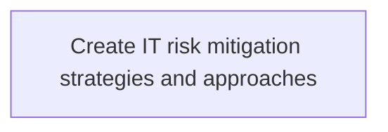
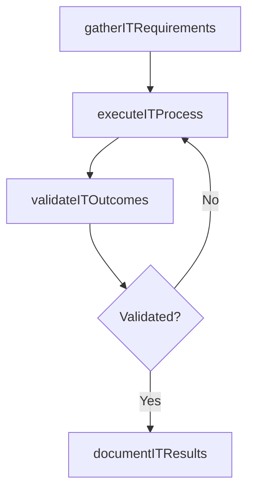

# Create IT risk mitigation strategies and approaches

> Business-as-Code definition for create it risk mitigation strategies and approaches. Models the process of developing activities to improve performance opportunities and lessen threats in it. evolve strategies and policies to a.

## Overview

Developing activities to improve performance opportunities and lessen threats in IT. Evolve strategies and policies to attain organizational objectives.

## Process Hierarchy



## GraphDL

```yaml
create:
  object: IT Risk Mitigation Strategies And Approaches
  actor: IdentityAccessManager
  result: CreateItRiskMitigationStrategiesAndApproaches
```

## Actions

| Action | Description |
|--------|-------------|
| gatherITRequirements | Collect requirements and inputs for create it risk mitigation strategies and approaches |
| executeITProcess | Perform the core activities of create it risk mitigation strategies and approaches |
| validateITOutcomes | Verify that outcomes meet defined criteria and standards |
| documentITResults | Record findings and results for stakeholder review |

## Events

| Event | Description |
|-------|-------------|
| itRequirementsGathered | Requirements for create it risk mitigation strategies and approaches collected |
| itProcessExecuted | Core activities of create it risk mitigation strategies and approaches completed |
| itOutcomesValidated | Outcomes verified against defined criteria |
| itResultsDocumented | Results recorded and distributed to stakeholders |

## Searches

| Search | Description |
|--------|-------------|
| getITStatus | Retrieve current status of create it risk mitigation strategies and approaches |
| findITRecords | List records related to create it risk mitigation strategies and approaches by date or status |
| getITReport | Retrieve summary report for create it risk mitigation strategies and approaches |

## Process Flow



## RACI Matrix

| Activity | Responsible | Accountable | Consulted | Informed |
|----------|-------------|-------------|-----------|----------|
| gatherITRequirements | IdentityAccessManager | ITRiskAnalyst | BusinessUnitLeaders | CIO |
| executeITProcess | IdentityAccessManager | ITRiskAnalyst | ITOperations | ITServiceManager |
| validateITOutcomes | IdentityAccessManager | ITRiskAnalyst | QualityAssurance | ITServiceManager |

## Related Processes

| Process | Relationship |
|---------|-------------|
| 8.3.1 Parent process | Parent - provides context and governance |
| 8.3.1.11 Sibling activity | Parallel - complementary activity in the same process |

## Related Departments

| Department | Role |
|-----------|------|
| IT Risk and Compliance | Manages risk assessment and compliance |
| IT Security | Implements security controls and monitoring |
| Legal | Advises on regulatory requirements |

## Related Occupations

| Occupation | Involvement |
|-----------|-------------|
| IT Risk Analyst | Assesses and monitors IT risks |
| IT Compliance Analyst | Evaluates regulatory compliance |

## KPIs

| KPI | Description | Unit |
|-----|-------------|------|
| Completion Rate | Percentage of create it risk mitigation strategies and approaches activities completed on schedule | % |
| Quality Score | Quality assessment score for create it risk mitigation strategies and approaches outputs | Score (1-10) |
| Cycle Time | Average time to complete create it risk mitigation strategies and approaches | Days |

## Usage

```typescript
import { createItRiskMitigationStrategiesAndApproaches } from '@headlessly/create-it-risk-mitigation-strategies-and-approaches'

const process = createItRiskMitigationStrategiesAndApproaches()

// Execute the core process
const result = await process.executeITProcess({
  scope: 'department',
  priority: 'high'
})

// Validate outcomes
const validation = await process.validateITOutcomes({
  criteria: 'standard',
  period: 'Q4-2025'
})
```
