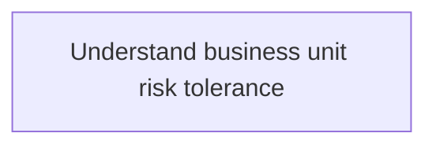
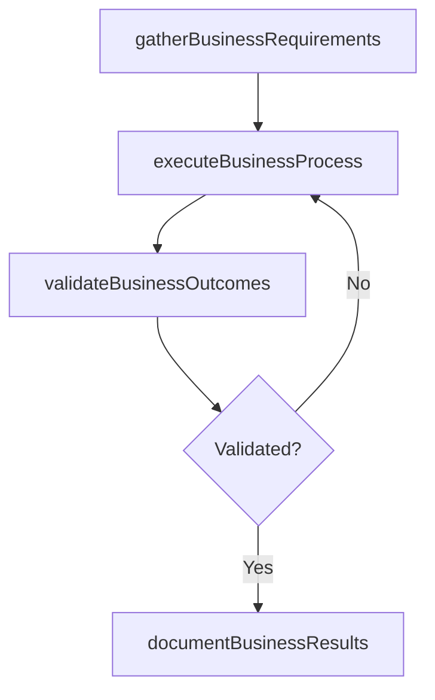

# Understand business unit risk tolerance

> Business-as-Code definition for understand business unit risk tolerance. Models the process of understand the risk tolerance levels of individual business units, given risk-return trade-offs for one or more anticipa.

## Overview

Understand the risk tolerance levels of individual business units, given risk-return trade-offs for one or more anticipated and predictable consequences.

## Process Hierarchy



## GraphDL

```yaml
understand:
  object: Business Unit Risk Tolerance
  actor: ITComplianceAnalyst
  result: UnderstandBusinessUnitRiskTolerance
```

## Actions

| Action | Description |
|--------|-------------|
| gatherBusinessRequirements | Collect requirements and inputs for understand business unit risk tolerance |
| executeBusinessProcess | Perform the core activities of understand business unit risk tolerance |
| validateBusinessOutcomes | Verify that outcomes meet defined criteria and standards |
| documentBusinessResults | Record findings and results for stakeholder review |

## Events

| Event | Description |
|-------|-------------|
| businessRequirementsGathered | Requirements for understand business unit risk tolerance collected |
| businessProcessExecuted | Core activities of understand business unit risk tolerance completed |
| businessOutcomesValidated | Outcomes verified against defined criteria |
| businessResultsDocumented | Results recorded and distributed to stakeholders |

## Searches

| Search | Description |
|--------|-------------|
| getBusinessStatus | Retrieve current status of understand business unit risk tolerance |
| findBusinessRecords | List records related to understand business unit risk tolerance by date or status |
| getBusinessReport | Retrieve summary report for understand business unit risk tolerance |

## Process Flow



## RACI Matrix

| Activity | Responsible | Accountable | Consulted | Informed |
|----------|-------------|-------------|-----------|----------|
| gatherBusinessRequirements | ITComplianceAnalyst | ITSecurityManager | BusinessUnitLeaders | CIO |
| executeBusinessProcess | ITComplianceAnalyst | ITSecurityManager | ITOperations | ITServiceManager |
| validateBusinessOutcomes | ITComplianceAnalyst | ITSecurityManager | QualityAssurance | ITServiceManager |

## Related Processes

| Process | Relationship |
|---------|-------------|
| 8.3.1 Parent process | Parent - provides context and governance |
| 8.3.1.3 Sibling activity | Parallel - complementary activity in the same process |

## Related Departments

| Department | Role |
|-----------|------|
| IT Risk and Compliance | Manages risk assessment and compliance |
| IT Security | Implements security controls and monitoring |
| Legal | Advises on regulatory requirements |

## Related Occupations

| Occupation | Involvement |
|-----------|-------------|
| IT Risk Analyst | Assesses and monitors IT risks |
| IT Compliance Analyst | Evaluates regulatory compliance |

## KPIs

| KPI | Description | Unit |
|-----|-------------|------|
| Completion Rate | Percentage of understand business unit risk tolerance activities completed on schedule | % |
| Quality Score | Quality assessment score for understand business unit risk tolerance outputs | Score (1-10) |
| Cycle Time | Average time to complete understand business unit risk tolerance | Days |

## Usage

```typescript
import { understandBusinessUnitRiskTolerance } from '@headlessly/understand-business-unit-risk-tolerance'

const process = understandBusinessUnitRiskTolerance()

// Execute the core process
const result = await process.executeBusinessProcess({
  scope: 'department',
  priority: 'high'
})

// Validate outcomes
const validation = await process.validateBusinessOutcomes({
  criteria: 'standard',
  period: 'Q4-2025'
})
```
