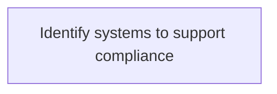
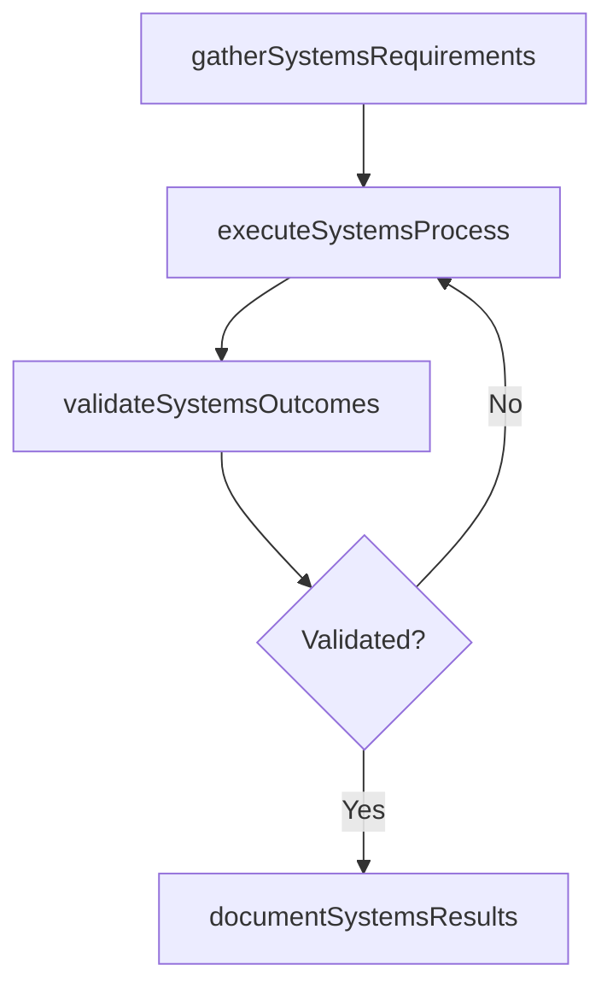

# Identify systems to support compliance

> Business-as-Code definition for identify systems to support compliance. Models the process of identifying and adopting information technology solutions to support changing regulatory compliance. safeguard complianc.

## Overview

Identifying and adopting information technology solutions to support changing regulatory compliance. Safeguard compliance and manage risk by outlining the risk policies and procedures.

## Process Hierarchy



## GraphDL

```yaml
identify:
  object: Systems To Support Compliance
  actor: IdentityAccessManager
  result: IdentifySystemsToSupportCompliance
```

## Actions

| Action | Description |
|--------|-------------|
| gatherSystemsRequirements | Collect requirements and inputs for identify systems to support compliance |
| executeSystemsProcess | Perform the core activities of identify systems to support compliance |
| validateSystemsOutcomes | Verify that outcomes meet defined criteria and standards |
| documentSystemsResults | Record findings and results for stakeholder review |

## Events

| Event | Description |
|-------|-------------|
| systemsRequirementsGathered | Requirements for identify systems to support compliance collected |
| systemsProcessExecuted | Core activities of identify systems to support compliance completed |
| systemsOutcomesValidated | Outcomes verified against defined criteria |
| systemsResultsDocumented | Results recorded and distributed to stakeholders |

## Searches

| Search | Description |
|--------|-------------|
| getSystemsStatus | Retrieve current status of identify systems to support compliance |
| findSystemsRecords | List records related to identify systems to support compliance by date or status |
| getSystemsReport | Retrieve summary report for identify systems to support compliance |

## Process Flow



## RACI Matrix

| Activity | Responsible | Accountable | Consulted | Informed |
|----------|-------------|-------------|-----------|----------|
| gatherSystemsRequirements | IdentityAccessManager | ITRiskAnalyst | BusinessUnitLeaders | CIO |
| executeSystemsProcess | IdentityAccessManager | ITRiskAnalyst | ITOperations | ITServiceManager |
| validateSystemsOutcomes | IdentityAccessManager | ITRiskAnalyst | QualityAssurance | ITServiceManager |

## Related Processes

| Process | Relationship |
|---------|-------------|
| 8.3.1 Parent process | Parent - provides context and governance |
| 8.3.1.8 Sibling activity | Parallel - complementary activity in the same process |

## Related Departments

| Department | Role |
|-----------|------|
| IT Risk and Compliance | Manages risk assessment and compliance |
| IT Security | Implements security controls and monitoring |
| Legal | Advises on regulatory requirements |

## Related Occupations

| Occupation | Involvement |
|-----------|-------------|
| IT Risk Analyst | Assesses and monitors IT risks |
| IT Compliance Analyst | Evaluates regulatory compliance |

## KPIs

| KPI | Description | Unit |
|-----|-------------|------|
| Completion Rate | Percentage of identify systems to support compliance activities completed on schedule | % |
| Quality Score | Quality assessment score for identify systems to support compliance outputs | Score (1-10) |
| Cycle Time | Average time to complete identify systems to support compliance | Days |

## Usage

```typescript
import { identifySystemsToSupportCompliance } from '@headlessly/identify-systems-to-support-compliance'

const process = identifySystemsToSupportCompliance()

// Execute the core process
const result = await process.executeSystemsProcess({
  scope: 'department',
  priority: 'high'
})

// Validate outcomes
const validation = await process.validateSystemsOutcomes({
  criteria: 'standard',
  period: 'Q4-2025'
})
```
