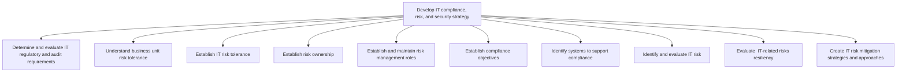
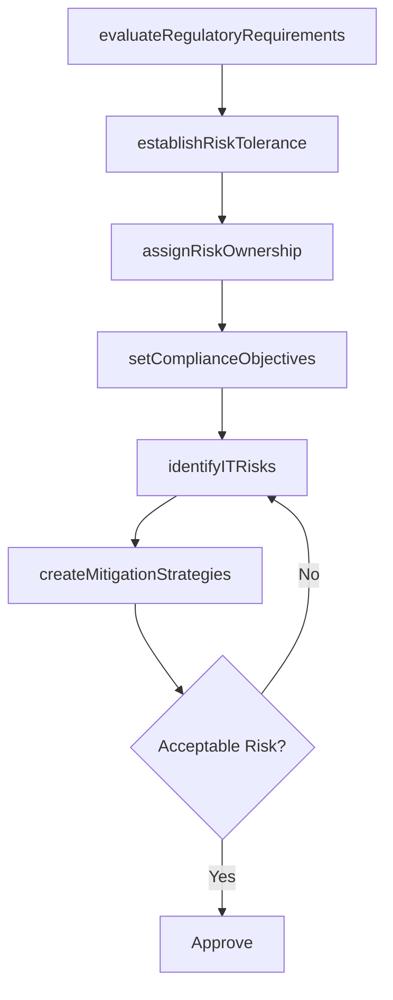

# Develop IT compliance, risk, and security strategy

> Business-as-Code definition for IT compliance, risk, and security strategy development. Models the process of evaluating regulatory requirements, establishing risk tolerance, defining compliance objectives, identifying risks, and creating mitigation strategies.

## Overview

Ensuring that the organization effectively manages risk. Develop rules and standards for robust IT operations, manage risk, and adopt measures to protect integrity, confidentiality, and security of IT assets.

## Process Hierarchy



## GraphDL

```yaml
develop:
  object: IT Compliance, Risk, And Security Strategy
  actor: ITRiskManager
  result: ComplianceRiskSecurityStrategy
```

## Actions

| Action | Description |
|--------|-------------|
| evaluateRegulatoryRequirements | Assess IT regulatory and audit compliance requirements |
| establishRiskTolerance | Define acceptable risk thresholds for IT operations |
| assignRiskOwnership | Designate risk owners and management roles |
| setComplianceObjectives | Establish compliance goals aligned to regulatory mandates |
| identifyITRisks | Catalog and evaluate IT risks across the technology landscape |
| createMitigationStrategies | Develop risk mitigation plans and approaches |

## Events

| Event | Description |
|-------|-------------|
| regulatoryRequirementsEvaluated | IT regulatory and audit requirements assessed |
| riskToleranceEstablished | IT risk tolerance thresholds defined and approved |
| riskOwnershipAssigned | Risk owners and management roles designated |
| complianceObjectivesSet | Compliance objectives established and communicated |
| itRisksIdentified | IT risks cataloged and assessed for impact |
| mitigationStrategiesCreated | Risk mitigation strategies documented and approved |

## Searches

| Search | Description |
|--------|-------------|
| getRiskRegister | Retrieve the IT risk register with severity and status |
| findComplianceRequirements | List compliance requirements by regulation or domain |
| getRiskTolerance | Get risk tolerance thresholds by risk category |
| findMitigationPlans | List risk mitigation plans by status or priority |

## Process Flow



## RACI Matrix

| Activity | Responsible | Accountable | Consulted | Informed |
|----------|-------------|-------------|-----------|----------|
| evaluateRegulatoryRequirements | ITComplianceAnalyst | ITRiskManager | Legal | CISO |
| establishRiskTolerance | ITRiskManager | CISO | BusinessUnitLeaders | CIO |
| setComplianceObjectives | ITComplianceAnalyst | ITRiskManager | InternalAudit | Legal |
| identifyITRisks | ITRiskAnalyst | ITRiskManager | ITOperations | CISO |
| createMitigationStrategies | ITRiskManager | CISO | EnterpriseArchitect | CIO |

## Sub-Processes

| ID | Name | Description |
|----|------|-------------|
| 8.3.1.1 | Determine and evaluate IT regulatory and audit requirements | Determining and evaluating IT regulatory and audit requirements. Train employees on regulatory and a |
| 8.3.1.2 | Understand business unit risk tolerance | Understand the risk tolerance levels of individual business units, given risk-return trade-offs for  |
| 8.3.1.3 | Establish IT risk tolerance | Determine the specific maximum risk to take in quantitative terms for each relevant risk sub-categor |
| 8.3.1.4 | Establish risk ownership | Establish an individual or a group who is ultimately accountable for ensuring that IT risks are mana |
| 8.3.1.5 | Establish and maintain risk management roles | Determine and maintain roles that are specialized in each risk areas and coordinating all risk manag |
| 8.3.1.6 | Establish compliance objectives | Establishing compliance objectives which ensures that the organization has systems of internal contr |
| 8.3.1.7 | Identify systems to support compliance | Identifying and adopting information technology solutions to support changing regulatory compliance. |
| 8.3.1.8 | Identify and evaluate IT risk | Developing a timely and continuous process to identify and evaluate activities that might hinder IT  |
| 8.3.1.9 | Evaluate  IT-related risks resiliency | Assess IT-related risk resilience strategies to ensure that the organization effectively manages its |
| 8.3.1.10 | Create IT risk mitigation strategies and approaches | Developing activities to improve performance opportunities and lessen threats in IT. Evolve strategi |

## Related Processes

| Process | Relationship |
|---------|-------------|
| 8.3.2 Develop IT resilience strategy | Downstream - risk strategy informs resilience planning |
| 8.3.3 Control IT risk, compliance, and security | Downstream - strategy drives operational risk controls |
| 11.0 Manage Business Risk | Parallel - IT risk integrates with enterprise risk management |

## Related Departments

| Department | Role |
|-----------|------|
| IT Risk Management | Primary owner of IT risk and compliance strategy |
| Legal and Compliance | Advises on regulatory requirements and obligations |
| Internal Audit | Provides independent assurance of risk controls |
| IT Security | Implements security measures aligned to risk strategy |
| Business Units | Provides business context for risk tolerance decisions |

## Related Occupations

| Occupation | Involvement |
|-----------|-------------|
| IT Risk Manager | Leads risk strategy development and mitigation planning |
| IT Compliance Analyst | Evaluates regulatory requirements and compliance gaps |
| IT Security Architect | Designs security controls for risk mitigation |

## KPIs

| KPI | Description | Unit |
|-----|-------------|------|
| Risk Coverage Rate | Percentage of identified IT risks with mitigation plans | % |
| Compliance Gap Count | Number of open compliance gaps across regulations | Count |
| Risk Assessment Cadence | Frequency of comprehensive IT risk assessments | Per Year |
| Regulatory Readiness Score | Preparedness score for upcoming regulatory audits | Score (1-10) |

## Usage

```typescript
import { developITComplianceRiskAndSecurityStrategy } from '@headlessly/develop-it-compliance-risk-and-security-strategy'

const riskStrategy = developITComplianceRiskAndSecurityStrategy()

// Evaluate regulatory requirements
const requirements = await riskStrategy.evaluateRegulatoryRequirements({
  regulations: ['SOX', 'GDPR', 'HIPAA', 'PCI-DSS'],
  scope: 'enterprise'
})

// Create mitigation strategies for high-risk items
const mitigations = await riskStrategy.createMitigationStrategies({
  riskSeverity: 'high',
  budgetCeiling: 500000,
  timeline: '6-months'
})
```
