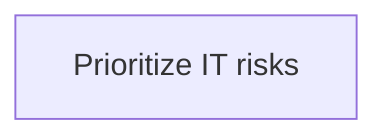
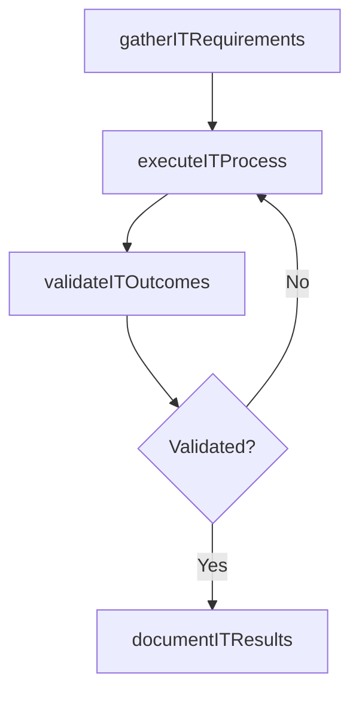

# Prioritize IT risks

> Business-as-Code definition for prioritize it risks. Models the process of prioritize potential it risks based on business need to ensure overall it stability.

## Overview

Prioritize potential IT risks based on business need to ensure overall IT stability.

## Process Hierarchy



## GraphDL

```yaml
prioritize:
  object: IT Risks
  actor: ITRiskAnalyst
  result: PrioritizeItRisks
```

## Actions

| Action | Description |
|--------|-------------|
| gatherITRequirements | Collect requirements and inputs for prioritize it risks |
| executeITProcess | Perform the core activities of prioritize it risks |
| validateITOutcomes | Verify that outcomes meet defined criteria and standards |
| documentITResults | Record findings and results for stakeholder review |

## Events

| Event | Description |
|-------|-------------|
| itRequirementsGathered | Requirements for prioritize it risks collected |
| itProcessExecuted | Core activities of prioritize it risks completed |
| itOutcomesValidated | Outcomes verified against defined criteria |
| itResultsDocumented | Results recorded and distributed to stakeholders |

## Searches

| Search | Description |
|--------|-------------|
| getITStatus | Retrieve current status of prioritize it risks |
| findITRecords | List records related to prioritize it risks by date or status |
| getITReport | Retrieve summary report for prioritize it risks |

## Process Flow



## RACI Matrix

| Activity | Responsible | Accountable | Consulted | Informed |
|----------|-------------|-------------|-----------|----------|
| gatherITRequirements | ITRiskAnalyst | ITComplianceAnalyst | BusinessUnitLeaders | CIO |
| executeITProcess | ITRiskAnalyst | ITComplianceAnalyst | ITOperations | ITServiceManager |
| validateITOutcomes | ITRiskAnalyst | ITComplianceAnalyst | QualityAssurance | ITServiceManager |

## Related Processes

| Process | Relationship |
|---------|-------------|
| 8.3.2 Parent process | Parent - provides context and governance |
| 8.3.2.4 Sibling activity | Parallel - complementary activity in the same process |

## Related Departments

| Department | Role |
|-----------|------|
| IT Risk and Compliance | Manages risk assessment and compliance |
| IT Security | Implements security controls and monitoring |
| Legal | Advises on regulatory requirements |

## Related Occupations

| Occupation | Involvement |
|-----------|-------------|
| IT Risk Analyst | Assesses and monitors IT risks |
| IT Compliance Analyst | Evaluates regulatory compliance |

## KPIs

| KPI | Description | Unit |
|-----|-------------|------|
| Completion Rate | Percentage of prioritize it risks activities completed on schedule | % |
| Quality Score | Quality assessment score for prioritize it risks outputs | Score (1-10) |
| Cycle Time | Average time to complete prioritize it risks | Days |

## Usage

```typescript
import { prioritizeItRisks } from '@headlessly/prioritize-it-risks'

const process = prioritizeItRisks()

// Execute the core process
const result = await process.executeITProcess({
  scope: 'department',
  priority: 'high'
})

// Validate outcomes
const validation = await process.validateITOutcomes({
  criteria: 'standard',
  period: 'Q4-2025'
})
```
