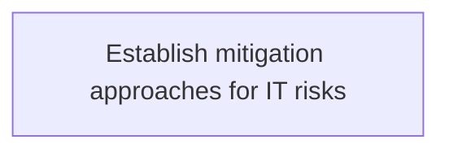
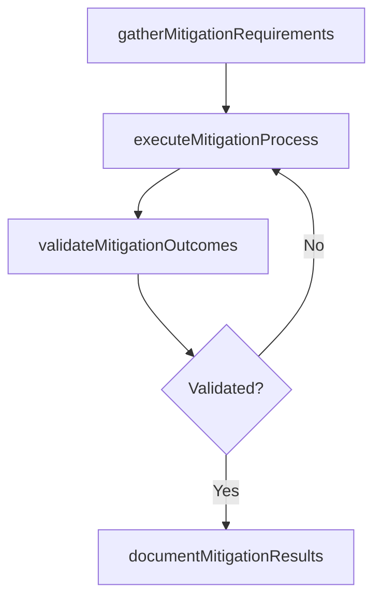

# Establish mitigation approaches for IT risks

> Business-as-Code definition for establish mitigation approaches for it risks. Models the process of establishing activities to improve opportunities and lessen threats for it.

## Overview

Establishing activities to improve opportunities and lessen threats for IT.

## Process Hierarchy



## GraphDL

```yaml
establish:
  object: Mitigation Approaches For IT Risks
  actor: IdentityAccessManager
  result: EstablishMitigationApproachesForItRisks
```

## Actions

| Action | Description |
|--------|-------------|
| gatherMitigationRequirements | Collect requirements and inputs for establish mitigation approaches for it risks |
| executeMitigationProcess | Perform the core activities of establish mitigation approaches for it risks |
| validateMitigationOutcomes | Verify that outcomes meet defined criteria and standards |
| documentMitigationResults | Record findings and results for stakeholder review |

## Events

| Event | Description |
|-------|-------------|
| mitigationRequirementsGathered | Requirements for establish mitigation approaches for it risks collected |
| mitigationProcessExecuted | Core activities of establish mitigation approaches for it risks completed |
| mitigationOutcomesValidated | Outcomes verified against defined criteria |
| mitigationResultsDocumented | Results recorded and distributed to stakeholders |

## Searches

| Search | Description |
|--------|-------------|
| getMitigationStatus | Retrieve current status of establish mitigation approaches for it risks |
| findMitigationRecords | List records related to establish mitigation approaches for it risks by date or status |
| getMitigationReport | Retrieve summary report for establish mitigation approaches for it risks |

## Process Flow



## RACI Matrix

| Activity | Responsible | Accountable | Consulted | Informed |
|----------|-------------|-------------|-----------|----------|
| gatherMitigationRequirements | IdentityAccessManager | ITRiskAnalyst | BusinessUnitLeaders | CIO |
| executeMitigationProcess | IdentityAccessManager | ITRiskAnalyst | ITOperations | ITServiceManager |
| validateMitigationOutcomes | IdentityAccessManager | ITRiskAnalyst | QualityAssurance | ITServiceManager |

## Related Processes

| Process | Relationship |
|---------|-------------|
| 8.3.2 Parent process | Parent - provides context and governance |
| 8.3.2.5 Sibling activity | Parallel - complementary activity in the same process |

## Related Departments

| Department | Role |
|-----------|------|
| IT Risk and Compliance | Manages risk assessment and compliance |
| IT Security | Implements security controls and monitoring |
| Legal | Advises on regulatory requirements |

## Related Occupations

| Occupation | Involvement |
|-----------|-------------|
| IT Risk Analyst | Assesses and monitors IT risks |
| IT Compliance Analyst | Evaluates regulatory compliance |

## KPIs

| KPI | Description | Unit |
|-----|-------------|------|
| Completion Rate | Percentage of establish mitigation approaches for it risks activities completed on schedule | % |
| Quality Score | Quality assessment score for establish mitigation approaches for it risks outputs | Score (1-10) |
| Cycle Time | Average time to complete establish mitigation approaches for it risks | Days |

## Usage

```typescript
import { establishMitigationApproachesForItRisks } from '@headlessly/establish-mitigation-approaches-for-it-risks'

const process = establishMitigationApproachesForItRisks()

// Execute the core process
const result = await process.executeMitigationProcess({
  scope: 'department',
  priority: 'high'
})

// Validate outcomes
const validation = await process.validateMitigationOutcomes({
  criteria: 'standard',
  period: 'Q4-2025'
})
```
