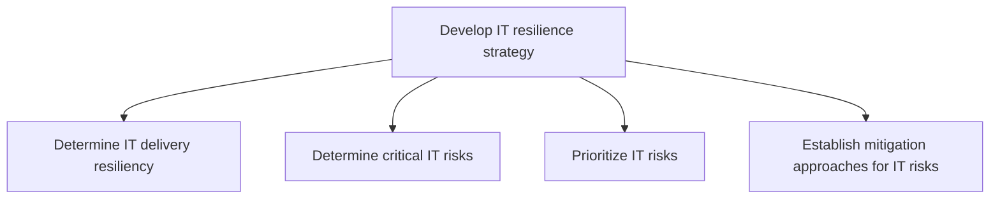
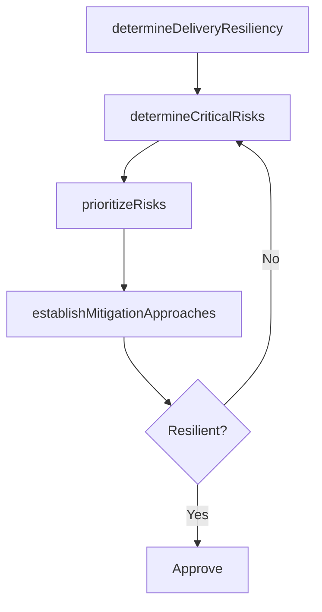

# Develop IT resilience strategy

> Business-as-Code definition for IT resilience strategy development. Models the process of determining IT delivery resiliency, identifying critical risks, prioritizing threats, and establishing mitigation approaches.

## Overview

Developing resilience strategies of IT across the organization so that prospective risks can be avoided.

## Process Hierarchy



## GraphDL

```yaml
develop:
  object: IT Resilience Strategy
  actor: ITResilienceArchitect
  result: ITResilienceStrategy
```

## Actions

| Action | Description |
|--------|-------------|
| determineDeliveryResiliency | Assess the resilience of IT service delivery processes |
| determineCriticalRisks | Identify risks that could disrupt critical IT objectives |
| prioritizeRisks | Rank IT risks by business impact and likelihood |
| establishMitigationApproaches | Design mitigation approaches for prioritized IT risks |

## Events

| Event | Description |
|-------|-------------|
| deliveryResiliencyDetermined | IT delivery resilience assessment completed |
| criticalRisksDetermined | Critical IT risks identified and documented |
| risksPrioritized | IT risks ranked and priority list approved |
| mitigationApproachesEstablished | Risk mitigation approaches designed and documented |

## Searches

| Search | Description |
|--------|-------------|
| getResilienceAssessment | Retrieve IT delivery resilience assessment results |
| findCriticalRisks | List critical IT risks by severity or domain |
| getMitigationApproaches | Get mitigation approaches for specific risk categories |

## Process Flow



## RACI Matrix

| Activity | Responsible | Accountable | Consulted | Informed |
|----------|-------------|-------------|-----------|----------|
| determineDeliveryResiliency | ITResilienceArchitect | CISO | ITOperations | CIO |
| determineCriticalRisks | ITRiskAnalyst | ITResilienceArchitect | BusinessUnitLeaders | CISO |
| prioritizeRisks | ITResilienceArchitect | CISO | ITRiskManager | CIO |
| establishMitigationApproaches | ITResilienceArchitect | CISO | EnterpriseArchitect | ITOperations |

## Sub-Processes

| ID | Name | Description |
|----|------|-------------|
| 8.3.2.1 | Determine IT delivery resiliency | Determining resilience strategies to ensure that IT effectively manages it's delivery process to mit |
| 8.3.2.2 | Determine critical IT risks | Determining risks that could disrupt objectives of IT. |
| 8.3.2.3 | Prioritize IT risks | Prioritize potential IT risks based on business need to ensure overall IT stability. |
| 8.3.2.4 | Establish mitigation approaches for IT risks | Establishing activities to improve opportunities and lessen threats for IT. |

## Related Processes

| Process | Relationship |
|---------|-------------|
| 8.3.1 Develop IT compliance, risk, and security strategy | Upstream - risk strategy informs resilience planning |
| 8.3.4 Plan and manage IT continuity | Downstream - resilience strategy drives continuity planning |
| 8.3.7 Develop and execute IT resilience and continuity operations | Downstream - strategy informs operational execution |

## Related Departments

| Department | Role |
|-----------|------|
| IT Risk Management | Leads resilience strategy development |
| IT Operations | Provides operational resilience context |
| Business Continuity | Integrates IT resilience with enterprise continuity |
| Enterprise Architecture | Advises on architectural resilience patterns |

## Related Occupations

| Occupation | Involvement |
|-----------|-------------|
| IT Resilience Architect | Primary executor of resilience strategy |
| IT Risk Analyst | Assesses and prioritizes IT risks |
| Business Continuity Manager | Aligns IT resilience with business continuity |

## KPIs

| KPI | Description | Unit |
|-----|-------------|------|
| Resilience Score | Composite resilience rating across critical IT systems | Score (1-10) |
| Critical Risk Coverage | Percentage of critical risks with mitigation approaches | % |
| Recovery Time Objective Compliance | Percentage of systems meeting defined RTO targets | % |

## Usage

```typescript
import { developITResilienceStrategy } from '@headlessly/develop-it-resilience-strategy'

const resilience = developITResilienceStrategy()

// Determine delivery resiliency
const assessment = await resilience.determineDeliveryResiliency({
  scope: 'tier-1-services',
  includeSupplyChain: true
})

// Establish mitigation approaches
const mitigations = await resilience.establishMitigationApproaches({
  riskLevel: 'critical',
  targetRTO: '4-hours',
  targetRPO: '1-hour'
})
```
