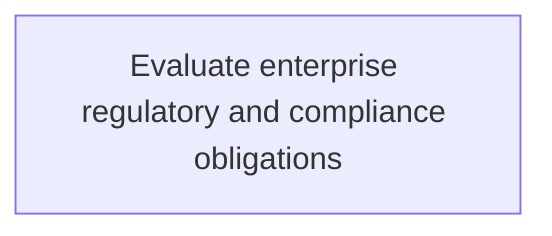
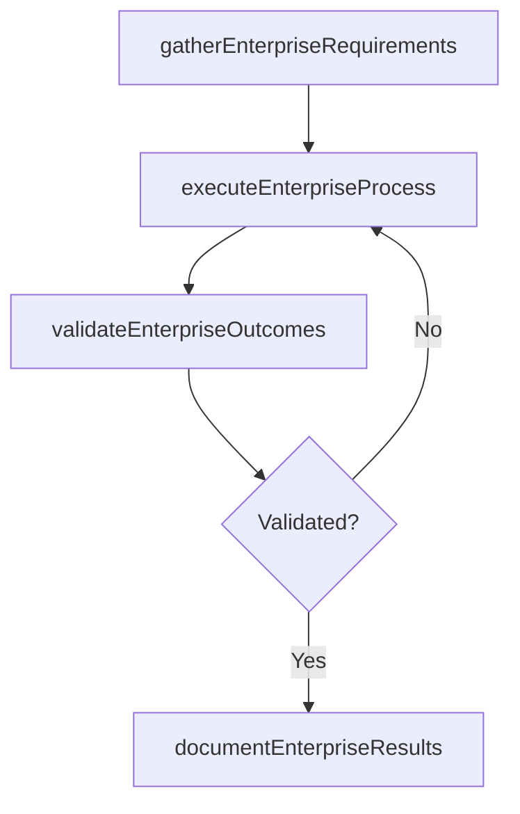

# Evaluate enterprise regulatory and compliance obligations

> Business-as-Code definition for evaluate enterprise regulatory and compliance obligations. Models the process of evaluation of dynamic, strategic, and integrated approach to manage regulatory requirements and compliance obligations.

## Overview

Evaluation of dynamic, strategic, and integrated approach to manage regulatory requirements and compliance obligations.

## Process Hierarchy



## GraphDL

```yaml
evaluate:
  object: Enterprise Regulatory And Compliance Obligations
  actor: IdentityAccessManager
  result: EvaluateEnterpriseRegulatoryAndComplianceObligations
```

## Actions

| Action | Description |
|--------|-------------|
| gatherEnterpriseRequirements | Collect requirements and inputs for evaluate enterprise regulatory and compliance obligations |
| executeEnterpriseProcess | Perform the core activities of evaluate enterprise regulatory and compliance obligations |
| validateEnterpriseOutcomes | Verify that outcomes meet defined criteria and standards |
| documentEnterpriseResults | Record findings and results for stakeholder review |

## Events

| Event | Description |
|-------|-------------|
| enterpriseRequirementsGathered | Requirements for evaluate enterprise regulatory and compliance obligations collected |
| enterpriseProcessExecuted | Core activities of evaluate enterprise regulatory and compliance obligations completed |
| enterpriseOutcomesValidated | Outcomes verified against defined criteria |
| enterpriseResultsDocumented | Results recorded and distributed to stakeholders |

## Searches

| Search | Description |
|--------|-------------|
| getEnterpriseStatus | Retrieve current status of evaluate enterprise regulatory and compliance obligations |
| findEnterpriseRecords | List records related to evaluate enterprise regulatory and compliance obligations by date or status |
| getEnterpriseReport | Retrieve summary report for evaluate enterprise regulatory and compliance obligations |

## Process Flow



## RACI Matrix

| Activity | Responsible | Accountable | Consulted | Informed |
|----------|-------------|-------------|-----------|----------|
| gatherEnterpriseRequirements | IdentityAccessManager | ITRiskAnalyst | BusinessUnitLeaders | CIO |
| executeEnterpriseProcess | IdentityAccessManager | ITRiskAnalyst | ITOperations | ITServiceManager |
| validateEnterpriseOutcomes | IdentityAccessManager | ITRiskAnalyst | QualityAssurance | ITServiceManager |

## Related Processes

| Process | Relationship |
|---------|-------------|
| 8.3.3 Parent process | Parent - provides context and governance |
| 8.3.3.2 Sibling activity | Parallel - complementary activity in the same process |

## Related Departments

| Department | Role |
|-----------|------|
| IT Risk and Compliance | Manages risk assessment and compliance |
| IT Security | Implements security controls and monitoring |
| Legal | Advises on regulatory requirements |

## Related Occupations

| Occupation | Involvement |
|-----------|-------------|
| IT Risk Analyst | Assesses and monitors IT risks |
| IT Compliance Analyst | Evaluates regulatory compliance |

## KPIs

| KPI | Description | Unit |
|-----|-------------|------|
| Completion Rate | Percentage of evaluate enterprise regulatory and compliance obligations activities completed on schedule | % |
| Quality Score | Quality assessment score for evaluate enterprise regulatory and compliance obligations outputs | Score (1-10) |
| Cycle Time | Average time to complete evaluate enterprise regulatory and compliance obligations | Days |

## Usage

```typescript
import { evaluateEnterpriseRegulatoryAndComplianceObligations } from '@headlessly/evaluate-enterprise-regulatory-and-compliance-obligations'

const process = evaluateEnterpriseRegulatoryAndComplianceObligations()

// Execute the core process
const result = await process.executeEnterpriseProcess({
  scope: 'department',
  priority: 'high'
})

// Validate outcomes
const validation = await process.validateEnterpriseOutcomes({
  criteria: 'standard',
  period: 'Q4-2025'
})
```
