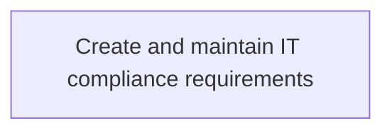
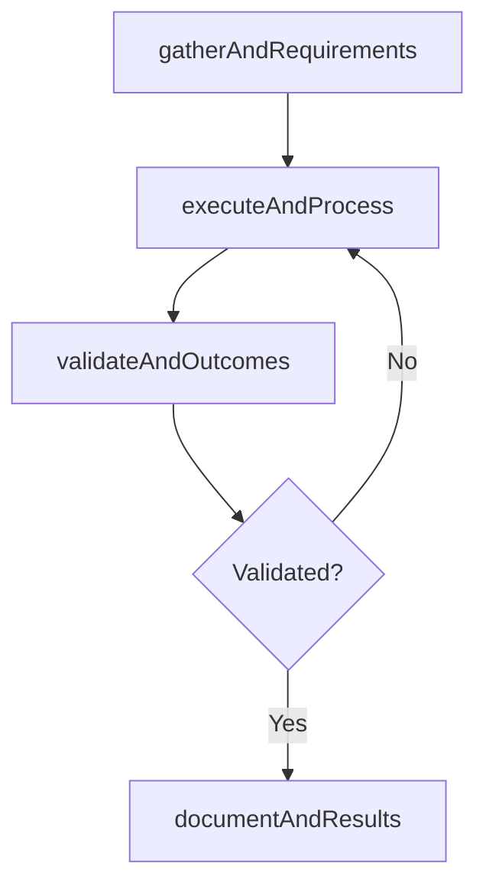

# Create and maintain IT compliance requirements

> Business-as-Code definition for create and maintain it compliance requirements. Models the process of develop and maintain it compliance standards. maintaining requirements set forth by such directives as grcp, pmi rmp, cg.

## Overview

Develop and maintain IT compliance standards. Maintaining requirements set forth by such directives as GRCP, PMI RMP, CGRC, CGEIT, CRMA.

## Process Hierarchy



## GraphDL

```yaml
create:
  object: And Maintain IT Compliance Requirements
  actor: ITComplianceAnalyst
  result: CreateAndMaintainItComplianceRequirements
```

## Actions

| Action | Description |
|--------|-------------|
| gatherAndRequirements | Collect requirements and inputs for create and maintain it compliance requirements |
| executeAndProcess | Perform the core activities of create and maintain it compliance requirements |
| validateAndOutcomes | Verify that outcomes meet defined criteria and standards |
| documentAndResults | Record findings and results for stakeholder review |

## Events

| Event | Description |
|-------|-------------|
| andRequirementsGathered | Requirements for create and maintain it compliance requirements collected |
| andProcessExecuted | Core activities of create and maintain it compliance requirements completed |
| andOutcomesValidated | Outcomes verified against defined criteria |
| andResultsDocumented | Results recorded and distributed to stakeholders |

## Searches

| Search | Description |
|--------|-------------|
| getAndStatus | Retrieve current status of create and maintain it compliance requirements |
| findAndRecords | List records related to create and maintain it compliance requirements by date or status |
| getAndReport | Retrieve summary report for create and maintain it compliance requirements |

## Process Flow



## RACI Matrix

| Activity | Responsible | Accountable | Consulted | Informed |
|----------|-------------|-------------|-----------|----------|
| gatherAndRequirements | ITComplianceAnalyst | ITSecurityManager | BusinessUnitLeaders | CIO |
| executeAndProcess | ITComplianceAnalyst | ITSecurityManager | ITOperations | ITServiceManager |
| validateAndOutcomes | ITComplianceAnalyst | ITSecurityManager | QualityAssurance | ITServiceManager |

## Related Processes

| Process | Relationship |
|---------|-------------|
| 8.3.3 Parent process | Parent - provides context and governance |
| 8.3.3.4 Sibling activity | Parallel - complementary activity in the same process |

## Related Departments

| Department | Role |
|-----------|------|
| IT Risk and Compliance | Manages risk assessment and compliance |
| IT Security | Implements security controls and monitoring |
| Legal | Advises on regulatory requirements |

## Related Occupations

| Occupation | Involvement |
|-----------|-------------|
| IT Risk Analyst | Assesses and monitors IT risks |
| IT Compliance Analyst | Evaluates regulatory compliance |

## KPIs

| KPI | Description | Unit |
|-----|-------------|------|
| Completion Rate | Percentage of create and maintain it compliance requirements activities completed on schedule | % |
| Quality Score | Quality assessment score for create and maintain it compliance requirements outputs | Score (1-10) |
| Cycle Time | Average time to complete create and maintain it compliance requirements | Days |

## Usage

```typescript
import { createAndMaintainItComplianceRequirements } from '@headlessly/create-and-maintain-it-compliance-requirements'

const process = createAndMaintainItComplianceRequirements()

// Execute the core process
const result = await process.executeAndProcess({
  scope: 'department',
  priority: 'high'
})

// Validate outcomes
const validation = await process.validateAndOutcomes({
  criteria: 'standard',
  period: 'Q4-2025'
})
```
