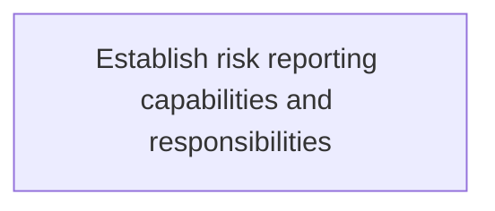
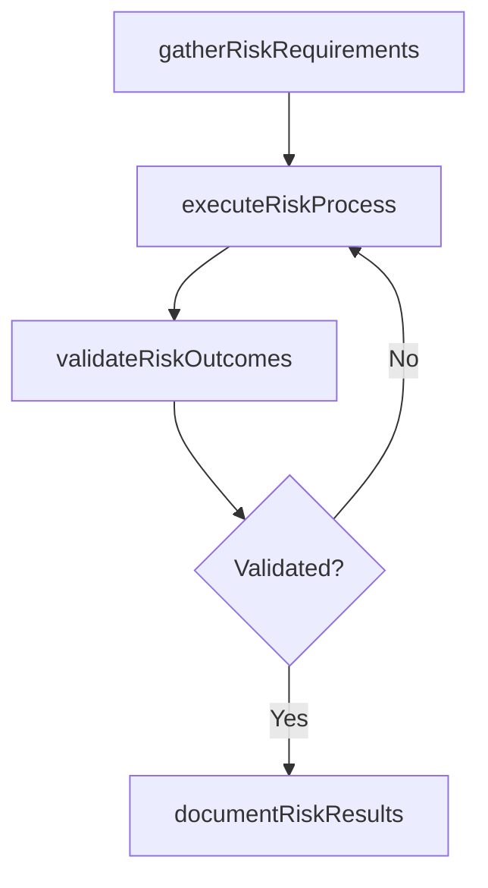

# Establish risk reporting capabilities and responsibilities

> Business-as-Code definition for establish risk reporting capabilities and responsibilities. Models the process of establishing processes to communicate it risk to the organization.

## Overview

Establishing processes to communicate IT risk to the organization.

## Process Hierarchy



## GraphDL

```yaml
establish:
  object: Risk Reporting Capabilities And Responsibilities
  actor: IdentityAccessManager
  result: EstablishRiskReportingCapabilitiesAndResponsibilities
```

## Actions

| Action | Description |
|--------|-------------|
| gatherRiskRequirements | Collect requirements and inputs for establish risk reporting capabilities and responsibilities |
| executeRiskProcess | Perform the core activities of establish risk reporting capabilities and responsibilities |
| validateRiskOutcomes | Verify that outcomes meet defined criteria and standards |
| documentRiskResults | Record findings and results for stakeholder review |

## Events

| Event | Description |
|-------|-------------|
| riskRequirementsGathered | Requirements for establish risk reporting capabilities and responsibilities collected |
| riskProcessExecuted | Core activities of establish risk reporting capabilities and responsibilities completed |
| riskOutcomesValidated | Outcomes verified against defined criteria |
| riskResultsDocumented | Results recorded and distributed to stakeholders |

## Searches

| Search | Description |
|--------|-------------|
| getRiskStatus | Retrieve current status of establish risk reporting capabilities and responsibilities |
| findRiskRecords | List records related to establish risk reporting capabilities and responsibilities by date or status |
| getRiskReport | Retrieve summary report for establish risk reporting capabilities and responsibilities |

## Process Flow



## RACI Matrix

| Activity | Responsible | Accountable | Consulted | Informed |
|----------|-------------|-------------|-----------|----------|
| gatherRiskRequirements | IdentityAccessManager | ITRiskAnalyst | BusinessUnitLeaders | CIO |
| executeRiskProcess | IdentityAccessManager | ITRiskAnalyst | ITOperations | ITServiceManager |
| validateRiskOutcomes | IdentityAccessManager | ITRiskAnalyst | QualityAssurance | ITServiceManager |

## Related Processes

| Process | Relationship |
|---------|-------------|
| 8.3.3 Parent process | Parent - provides context and governance |
| 8.3.3.7 Sibling activity | Parallel - complementary activity in the same process |

## Related Departments

| Department | Role |
|-----------|------|
| IT Risk and Compliance | Manages risk assessment and compliance |
| IT Security | Implements security controls and monitoring |
| Legal | Advises on regulatory requirements |

## Related Occupations

| Occupation | Involvement |
|-----------|-------------|
| IT Risk Analyst | Assesses and monitors IT risks |
| IT Compliance Analyst | Evaluates regulatory compliance |

## KPIs

| KPI | Description | Unit |
|-----|-------------|------|
| Completion Rate | Percentage of establish risk reporting capabilities and responsibilities activities completed on schedule | % |
| Quality Score | Quality assessment score for establish risk reporting capabilities and responsibilities outputs | Score (1-10) |
| Cycle Time | Average time to complete establish risk reporting capabilities and responsibilities | Days |

## Usage

```typescript
import { establishRiskReportingCapabilitiesAndResponsibilities } from '@headlessly/establish-risk-reporting-capabilities-and-responsibilities'

const process = establishRiskReportingCapabilitiesAndResponsibilities()

// Execute the core process
const result = await process.executeRiskProcess({
  scope: 'department',
  priority: 'high'
})

// Validate outcomes
const validation = await process.validateRiskOutcomes({
  criteria: 'standard',
  period: 'Q4-2025'
})
```
