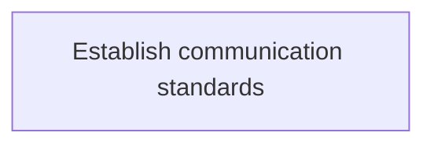
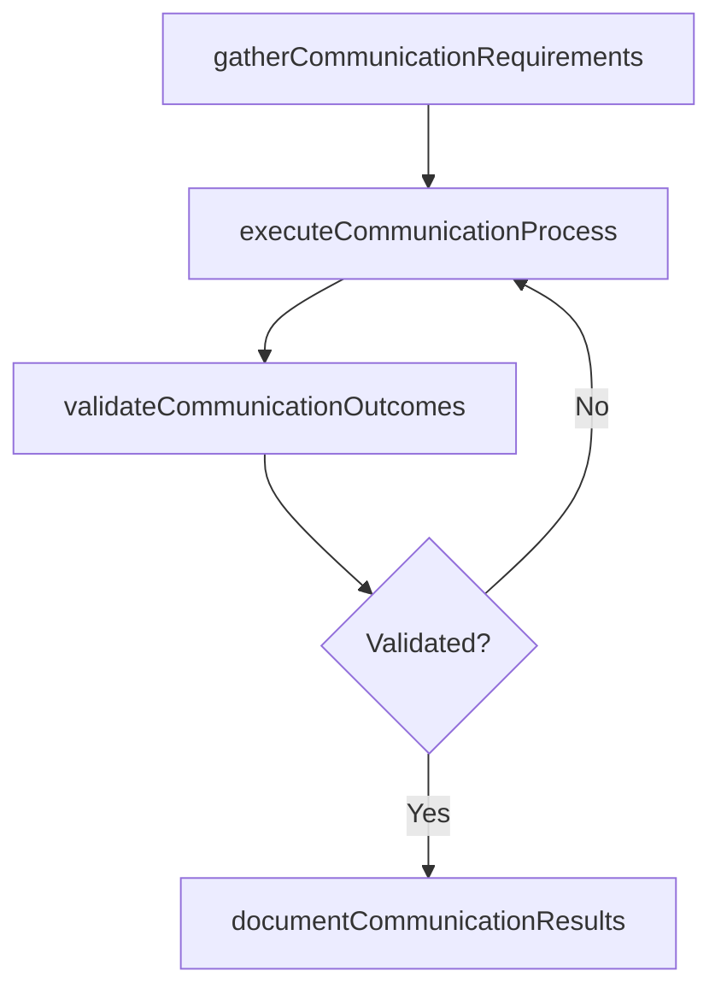

# Establish communication standards

> Business-as-Code definition for establish communication standards. Models the process of establishing standards for communications within the organization which creates the road map for successful understandin.

## Overview

Establishing standards for communications within the organization which creates the road map for successful understanding of strategic initiatives for both business units and information technology services.

## Process Hierarchy



## GraphDL

```yaml
establish:
  object: Communication Standards
  actor: ITSecurityManager
  result: EstablishCommunicationStandards
```

## Actions

| Action | Description |
|--------|-------------|
| gatherCommunicationRequirements | Collect requirements and inputs for establish communication standards |
| executeCommunicationProcess | Perform the core activities of establish communication standards |
| validateCommunicationOutcomes | Verify that outcomes meet defined criteria and standards |
| documentCommunicationResults | Record findings and results for stakeholder review |

## Events

| Event | Description |
|-------|-------------|
| communicationRequirementsGathered | Requirements for establish communication standards collected |
| communicationProcessExecuted | Core activities of establish communication standards completed |
| communicationOutcomesValidated | Outcomes verified against defined criteria |
| communicationResultsDocumented | Results recorded and distributed to stakeholders |

## Searches

| Search | Description |
|--------|-------------|
| getCommunicationStatus | Retrieve current status of establish communication standards |
| findCommunicationRecords | List records related to establish communication standards by date or status |
| getCommunicationReport | Retrieve summary report for establish communication standards |

## Process Flow



## RACI Matrix

| Activity | Responsible | Accountable | Consulted | Informed |
|----------|-------------|-------------|-----------|----------|
| gatherCommunicationRequirements | ITSecurityManager | IdentityAccessManager | BusinessUnitLeaders | CIO |
| executeCommunicationProcess | ITSecurityManager | IdentityAccessManager | ITOperations | ITServiceManager |
| validateCommunicationOutcomes | ITSecurityManager | IdentityAccessManager | QualityAssurance | ITServiceManager |

## Related Processes

| Process | Relationship |
|---------|-------------|
| 8.3.3 Parent process | Parent - provides context and governance |
| 8.3.3.8 Sibling activity | Parallel - complementary activity in the same process |

## Related Departments

| Department | Role |
|-----------|------|
| IT Risk and Compliance | Manages risk assessment and compliance |
| IT Security | Implements security controls and monitoring |
| Legal | Advises on regulatory requirements |

## Related Occupations

| Occupation | Involvement |
|-----------|-------------|
| IT Risk Analyst | Assesses and monitors IT risks |
| IT Compliance Analyst | Evaluates regulatory compliance |

## KPIs

| KPI | Description | Unit |
|-----|-------------|------|
| Completion Rate | Percentage of establish communication standards activities completed on schedule | % |
| Quality Score | Quality assessment score for establish communication standards outputs | Score (1-10) |
| Cycle Time | Average time to complete establish communication standards | Days |

## Usage

```typescript
import { establishCommunicationStandards } from '@headlessly/establish-communication-standards'

const process = establishCommunicationStandards()

// Execute the core process
const result = await process.executeCommunicationProcess({
  scope: 'department',
  priority: 'high'
})

// Validate outcomes
const validation = await process.validateCommunicationOutcomes({
  criteria: 'standard',
  period: 'Q4-2025'
})
```
