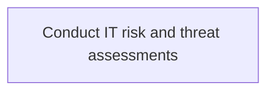
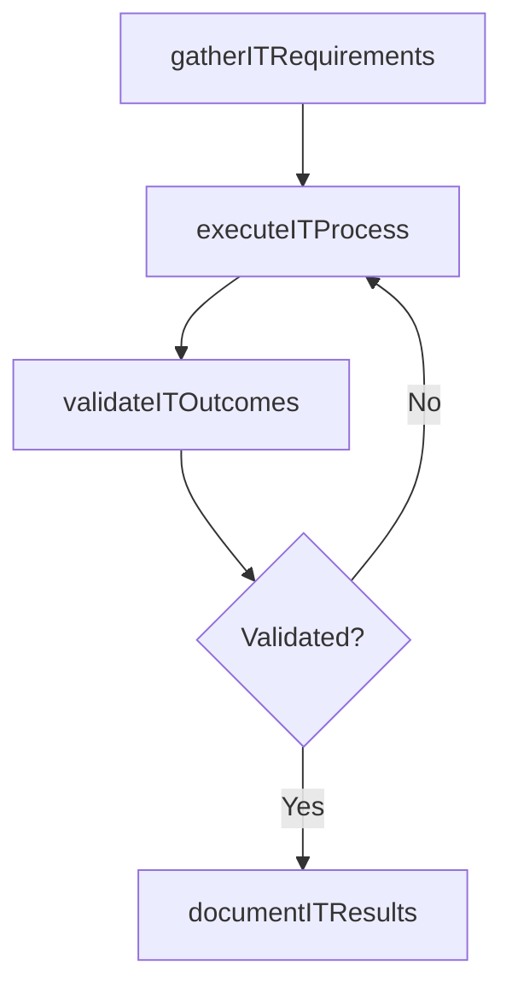

# Conduct IT risk and threat assessments

> Business-as-Code definition for conduct it risk and threat assessments. Models the process of evaluate it risk and threat assessments by way of it assets, information security, and breach points within the organiza.

## Overview

Evaluate IT risk and threat assessments by way of IT assets, information security, and breach points within the organization.

## Process Hierarchy



## GraphDL

```yaml
conduct:
  object: IT Risk And Threat Assessments
  actor: ITComplianceAnalyst
  result: ConductItRiskAndThreatAssessments
```

## Actions

| Action | Description |
|--------|-------------|
| gatherITRequirements | Collect requirements and inputs for conduct it risk and threat assessments |
| executeITProcess | Perform the core activities of conduct it risk and threat assessments |
| validateITOutcomes | Verify that outcomes meet defined criteria and standards |
| documentITResults | Record findings and results for stakeholder review |

## Events

| Event | Description |
|-------|-------------|
| itRequirementsGathered | Requirements for conduct it risk and threat assessments collected |
| itProcessExecuted | Core activities of conduct it risk and threat assessments completed |
| itOutcomesValidated | Outcomes verified against defined criteria |
| itResultsDocumented | Results recorded and distributed to stakeholders |

## Searches

| Search | Description |
|--------|-------------|
| getITStatus | Retrieve current status of conduct it risk and threat assessments |
| findITRecords | List records related to conduct it risk and threat assessments by date or status |
| getITReport | Retrieve summary report for conduct it risk and threat assessments |

## Process Flow



## RACI Matrix

| Activity | Responsible | Accountable | Consulted | Informed |
|----------|-------------|-------------|-----------|----------|
| gatherITRequirements | ITComplianceAnalyst | ITSecurityManager | BusinessUnitLeaders | CIO |
| executeITProcess | ITComplianceAnalyst | ITSecurityManager | ITOperations | ITServiceManager |
| validateITOutcomes | ITComplianceAnalyst | ITSecurityManager | QualityAssurance | ITServiceManager |

## Related Processes

| Process | Relationship |
|---------|-------------|
| 8.3.3 Parent process | Parent - provides context and governance |
| 8.3.3.9 Sibling activity | Parallel - complementary activity in the same process |

## Related Departments

| Department | Role |
|-----------|------|
| IT Risk and Compliance | Manages risk assessment and compliance |
| IT Security | Implements security controls and monitoring |
| Legal | Advises on regulatory requirements |

## Related Occupations

| Occupation | Involvement |
|-----------|-------------|
| IT Risk Analyst | Assesses and monitors IT risks |
| IT Compliance Analyst | Evaluates regulatory compliance |

## KPIs

| KPI | Description | Unit |
|-----|-------------|------|
| Completion Rate | Percentage of conduct it risk and threat assessments activities completed on schedule | % |
| Quality Score | Quality assessment score for conduct it risk and threat assessments outputs | Score (1-10) |
| Cycle Time | Average time to complete conduct it risk and threat assessments | Days |

## Usage

```typescript
import { conductItRiskAndThreatAssessments } from '@headlessly/conduct-it-risk-and-threat-assessments'

const process = conductItRiskAndThreatAssessments()

// Execute the core process
const result = await process.executeITProcess({
  scope: 'department',
  priority: 'high'
})

// Validate outcomes
const validation = await process.validateITOutcomes({
  criteria: 'standard',
  period: 'Q4-2025'
})
```
