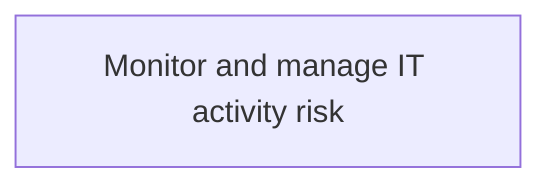
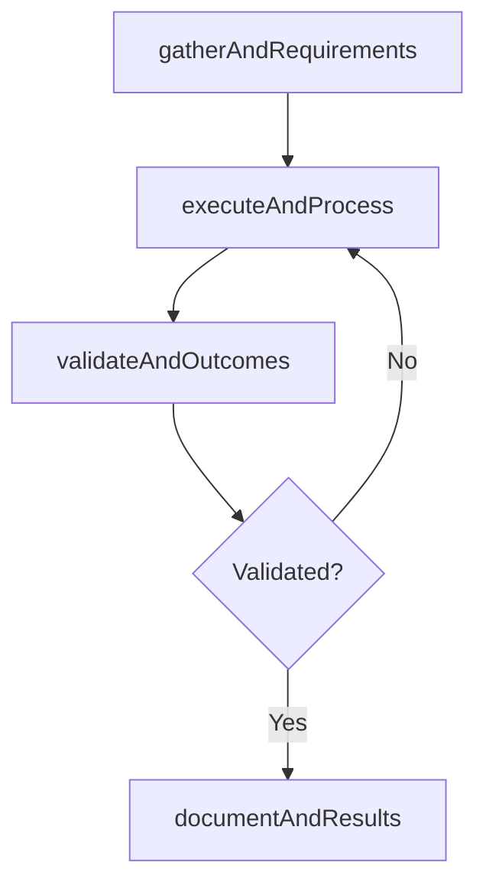

# Monitor and manage IT activity risk

> Business-as-Code definition for monitor and manage it activity risk. Models the process of monitoring and managing risks related to it adoption within the organization.

## Overview

Monitoring and managing risks related to IT adoption within the organization.

## Process Hierarchy



## GraphDL

```yaml
monitor:
  object: And Manage IT Activity Risk
  actor: ITSecurityManager
  result: MonitorAndManageItActivityRisk
```

## Actions

| Action | Description |
|--------|-------------|
| gatherAndRequirements | Collect requirements and inputs for monitor and manage it activity risk |
| executeAndProcess | Perform the core activities of monitor and manage it activity risk |
| validateAndOutcomes | Verify that outcomes meet defined criteria and standards |
| documentAndResults | Record findings and results for stakeholder review |

## Events

| Event | Description |
|-------|-------------|
| andRequirementsGathered | Requirements for monitor and manage it activity risk collected |
| andProcessExecuted | Core activities of monitor and manage it activity risk completed |
| andOutcomesValidated | Outcomes verified against defined criteria |
| andResultsDocumented | Results recorded and distributed to stakeholders |

## Searches

| Search | Description |
|--------|-------------|
| getAndStatus | Retrieve current status of monitor and manage it activity risk |
| findAndRecords | List records related to monitor and manage it activity risk by date or status |
| getAndReport | Retrieve summary report for monitor and manage it activity risk |

## Process Flow



## RACI Matrix

| Activity | Responsible | Accountable | Consulted | Informed |
|----------|-------------|-------------|-----------|----------|
| gatherAndRequirements | ITSecurityManager | IdentityAccessManager | BusinessUnitLeaders | CIO |
| executeAndProcess | ITSecurityManager | IdentityAccessManager | ITOperations | ITServiceManager |
| validateAndOutcomes | ITSecurityManager | IdentityAccessManager | QualityAssurance | ITServiceManager |

## Related Processes

| Process | Relationship |
|---------|-------------|
| 8.3.3 Parent process | Parent - provides context and governance |
| 8.3.3.10 Sibling activity | Parallel - complementary activity in the same process |

## Related Departments

| Department | Role |
|-----------|------|
| IT Risk and Compliance | Manages risk assessment and compliance |
| IT Security | Implements security controls and monitoring |
| Legal | Advises on regulatory requirements |

## Related Occupations

| Occupation | Involvement |
|-----------|-------------|
| IT Risk Analyst | Assesses and monitors IT risks |
| IT Compliance Analyst | Evaluates regulatory compliance |

## KPIs

| KPI | Description | Unit |
|-----|-------------|------|
| Completion Rate | Percentage of monitor and manage it activity risk activities completed on schedule | % |
| Quality Score | Quality assessment score for monitor and manage it activity risk outputs | Score (1-10) |
| Cycle Time | Average time to complete monitor and manage it activity risk | Days |

## Usage

```typescript
import { monitorAndManageItActivityRisk } from '@headlessly/monitor-and-manage-it-activity-risk'

const process = monitorAndManageItActivityRisk()

// Execute the core process
const result = await process.executeAndProcess({
  scope: 'department',
  priority: 'high'
})

// Validate outcomes
const validation = await process.validateAndOutcomes({
  criteria: 'standard',
  period: 'Q4-2025'
})
```
