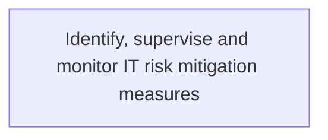
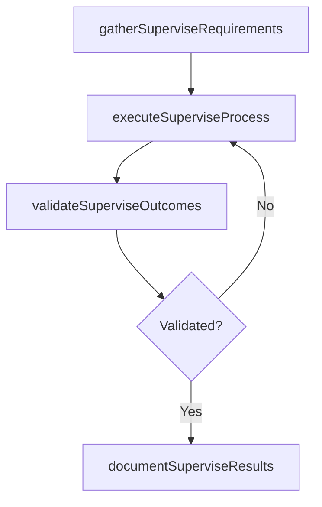

# Identify, supervise and monitor IT risk mitigation measures

> Business-as-Code definition for identify, supervise and monitor it risk mitigation measures. Models the process of identifying and supervising a blueprint of measures for managing risk in it. monitor actions to enhance opportunities an.

## Overview

Identifying and supervising a blueprint of measures for managing risk in IT. Monitor actions to enhance opportunities and reduce threats to project objectives.

## Process Hierarchy



## GraphDL

```yaml
identify,:
  object: Supervise And Monitor IT Risk Mitigation Measures
  actor: ITRiskAnalyst
  result: IdentifySuperviseAndMonitorItRiskMitigationMeasures
```

## Actions

| Action | Description |
|--------|-------------|
| gatherSuperviseRequirements | Collect requirements and inputs for identify, supervise and monitor it risk mitigation measures |
| executeSuperviseProcess | Perform the core activities of identify, supervise and monitor it risk mitigation measures |
| validateSuperviseOutcomes | Verify that outcomes meet defined criteria and standards |
| documentSuperviseResults | Record findings and results for stakeholder review |

## Events

| Event | Description |
|-------|-------------|
| superviseRequirementsGathered | Requirements for identify, supervise and monitor it risk mitigation measures collected |
| superviseProcessExecuted | Core activities of identify, supervise and monitor it risk mitigation measures completed |
| superviseOutcomesValidated | Outcomes verified against defined criteria |
| superviseResultsDocumented | Results recorded and distributed to stakeholders |

## Searches

| Search | Description |
|--------|-------------|
| getSuperviseStatus | Retrieve current status of identify, supervise and monitor it risk mitigation measures |
| findSuperviseRecords | List records related to identify, supervise and monitor it risk mitigation measures by date or status |
| getSuperviseReport | Retrieve summary report for identify, supervise and monitor it risk mitigation measures |

## Process Flow



## RACI Matrix

| Activity | Responsible | Accountable | Consulted | Informed |
|----------|-------------|-------------|-----------|----------|
| gatherSuperviseRequirements | ITRiskAnalyst | ITComplianceAnalyst | BusinessUnitLeaders | CIO |
| executeSuperviseProcess | ITRiskAnalyst | ITComplianceAnalyst | ITOperations | ITServiceManager |
| validateSuperviseOutcomes | ITRiskAnalyst | ITComplianceAnalyst | QualityAssurance | ITServiceManager |

## Related Processes

| Process | Relationship |
|---------|-------------|
| 8.3.3 Parent process | Parent - provides context and governance |
| 8.3.3.11 Sibling activity | Parallel - complementary activity in the same process |

## Related Departments

| Department | Role |
|-----------|------|
| IT Risk and Compliance | Manages risk assessment and compliance |
| IT Security | Implements security controls and monitoring |
| Legal | Advises on regulatory requirements |

## Related Occupations

| Occupation | Involvement |
|-----------|-------------|
| IT Risk Analyst | Assesses and monitors IT risks |
| IT Compliance Analyst | Evaluates regulatory compliance |

## KPIs

| KPI | Description | Unit |
|-----|-------------|------|
| Completion Rate | Percentage of identify, supervise and monitor it risk mitigation measures activities completed on schedule | % |
| Quality Score | Quality assessment score for identify, supervise and monitor it risk mitigation measures outputs | Score (1-10) |
| Cycle Time | Average time to complete identify, supervise and monitor it risk mitigation measures | Days |

## Usage

```typescript
import { identifySuperviseAndMonitorItRiskMitigationMeasures } from '@headlessly/identify-supervise-and-monitor-it-risk-mitigation-measures'

const process = identifySuperviseAndMonitorItRiskMitigationMeasures()

// Execute the core process
const result = await process.executeSuperviseProcess({
  scope: 'department',
  priority: 'high'
})

// Validate outcomes
const validation = await process.validateSuperviseOutcomes({
  criteria: 'standard',
  period: 'Q4-2025'
})
```
