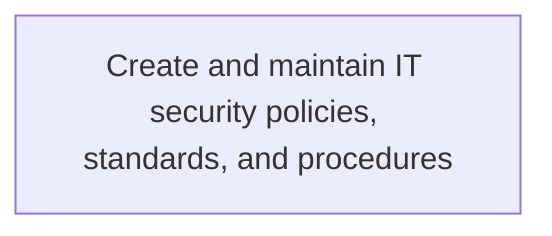
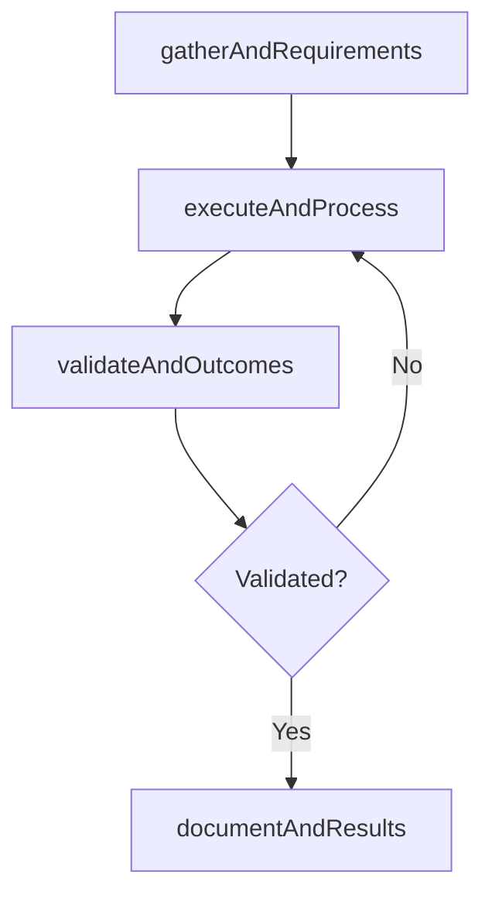

# Create and maintain IT security policies, standards, and procedures

> Business-as-Code definition for create and maintain it security policies, standards, and procedures. Models the process of develop and maintain an architecture for securing and ensuring the privacy of data flows throughout the organization. cr.

## Overview

Develop and maintain an architecture for securing and ensuring the privacy of data flows throughout the organization. Create, test, evaluate, and implement IT security policies to ensure the safe use of IT services and solutions.

## Process Hierarchy



## GraphDL

```yaml
create:
  object: And Maintain IT Security Policies, Standards, And Procedures
  actor: ITComplianceAnalyst
  result: CreateAndMaintainItSecurityPoliciesStandardsAndProcedures
```

## Actions

| Action | Description |
|--------|-------------|
| gatherAndRequirements | Collect requirements and inputs for create and maintain it security policies, standards, and procedures |
| executeAndProcess | Perform the core activities of create and maintain it security policies, standards, and procedures |
| validateAndOutcomes | Verify that outcomes meet defined criteria and standards |
| documentAndResults | Record findings and results for stakeholder review |

## Events

| Event | Description |
|-------|-------------|
| andRequirementsGathered | Requirements for create and maintain it security policies, standards, and procedures collected |
| andProcessExecuted | Core activities of create and maintain it security policies, standards, and procedures completed |
| andOutcomesValidated | Outcomes verified against defined criteria |
| andResultsDocumented | Results recorded and distributed to stakeholders |

## Searches

| Search | Description |
|--------|-------------|
| getAndStatus | Retrieve current status of create and maintain it security policies, standards, and procedures |
| findAndRecords | List records related to create and maintain it security policies, standards, and procedures by date or status |
| getAndReport | Retrieve summary report for create and maintain it security policies, standards, and procedures |

## Process Flow



## RACI Matrix

| Activity | Responsible | Accountable | Consulted | Informed |
|----------|-------------|-------------|-----------|----------|
| gatherAndRequirements | ITComplianceAnalyst | ITSecurityManager | BusinessUnitLeaders | CIO |
| executeAndProcess | ITComplianceAnalyst | ITSecurityManager | ITOperations | ITServiceManager |
| validateAndOutcomes | ITComplianceAnalyst | ITSecurityManager | QualityAssurance | ITServiceManager |

## Related Processes

| Process | Relationship |
|---------|-------------|
| 8.3.3 Parent process | Parent - provides context and governance |
| 8.3.3.5 Sibling activity | Parallel - complementary activity in the same process |

## Related Departments

| Department | Role |
|-----------|------|
| IT Risk and Compliance | Manages risk assessment and compliance |
| IT Security | Implements security controls and monitoring |
| Legal | Advises on regulatory requirements |

## Related Occupations

| Occupation | Involvement |
|-----------|-------------|
| IT Risk Analyst | Assesses and monitors IT risks |
| IT Compliance Analyst | Evaluates regulatory compliance |

## KPIs

| KPI | Description | Unit |
|-----|-------------|------|
| Completion Rate | Percentage of create and maintain it security policies, standards, and procedures activities completed on schedule | % |
| Quality Score | Quality assessment score for create and maintain it security policies, standards, and procedures outputs | Score (1-10) |
| Cycle Time | Average time to complete create and maintain it security policies, standards, and procedures | Days |

## Usage

```typescript
import { createAndMaintainItSecurityPoliciesStandardsAndProcedures } from '@headlessly/create-and-maintain-it-security-policies-standards-and-procedures'

const process = createAndMaintainItSecurityPoliciesStandardsAndProcedures()

// Execute the core process
const result = await process.executeAndProcess({
  scope: 'department',
  priority: 'high'
})

// Validate outcomes
const validation = await process.validateAndOutcomes({
  criteria: 'standard',
  period: 'Q4-2025'
})
```
