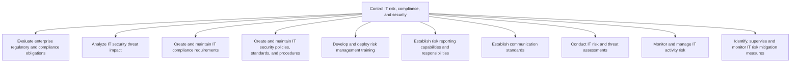
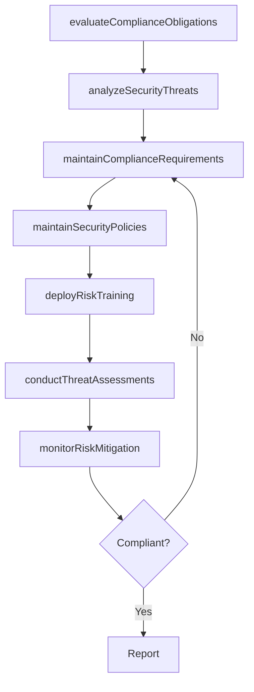

# Control IT risk, compliance, and security

> Business-as-Code definition for IT risk, compliance, and security control. Models the process of evaluating regulatory obligations, analyzing threats, maintaining compliance and security policies, deploying training, and monitoring risk mitigation measures.

## Overview

Ensure effective control in overall IT risk management, formulate and execute guidelines in-line with regulatory bodies, and manage organizational security throughout the business operations.

## Process Hierarchy



## GraphDL

```yaml
control:
  object: IT Risk, Compliance, And Security
  actor: ITComplianceManager
  result: RiskComplianceControlReport
```

## Actions

| Action | Description |
|--------|-------------|
| evaluateComplianceObligations | Assess enterprise regulatory and compliance requirements |
| analyzeSecurityThreats | Evaluate IT security threat impact on business operations |
| maintainComplianceRequirements | Create and update IT compliance standards and requirements |
| maintainSecurityPolicies | Develop and update IT security policies and procedures |
| deployRiskTraining | Develop and deliver risk management training programs |
| conductThreatAssessments | Perform IT risk and threat assessments across the environment |
| monitorRiskMitigation | Track and supervise IT risk mitigation measure effectiveness |

## Events

| Event | Description |
|-------|-------------|
| complianceObligationsEvaluated | Enterprise compliance obligations reviewed and documented |
| securityThreatsAnalyzed | IT security threat impact assessment completed |
| complianceRequirementsMaintained | IT compliance requirements updated |
| securityPoliciesMaintained | IT security policies and procedures published |
| riskTrainingDeployed | Risk management training program delivered |
| threatAssessmentsConducted | IT risk and threat assessment completed |
| riskMitigationMonitored | Risk mitigation measure effectiveness reviewed |

## Searches

| Search | Description |
|--------|-------------|
| findComplianceObligations | List compliance obligations by regulation or status |
| getSecurityThreatAnalysis | Retrieve security threat impact analysis results |
| findRiskMitigationMeasures | List active risk mitigation measures by status |
| getRiskTrainingCompletion | Get risk training completion rates by department |

## Process Flow



## RACI Matrix

| Activity | Responsible | Accountable | Consulted | Informed |
|----------|-------------|-------------|-----------|----------|
| evaluateComplianceObligations | ITComplianceAnalyst | ITComplianceManager | Legal | CISO |
| analyzeSecurityThreats | SecurityAnalyst | CISO | ITOperations | ITRiskManager |
| maintainSecurityPolicies | ITSecurityManager | CISO | Legal | AllITStaff |
| conductThreatAssessments | SecurityAnalyst | ITComplianceManager | EnterpriseArchitect | ITOperations |
| monitorRiskMitigation | ITRiskAnalyst | ITComplianceManager | ITOperations | CISO |

## Sub-Processes

| ID | Name | Description |
|----|------|-------------|
| 8.3.3.1 | Evaluate enterprise regulatory and compliance obligations | Evaluation of dynamic, strategic, and integrated approach to manage regulatory requirements and comp |
| 8.3.3.2 | Analyze IT security threat impact | Analyzing the impact of threats to critical IT assets across different departments and functions in  |
| 8.3.3.3 | Create and maintain IT compliance requirements | Develop and maintain IT compliance standards. Maintaining requirements set forth by such directives  |
| 8.3.3.4 | Create and maintain IT security policies, standards, and procedures | Develop and maintain an architecture for securing and ensuring the privacy of data flows throughout  |
| 8.3.3.5 | Develop and deploy risk management training | Develop and implement training in regard to managing IT risks, understanding criticality, impact, an |
| 8.3.3.6 | Establish risk reporting capabilities and responsibilities | Establishing processes to communicate IT risk to the organization. |
| 8.3.3.7 | Establish communication standards | Establishing standards for communications within the organization which creates the road map for suc |
| 8.3.3.8 | Conduct IT risk and threat assessments | Evaluate IT risk and threat assessments by way of IT assets, information security, and breach points |
| 8.3.3.9 | Monitor and manage IT activity risk | Monitoring and managing risks related to IT adoption within the organization. |
| 8.3.3.10 | Identify, supervise and monitor IT risk mitigation measures | Identifying and supervising a blueprint of measures for managing risk in IT. Monitor actions to enha |

## Related Processes

| Process | Relationship |
|---------|-------------|
| 8.3.1 Develop IT compliance, risk, and security strategy | Upstream - strategy defines control framework |
| 8.3.5 Develop and manage IT security, privacy, and data protection | Parallel - security controls complement data protection |
| 8.3.6 Conduct and analyze IT compliance assessments | Downstream - controls are validated through assessments |

## Related Departments

| Department | Role |
|-----------|------|
| IT Compliance | Primary owner of risk and compliance controls |
| IT Security Operations | Implements and monitors security measures |
| Legal | Interprets regulatory requirements |
| Human Resources | Supports risk training deployment |
| Internal Audit | Validates control effectiveness |

## Related Occupations

| Occupation | Involvement |
|-----------|-------------|
| IT Compliance Manager | Oversees compliance control implementation |
| Security Operations Analyst | Monitors threats and security controls |
| IT Risk Analyst | Tracks risk mitigation effectiveness |

## KPIs

| KPI | Description | Unit |
|-----|-------------|------|
| Compliance Control Pass Rate | Percentage of compliance controls passing assessment | % |
| Security Policy Adherence | Percentage of IT staff compliant with security policies | % |
| Risk Training Completion | Percentage of staff completing risk management training | % |
| Threat Assessment Frequency | Number of threat assessments conducted per quarter | Count/Quarter |

## Usage

```typescript
import { controlITRiskComplianceAndSecurity } from '@headlessly/control-it-risk-compliance-and-security'

const controls = controlITRiskComplianceAndSecurity()

// Evaluate compliance obligations
const obligations = await controls.evaluateComplianceObligations({
  regulations: ['SOC2', 'GDPR', 'ISO-27001'],
  scope: 'enterprise'
})

// Conduct threat assessment
const threats = await controls.conductThreatAssessments({
  environment: 'production',
  assessmentType: 'comprehensive',
  includeSupplyChain: true
})
```
