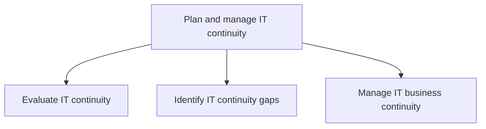
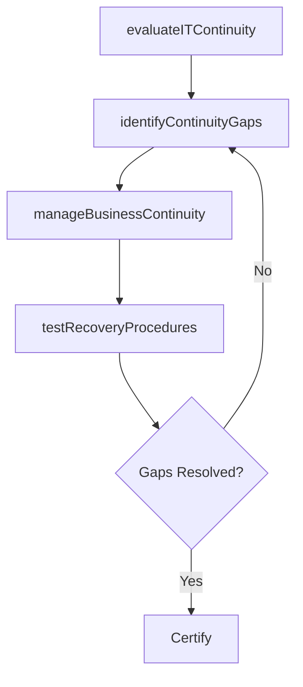

# Plan and manage IT continuity

> Business-as-Code definition for IT continuity planning and management. Models the process of evaluating IT continuity readiness, identifying gaps, and managing business continuity programs for critical IT services.

## Overview

Planning and managing IT's ability to recover from exposure to internal and external threats.

## Process Hierarchy



## GraphDL

```yaml
plan:
  object: And Manage IT Continuity
  actor: ITContinuityManager
  result: ITContinuityPlan
```

## Actions

| Action | Description |
|--------|-------------|
| evaluateITContinuity | Assess IT business continuity readiness and recovery capabilities |
| identifyContinuityGaps | Discover gaps in IT continuity plans and recovery procedures |
| manageBusinessContinuity | Coordinate IT business continuity programs and disaster recovery |
| testRecoveryProcedures | Execute continuity tests and validate recovery procedures |

## Events

| Event | Description |
|-------|-------------|
| itContinuityEvaluated | IT continuity readiness assessment completed |
| continuityGapsIdentified | IT continuity gaps documented and prioritized |
| businessContinuityManaged | IT business continuity plans updated and approved |
| recoveryProceduresTested | Recovery procedures tested and results documented |

## Searches

| Search | Description |
|--------|-------------|
| getContinuityPlans | Retrieve IT business continuity plans by system or tier |
| findContinuityGaps | List IT continuity gaps by severity or system |
| getRecoveryTestResults | Get results from most recent recovery procedure tests |

## Process Flow



## RACI Matrix

| Activity | Responsible | Accountable | Consulted | Informed |
|----------|-------------|-------------|-----------|----------|
| evaluateITContinuity | ITContinuityManager | CISO | ITOperations | CIO |
| identifyContinuityGaps | ITContinuityAnalyst | ITContinuityManager | EnterpriseArchitect | ITRiskManager |
| manageBusinessContinuity | ITContinuityManager | CIO | BusinessUnitLeaders | ExecutiveTeam |
| testRecoveryProcedures | DisasterRecoveryEngineer | ITContinuityManager | ITOperations | BusinessUnitLeaders |

## Sub-Processes

| ID | Name | Description |
|----|------|-------------|
| 8.3.4.1 | Evaluate IT continuity | Evaluating IT business needs and IT's ability to recover from internal or external threat exposure. |
| 8.3.4.2 | Identify IT continuity gaps | Identifying the limitations of the IT organization's ability to remediate disruptions in IT services |
| 8.3.4.3 | Manage IT business continuity | Integrating the disciplines of Emergency Response, Crisis Management, Disaster Recovery (technology  |

## Related Processes

| Process | Relationship |
|---------|-------------|
| 8.3.2 Develop IT resilience strategy | Upstream - resilience strategy drives continuity requirements |
| 8.3.7 Develop and execute IT resilience and continuity operations | Downstream - continuity plans are executed operationally |

## Related Departments

| Department | Role |
|-----------|------|
| IT Business Continuity | Primary owner of continuity planning |
| IT Operations | Implements and tests recovery procedures |
| Facilities | Coordinates physical site recovery |
| Business Units | Defines recovery priorities and impact tolerance |

## Related Occupations

| Occupation | Involvement |
|-----------|-------------|
| IT Continuity Manager | Leads continuity planning and gap analysis |
| Disaster Recovery Engineer | Designs and tests recovery procedures |
| Business Continuity Analyst | Evaluates business impact and recovery needs |

## KPIs

| KPI | Description | Unit |
|-----|-------------|------|
| Continuity Plan Coverage | Percentage of critical systems with active continuity plans | % |
| Recovery Test Pass Rate | Percentage of recovery tests meeting RTO/RPO targets | % |
| Continuity Gap Closure Rate | Percentage of identified gaps remediated per cycle | % |

## Usage

```typescript
import { planAndManageITContinuity } from '@headlessly/plan-and-manage-it-continuity'

const continuity = planAndManageITContinuity()

// Evaluate IT continuity readiness
const readiness = await continuity.evaluateITContinuity({
  scope: 'tier-1-systems',
  targetRTO: '4-hours',
  targetRPO: '1-hour'
})

// Test recovery procedures
const testResults = await continuity.testRecoveryProcedures({
  systems: ['erp', 'email', 'crm'],
  testType: 'full-failover'
})
```
