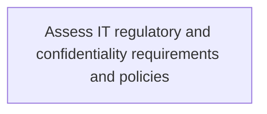
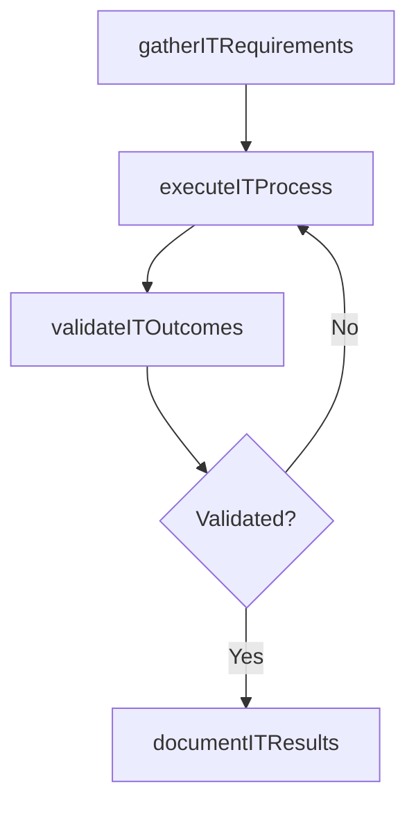

# Assess IT regulatory and confidentiality requirements and policies

> Business-as-Code definition for assess it regulatory and confidentiality requirements and policies. Models the process of evaluate principles or rules employed in controlling, directing, or managing it services. assessing requirements and pol.

## Overview

Evaluate principles or rules employed in controlling, directing, or managing IT services. Assessing requirements and policies related to confidentiality.

## Process Hierarchy



## GraphDL

```yaml
assess:
  object: IT Regulatory And Confidentiality Requirements And Policies
  actor: ITComplianceAnalyst
  result: AssessItRegulatoryAndConfidentialityRequirementsAndPolicies
```

## Actions

| Action | Description |
|--------|-------------|
| gatherITRequirements | Collect requirements and inputs for assess it regulatory and confidentiality requirements and policies |
| executeITProcess | Perform the core activities of assess it regulatory and confidentiality requirements and policies |
| validateITOutcomes | Verify that outcomes meet defined criteria and standards |
| documentITResults | Record findings and results for stakeholder review |

## Events

| Event | Description |
|-------|-------------|
| itRequirementsGathered | Requirements for assess it regulatory and confidentiality requirements and policies collected |
| itProcessExecuted | Core activities of assess it regulatory and confidentiality requirements and policies completed |
| itOutcomesValidated | Outcomes verified against defined criteria |
| itResultsDocumented | Results recorded and distributed to stakeholders |

## Searches

| Search | Description |
|--------|-------------|
| getITStatus | Retrieve current status of assess it regulatory and confidentiality requirements and policies |
| findITRecords | List records related to assess it regulatory and confidentiality requirements and policies by date or status |
| getITReport | Retrieve summary report for assess it regulatory and confidentiality requirements and policies |

## Process Flow



## RACI Matrix

| Activity | Responsible | Accountable | Consulted | Informed |
|----------|-------------|-------------|-----------|----------|
| gatherITRequirements | ITComplianceAnalyst | ITSecurityManager | BusinessUnitLeaders | CIO |
| executeITProcess | ITComplianceAnalyst | ITSecurityManager | ITOperations | ITServiceManager |
| validateITOutcomes | ITComplianceAnalyst | ITSecurityManager | QualityAssurance | ITServiceManager |

## Related Processes

| Process | Relationship |
|---------|-------------|
| 8.3.5 Parent process | Parent - provides context and governance |
| 8.3.5.2 Sibling activity | Parallel - complementary activity in the same process |

## Related Departments

| Department | Role |
|-----------|------|
| IT Risk and Compliance | Manages risk assessment and compliance |
| IT Security | Implements security controls and monitoring |
| Legal | Advises on regulatory requirements |

## Related Occupations

| Occupation | Involvement |
|-----------|-------------|
| IT Risk Analyst | Assesses and monitors IT risks |
| IT Compliance Analyst | Evaluates regulatory compliance |

## KPIs

| KPI | Description | Unit |
|-----|-------------|------|
| Completion Rate | Percentage of assess it regulatory and confidentiality requirements and policies activities completed on schedule | % |
| Quality Score | Quality assessment score for assess it regulatory and confidentiality requirements and policies outputs | Score (1-10) |
| Cycle Time | Average time to complete assess it regulatory and confidentiality requirements and policies | Days |

## Usage

```typescript
import { assessItRegulatoryAndConfidentialityRequirementsAndPolicies } from '@headlessly/assess-it-regulatory-and-confidentiality-requirements-and-policies'

const process = assessItRegulatoryAndConfidentialityRequirementsAndPolicies()

// Execute the core process
const result = await process.executeITProcess({
  scope: 'department',
  priority: 'high'
})

// Validate outcomes
const validation = await process.validateITOutcomes({
  criteria: 'standard',
  period: 'Q4-2025'
})
```
