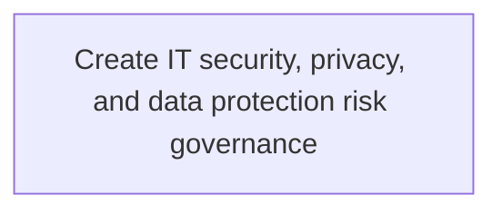
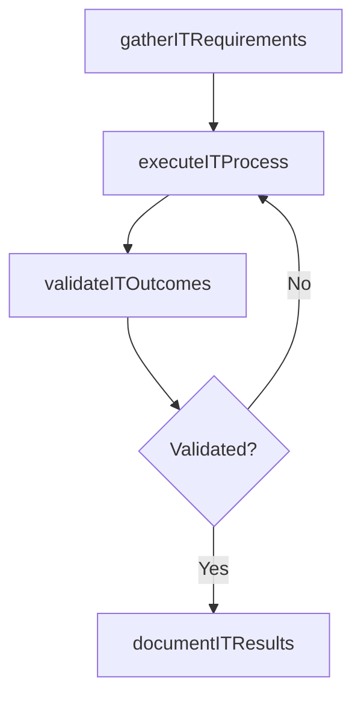

# Create IT security, privacy, and data protection risk governance

> Business-as-Code definition for create it security, privacy, and data protection risk governance. Models the process of defining and managing organization's approach to governing it security and ensuring the privacy of data flows throughout.

## Overview

Defining and managing organization's approach to governing IT security and ensuring the privacy of data flows throughout the organization. Establish and manage tools to support the governance process in order to avoid misuse of information and breach of organizational privacy.

## Process Hierarchy



## GraphDL

```yaml
create:
  object: IT Security, Privacy, And Data Protection Risk Governance
  actor: IdentityAccessManager
  result: CreateItSecurityPrivacyAndDataProtectionRiskGovernance
```

## Actions

| Action | Description |
|--------|-------------|
| gatherITRequirements | Collect requirements and inputs for create it security, privacy, and data protection risk governance |
| executeITProcess | Perform the core activities of create it security, privacy, and data protection risk governance |
| validateITOutcomes | Verify that outcomes meet defined criteria and standards |
| documentITResults | Record findings and results for stakeholder review |

## Events

| Event | Description |
|-------|-------------|
| itRequirementsGathered | Requirements for create it security, privacy, and data protection risk governance collected |
| itProcessExecuted | Core activities of create it security, privacy, and data protection risk governance completed |
| itOutcomesValidated | Outcomes verified against defined criteria |
| itResultsDocumented | Results recorded and distributed to stakeholders |

## Searches

| Search | Description |
|--------|-------------|
| getITStatus | Retrieve current status of create it security, privacy, and data protection risk governance |
| findITRecords | List records related to create it security, privacy, and data protection risk governance by date or status |
| getITReport | Retrieve summary report for create it security, privacy, and data protection risk governance |

## Process Flow



## RACI Matrix

| Activity | Responsible | Accountable | Consulted | Informed |
|----------|-------------|-------------|-----------|----------|
| gatherITRequirements | IdentityAccessManager | ITRiskAnalyst | BusinessUnitLeaders | CIO |
| executeITProcess | IdentityAccessManager | ITRiskAnalyst | ITOperations | ITServiceManager |
| validateITOutcomes | IdentityAccessManager | ITRiskAnalyst | QualityAssurance | ITServiceManager |

## Related Processes

| Process | Relationship |
|---------|-------------|
| 8.3.5 Parent process | Parent - provides context and governance |
| 8.3.5.3 Sibling activity | Parallel - complementary activity in the same process |

## Related Departments

| Department | Role |
|-----------|------|
| IT Risk and Compliance | Manages risk assessment and compliance |
| IT Security | Implements security controls and monitoring |
| Legal | Advises on regulatory requirements |

## Related Occupations

| Occupation | Involvement |
|-----------|-------------|
| IT Risk Analyst | Assesses and monitors IT risks |
| IT Compliance Analyst | Evaluates regulatory compliance |

## KPIs

| KPI | Description | Unit |
|-----|-------------|------|
| Completion Rate | Percentage of create it security, privacy, and data protection risk governance activities completed on schedule | % |
| Quality Score | Quality assessment score for create it security, privacy, and data protection risk governance outputs | Score (1-10) |
| Cycle Time | Average time to complete create it security, privacy, and data protection risk governance | Days |

## Usage

```typescript
import { createItSecurityPrivacyAndDataProtectionRiskGovernance } from '@headlessly/create-it-security-privacy-and-data-protection-risk-governance'

const process = createItSecurityPrivacyAndDataProtectionRiskGovernance()

// Execute the core process
const result = await process.executeITProcess({
  scope: 'department',
  priority: 'high'
})

// Validate outcomes
const validation = await process.validateITOutcomes({
  criteria: 'standard',
  period: 'Q4-2025'
})
```
