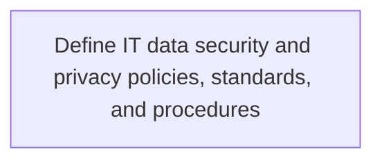
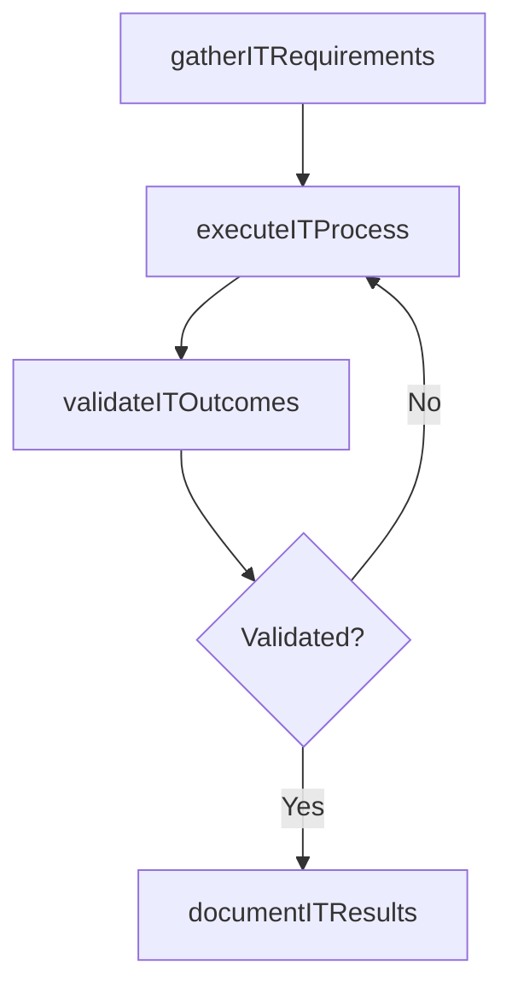

# Define IT data security and privacy policies, standards, and procedures

> Business-as-Code definition for define it data security and privacy policies, standards, and procedures. Models the process of outlining and establishing policies, regulations, standards, and procedures for it data security and privacy.

## Overview

Outlining and establishing policies, regulations, standards, and procedures for IT data security and privacy.

## Process Hierarchy



## GraphDL

```yaml
define:
  object: IT Data Security And Privacy Policies, Standards, And Procedures
  actor: ITSecurityManager
  result: DefineItDataSecurityAndPrivacyPoliciesStandardsAndProcedures
```

## Actions

| Action | Description |
|--------|-------------|
| gatherITRequirements | Collect requirements and inputs for define it data security and privacy policies, standards, and procedures |
| executeITProcess | Perform the core activities of define it data security and privacy policies, standards, and procedures |
| validateITOutcomes | Verify that outcomes meet defined criteria and standards |
| documentITResults | Record findings and results for stakeholder review |

## Events

| Event | Description |
|-------|-------------|
| itRequirementsGathered | Requirements for define it data security and privacy policies, standards, and procedures collected |
| itProcessExecuted | Core activities of define it data security and privacy policies, standards, and procedures completed |
| itOutcomesValidated | Outcomes verified against defined criteria |
| itResultsDocumented | Results recorded and distributed to stakeholders |

## Searches

| Search | Description |
|--------|-------------|
| getITStatus | Retrieve current status of define it data security and privacy policies, standards, and procedures |
| findITRecords | List records related to define it data security and privacy policies, standards, and procedures by date or status |
| getITReport | Retrieve summary report for define it data security and privacy policies, standards, and procedures |

## Process Flow



## RACI Matrix

| Activity | Responsible | Accountable | Consulted | Informed |
|----------|-------------|-------------|-----------|----------|
| gatherITRequirements | ITSecurityManager | IdentityAccessManager | BusinessUnitLeaders | CIO |
| executeITProcess | ITSecurityManager | IdentityAccessManager | ITOperations | ITServiceManager |
| validateITOutcomes | ITSecurityManager | IdentityAccessManager | QualityAssurance | ITServiceManager |

## Related Processes

| Process | Relationship |
|---------|-------------|
| 8.3.5 Parent process | Parent - provides context and governance |
| 8.3.5.4 Sibling activity | Parallel - complementary activity in the same process |

## Related Departments

| Department | Role |
|-----------|------|
| IT Risk and Compliance | Manages risk assessment and compliance |
| IT Security | Implements security controls and monitoring |
| Legal | Advises on regulatory requirements |

## Related Occupations

| Occupation | Involvement |
|-----------|-------------|
| IT Risk Analyst | Assesses and monitors IT risks |
| IT Compliance Analyst | Evaluates regulatory compliance |

## KPIs

| KPI | Description | Unit |
|-----|-------------|------|
| Completion Rate | Percentage of define it data security and privacy policies, standards, and procedures activities completed on schedule | % |
| Quality Score | Quality assessment score for define it data security and privacy policies, standards, and procedures outputs | Score (1-10) |
| Cycle Time | Average time to complete define it data security and privacy policies, standards, and procedures | Days |

## Usage

```typescript
import { defineItDataSecurityAndPrivacyPoliciesStandardsAndProcedures } from '@headlessly/define-it-data-security-and-privacy-policies-standards-and-procedures'

const process = defineItDataSecurityAndPrivacyPoliciesStandardsAndProcedures()

// Execute the core process
const result = await process.executeITProcess({
  scope: 'department',
  priority: 'high'
})

// Validate outcomes
const validation = await process.validateITOutcomes({
  criteria: 'standard',
  period: 'Q4-2025'
})
```
