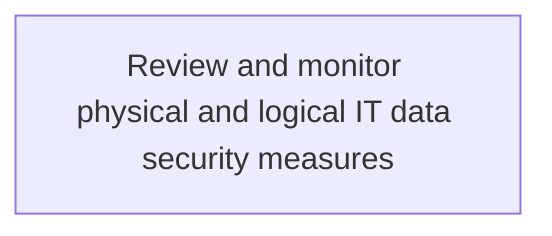
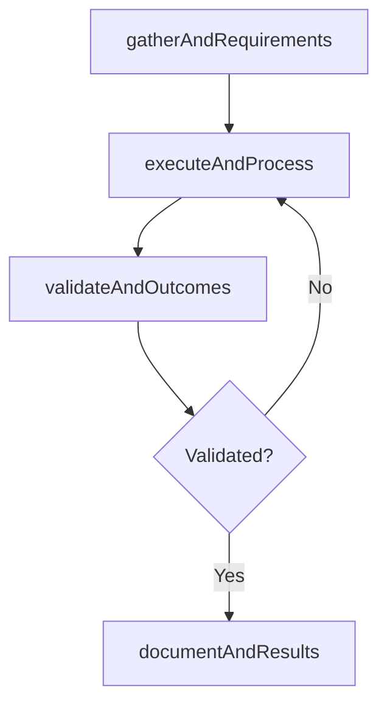

# Review and monitor physical and logical IT data security measures

> Business-as-Code definition for review and monitor physical and logical it data security measures. Models the process of identifying, examining, and reviewing physical and logical it data security measures such as hardware security (smart ca.

## Overview

Identifying, examining, and reviewing physical and logical IT data security measures such as hardware security (smart cards), cryptographic protocols, and access control.

## Process Hierarchy



## GraphDL

```yaml
review:
  object: And Monitor Physical And Logical IT Data Security Measures
  actor: ITRiskAnalyst
  result: ReviewAndMonitorPhysicalAndLogicalItDataSecurityMeasures
```

## Actions

| Action | Description |
|--------|-------------|
| gatherAndRequirements | Collect requirements and inputs for review and monitor physical and logical it data security measures |
| executeAndProcess | Perform the core activities of review and monitor physical and logical it data security measures |
| validateAndOutcomes | Verify that outcomes meet defined criteria and standards |
| documentAndResults | Record findings and results for stakeholder review |

## Events

| Event | Description |
|-------|-------------|
| andRequirementsGathered | Requirements for review and monitor physical and logical it data security measures collected |
| andProcessExecuted | Core activities of review and monitor physical and logical it data security measures completed |
| andOutcomesValidated | Outcomes verified against defined criteria |
| andResultsDocumented | Results recorded and distributed to stakeholders |

## Searches

| Search | Description |
|--------|-------------|
| getAndStatus | Retrieve current status of review and monitor physical and logical it data security measures |
| findAndRecords | List records related to review and monitor physical and logical it data security measures by date or status |
| getAndReport | Retrieve summary report for review and monitor physical and logical it data security measures |

## Process Flow



## RACI Matrix

| Activity | Responsible | Accountable | Consulted | Informed |
|----------|-------------|-------------|-----------|----------|
| gatherAndRequirements | ITRiskAnalyst | ITComplianceAnalyst | BusinessUnitLeaders | CIO |
| executeAndProcess | ITRiskAnalyst | ITComplianceAnalyst | ITOperations | ITServiceManager |
| validateAndOutcomes | ITRiskAnalyst | ITComplianceAnalyst | QualityAssurance | ITServiceManager |

## Related Processes

| Process | Relationship |
|---------|-------------|
| 8.3.5 Parent process | Parent - provides context and governance |
| 8.3.5.5 Sibling activity | Parallel - complementary activity in the same process |

## Related Departments

| Department | Role |
|-----------|------|
| IT Risk and Compliance | Manages risk assessment and compliance |
| IT Security | Implements security controls and monitoring |
| Legal | Advises on regulatory requirements |

## Related Occupations

| Occupation | Involvement |
|-----------|-------------|
| IT Risk Analyst | Assesses and monitors IT risks |
| IT Compliance Analyst | Evaluates regulatory compliance |

## KPIs

| KPI | Description | Unit |
|-----|-------------|------|
| Completion Rate | Percentage of review and monitor physical and logical it data security measures activities completed on schedule | % |
| Quality Score | Quality assessment score for review and monitor physical and logical it data security measures outputs | Score (1-10) |
| Cycle Time | Average time to complete review and monitor physical and logical it data security measures | Days |

## Usage

```typescript
import { reviewAndMonitorPhysicalAndLogicalItDataSecurityMeasures } from '@headlessly/review-and-monitor-physical-and-logical-it-data-security-measures'

const process = reviewAndMonitorPhysicalAndLogicalItDataSecurityMeasures()

// Execute the core process
const result = await process.executeAndProcess({
  scope: 'department',
  priority: 'high'
})

// Validate outcomes
const validation = await process.validateAndOutcomes({
  criteria: 'standard',
  period: 'Q4-2025'
})
```
