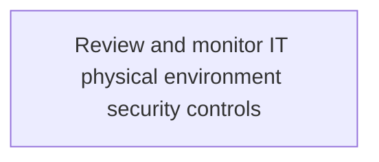
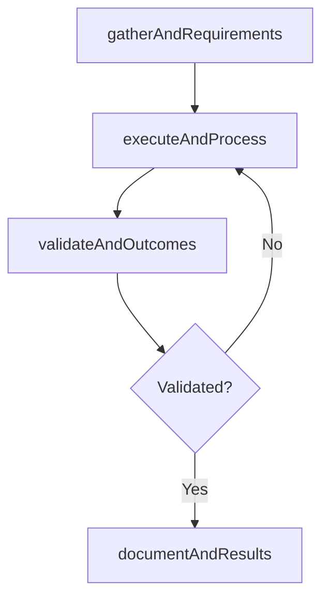

# Review and monitor IT physical environment security controls

> Business-as-Code definition for review and monitor it physical environment security controls. Models the process of identifying and examining security controls for physical environment of information technology such as business faciliti.

## Overview

Identifying and examining security controls for physical environment of information technology such as business facilities, equipment, and resources.

## Process Hierarchy



## GraphDL

```yaml
review:
  object: And Monitor IT Physical Environment Security Controls
  actor: ITComplianceAnalyst
  result: ReviewAndMonitorItPhysicalEnvironmentSecurityControls
```

## Actions

| Action | Description |
|--------|-------------|
| gatherAndRequirements | Collect requirements and inputs for review and monitor it physical environment security controls |
| executeAndProcess | Perform the core activities of review and monitor it physical environment security controls |
| validateAndOutcomes | Verify that outcomes meet defined criteria and standards |
| documentAndResults | Record findings and results for stakeholder review |

## Events

| Event | Description |
|-------|-------------|
| andRequirementsGathered | Requirements for review and monitor it physical environment security controls collected |
| andProcessExecuted | Core activities of review and monitor it physical environment security controls completed |
| andOutcomesValidated | Outcomes verified against defined criteria |
| andResultsDocumented | Results recorded and distributed to stakeholders |

## Searches

| Search | Description |
|--------|-------------|
| getAndStatus | Retrieve current status of review and monitor it physical environment security controls |
| findAndRecords | List records related to review and monitor it physical environment security controls by date or status |
| getAndReport | Retrieve summary report for review and monitor it physical environment security controls |

## Process Flow



## RACI Matrix

| Activity | Responsible | Accountable | Consulted | Informed |
|----------|-------------|-------------|-----------|----------|
| gatherAndRequirements | ITComplianceAnalyst | ITSecurityManager | BusinessUnitLeaders | CIO |
| executeAndProcess | ITComplianceAnalyst | ITSecurityManager | ITOperations | ITServiceManager |
| validateAndOutcomes | ITComplianceAnalyst | ITSecurityManager | QualityAssurance | ITServiceManager |

## Related Processes

| Process | Relationship |
|---------|-------------|
| 8.3.5 Parent process | Parent - provides context and governance |
| 8.3.5.7 Sibling activity | Parallel - complementary activity in the same process |

## Related Departments

| Department | Role |
|-----------|------|
| IT Risk and Compliance | Manages risk assessment and compliance |
| IT Security | Implements security controls and monitoring |
| Legal | Advises on regulatory requirements |

## Related Occupations

| Occupation | Involvement |
|-----------|-------------|
| IT Risk Analyst | Assesses and monitors IT risks |
| IT Compliance Analyst | Evaluates regulatory compliance |

## KPIs

| KPI | Description | Unit |
|-----|-------------|------|
| Completion Rate | Percentage of review and monitor it physical environment security controls activities completed on schedule | % |
| Quality Score | Quality assessment score for review and monitor it physical environment security controls outputs | Score (1-10) |
| Cycle Time | Average time to complete review and monitor it physical environment security controls | Days |

## Usage

```typescript
import { reviewAndMonitorItPhysicalEnvironmentSecurityControls } from '@headlessly/review-and-monitor-it-physical-environment-security-controls'

const process = reviewAndMonitorItPhysicalEnvironmentSecurityControls()

// Execute the core process
const result = await process.executeAndProcess({
  scope: 'department',
  priority: 'high'
})

// Validate outcomes
const validation = await process.validateAndOutcomes({
  criteria: 'standard',
  period: 'Q4-2025'
})
```
