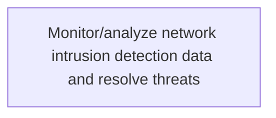
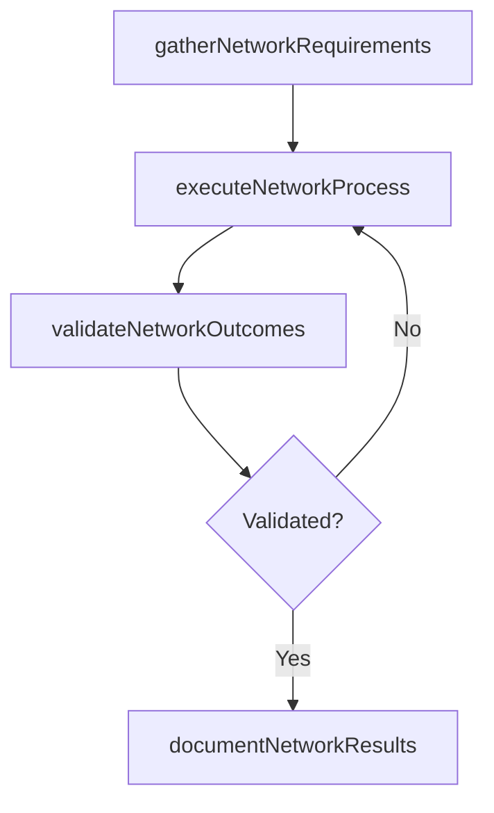

# Monitor/analyze network intrusion detection data and resolve threats

> Business-as-Code definition for monitor/analyze network intrusion detection data and resolve threats. Models the process of monitoring and evaluating network intrusion detection for any malicious activity or policy violations. identify the gaps.

## Overview

Monitoring and evaluating network intrusion detection for any malicious activity or policy violations. Identify the gaps in order to resolve threats and enhance existing network security.

## Process Hierarchy



## GraphDL

```yaml
monitor/analyze:
  object: Network Intrusion Detection Data And Resolve Threats
  actor: ITRiskAnalyst
  result: MonitoranalyzeNetworkIntrusionDetectionDataAndResolveThreats
```

## Actions

| Action | Description |
|--------|-------------|
| gatherNetworkRequirements | Collect requirements and inputs for monitor/analyze network intrusion detection data and resolve threats |
| executeNetworkProcess | Perform the core activities of monitor/analyze network intrusion detection data and resolve threats |
| validateNetworkOutcomes | Verify that outcomes meet defined criteria and standards |
| documentNetworkResults | Record findings and results for stakeholder review |

## Events

| Event | Description |
|-------|-------------|
| networkRequirementsGathered | Requirements for monitor/analyze network intrusion detection data and resolve threats collected |
| networkProcessExecuted | Core activities of monitor/analyze network intrusion detection data and resolve threats completed |
| networkOutcomesValidated | Outcomes verified against defined criteria |
| networkResultsDocumented | Results recorded and distributed to stakeholders |

## Searches

| Search | Description |
|--------|-------------|
| getNetworkStatus | Retrieve current status of monitor/analyze network intrusion detection data and resolve threats |
| findNetworkRecords | List records related to monitor/analyze network intrusion detection data and resolve threats by date or status |
| getNetworkReport | Retrieve summary report for monitor/analyze network intrusion detection data and resolve threats |

## Process Flow



## RACI Matrix

| Activity | Responsible | Accountable | Consulted | Informed |
|----------|-------------|-------------|-----------|----------|
| gatherNetworkRequirements | ITRiskAnalyst | ITComplianceAnalyst | BusinessUnitLeaders | CIO |
| executeNetworkProcess | ITRiskAnalyst | ITComplianceAnalyst | ITOperations | ITServiceManager |
| validateNetworkOutcomes | ITRiskAnalyst | ITComplianceAnalyst | QualityAssurance | ITServiceManager |

## Related Processes

| Process | Relationship |
|---------|-------------|
| 8.3.5 Parent process | Parent - provides context and governance |
| 8.3.5.8 Sibling activity | Parallel - complementary activity in the same process |

## Related Departments

| Department | Role |
|-----------|------|
| IT Risk and Compliance | Manages risk assessment and compliance |
| IT Security | Implements security controls and monitoring |
| Legal | Advises on regulatory requirements |

## Related Occupations

| Occupation | Involvement |
|-----------|-------------|
| IT Risk Analyst | Assesses and monitors IT risks |
| IT Compliance Analyst | Evaluates regulatory compliance |

## KPIs

| KPI | Description | Unit |
|-----|-------------|------|
| Completion Rate | Percentage of monitor/analyze network intrusion detection data and resolve threats activities completed on schedule | % |
| Quality Score | Quality assessment score for monitor/analyze network intrusion detection data and resolve threats outputs | Score (1-10) |
| Cycle Time | Average time to complete monitor/analyze network intrusion detection data and resolve threats | Days |

## Usage

```typescript
import { monitoranalyzeNetworkIntrusionDetectionDataAndResolveThreats } from '@headlessly/monitoranalyze-network-intrusion-detection-data-and-resolve-threats'

const process = monitoranalyzeNetworkIntrusionDetectionDataAndResolveThreats()

// Execute the core process
const result = await process.executeNetworkProcess({
  scope: 'department',
  priority: 'high'
})

// Validate outcomes
const validation = await process.validateNetworkOutcomes({
  criteria: 'standard',
  period: 'Q4-2025'
})
```
