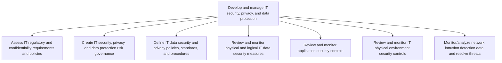
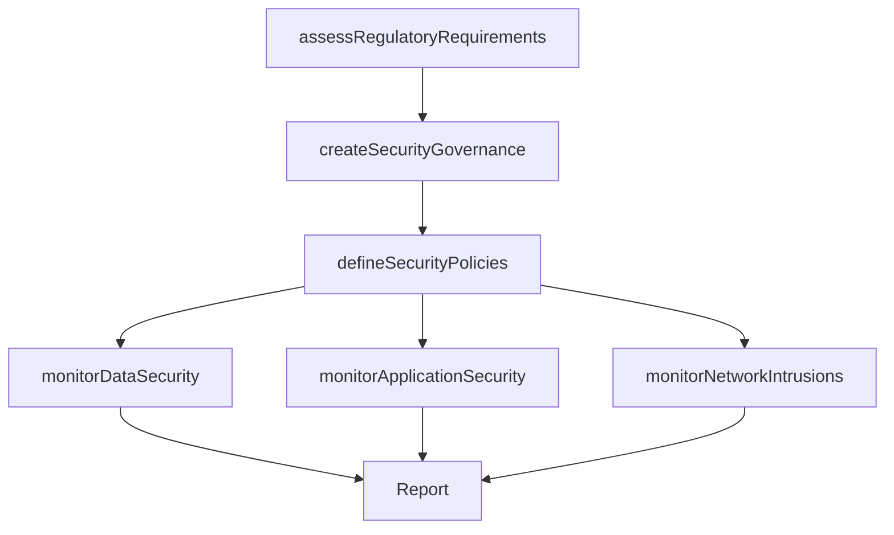

# Develop and manage IT security, privacy, and data protection

> Business-as-Code definition for IT security, privacy, and data protection. Models the process of assessing regulatory requirements, establishing governance, defining policies, and monitoring security controls across physical, logical, and network layers.

## Overview

Creating and deploying an architecture for securing and ensuring the privacy of data flows throughout the organization. Create and develop protocols that ensure proper and efficient use of IT services and solutions

## Process Hierarchy



## GraphDL

```yaml
develop:
  object: And Manage IT Security, Privacy, And Data Protection
  actor: ITSecurityManager
  result: SecurityPrivacyFramework
```

## Actions

| Action | Description |
|--------|-------------|
| assessRegulatoryRequirements | Evaluate IT regulatory and confidentiality requirements |
| createSecurityGovernance | Establish IT security, privacy, and data protection governance |
| defineSecurityPolicies | Draft IT data security and privacy policies and procedures |
| monitorDataSecurity | Review physical and logical IT data security measures |
| monitorApplicationSecurity | Review and assess application security controls |
| monitorNetworkIntrusions | Analyze network intrusion detection data and resolve threats |

## Events

| Event | Description |
|-------|-------------|
| regulatoryRequirementsAssessed | IT regulatory and privacy requirements evaluated |
| securityGovernanceCreated | Security and data protection governance framework established |
| securityPoliciesDefined | IT security and privacy policies published |
| dataSecurityMonitored | Physical and logical data security measures reviewed |
| applicationSecurityMonitored | Application security controls assessed |
| networkIntrusionsMonitored | Network intrusion detection review completed |

## Searches

| Search | Description |
|--------|-------------|
| getSecurityPolicies | Retrieve IT security and privacy policies by domain |
| findSecurityVulnerabilities | List open vulnerabilities by severity or system |
| getIntrusionDetectionAlerts | Get network intrusion alerts by severity or time range |
| getSecurityComplianceStatus | Retrieve security compliance status by framework |

## Process Flow



## RACI Matrix

| Activity | Responsible | Accountable | Consulted | Informed |
|----------|-------------|-------------|-----------|----------|
| assessRegulatoryRequirements | ITComplianceAnalyst | ITSecurityManager | Legal | DataProtectionOfficer |
| createSecurityGovernance | ITSecurityManager | CISO | CIO | Board |
| defineSecurityPolicies | ITSecurityManager | CISO | Legal | AllITStaff |
| monitorDataSecurity | SecurityOperationsAnalyst | ITSecurityManager | ITOperations | CISO |
| monitorNetworkIntrusions | SOCAnalyst | ITSecurityManager | NetworkEngineering | CISO |

## Sub-Processes

| ID | Name | Description |
|----|------|-------------|
| 8.3.5.1 | Assess IT regulatory and confidentiality requirements and policies | Evaluate principles or rules employed in controlling, directing, or managing IT services. Assessing  |
| 8.3.5.2 | Create IT security, privacy, and data protection risk governance | Defining and managing organization's approach to governing IT security and ensuring the privacy of d |
| 8.3.5.3 | Define IT data security and privacy policies, standards, and procedures | Outlining and establishing policies, regulations, standards, and procedures for IT data security and |
| 8.3.5.4 | Review and monitor physical and logical IT data security measures | Identifying, examining, and reviewing physical and logical IT data security measures such as hardwar |
| 8.3.5.5 | Review and monitor application security controls | Identifying, examining, and reviewing security control for IT applications. Test, analyze, and imple |
| 8.3.5.6 | Review and monitor IT physical environment security controls | Identifying and examining security controls for physical environment of information technology such  |
| 8.3.5.7 | Monitor/analyze network intrusion detection data and resolve threats | Monitoring and evaluating network intrusion detection for any malicious activity or policy violation |

## Related Processes

| Process | Relationship |
|---------|-------------|
| 8.3.1 Develop IT compliance, risk, and security strategy | Upstream - security strategy defines protection requirements |
| 8.3.3 Control IT risk, compliance, and security | Parallel - security policies complement compliance controls |
| 8.3.8 Manage IT user identity and authorization | Parallel - identity management supports data protection |

## Related Departments

| Department | Role |
|-----------|------|
| IT Security | Primary owner of security and data protection |
| Data Privacy | Manages data protection and privacy compliance |
| Network Operations | Monitors network security and intrusion detection |
| Legal | Advises on regulatory and privacy law requirements |
| Physical Security | Coordinates physical environment security controls |

## Related Occupations

| Occupation | Involvement |
|-----------|-------------|
| IT Security Manager | Leads security governance and policy development |
| Data Protection Officer | Ensures privacy regulation compliance |
| SOC Analyst | Monitors security events and responds to threats |

## KPIs

| KPI | Description | Unit |
|-----|-------------|------|
| Vulnerability Remediation Rate | Percentage of vulnerabilities remediated within SLA | % |
| Security Policy Compliance | Percentage of systems compliant with security policies | % |
| Mean Time to Detect | Average time to detect security incidents | Hours |
| Data Protection Coverage | Percentage of sensitive data assets with active protection | % |

## Usage

```typescript
import { developAndManageITSecurityPrivacyAndDataProtection } from '@headlessly/develop-and-manage-it-security-privacy-and-data-protection'

const security = developAndManageITSecurityPrivacyAndDataProtection()

// Assess regulatory requirements
const requirements = await security.assessRegulatoryRequirements({
  regulations: ['GDPR', 'CCPA', 'HIPAA'],
  dataClassifications: ['PII', 'PHI', 'financial']
})

// Monitor network intrusions
const alerts = await security.monitorNetworkIntrusions({
  timeRange: 'last-24-hours',
  severityThreshold: 'medium'
})
```
