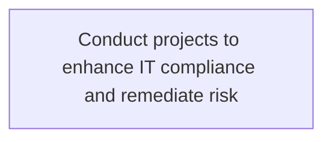
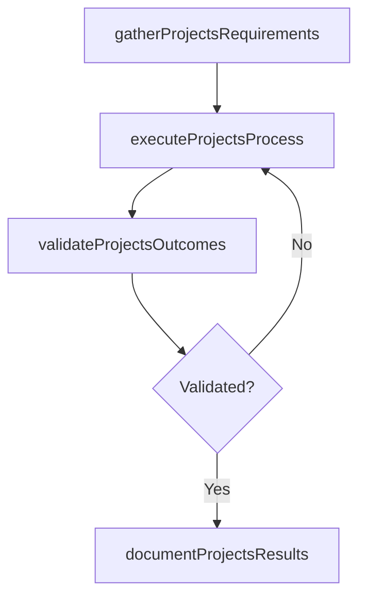

# Conduct projects to enhance IT compliance and remediate risk

> Business-as-Code definition for conduct projects to enhance it compliance and remediate risk. Models the process of conducting projects in order to enhance set standards, established guidelines, and risk preventive measures for it risk .

## Overview

Conducting projects in order to enhance set standards, established guidelines, and risk preventive measures for IT risk and resilience.

## Process Hierarchy



## GraphDL

```yaml
conduct:
  object: Projects To Enhance IT Compliance And Remediate Risk
  actor: ITSecurityManager
  result: ConductProjectsToEnhanceItComplianceAndRemediateRisk
```

## Actions

| Action | Description |
|--------|-------------|
| gatherProjectsRequirements | Collect requirements and inputs for conduct projects to enhance it compliance and remediate risk |
| executeProjectsProcess | Perform the core activities of conduct projects to enhance it compliance and remediate risk |
| validateProjectsOutcomes | Verify that outcomes meet defined criteria and standards |
| documentProjectsResults | Record findings and results for stakeholder review |

## Events

| Event | Description |
|-------|-------------|
| projectsRequirementsGathered | Requirements for conduct projects to enhance it compliance and remediate risk collected |
| projectsProcessExecuted | Core activities of conduct projects to enhance it compliance and remediate risk completed |
| projectsOutcomesValidated | Outcomes verified against defined criteria |
| projectsResultsDocumented | Results recorded and distributed to stakeholders |

## Searches

| Search | Description |
|--------|-------------|
| getProjectsStatus | Retrieve current status of conduct projects to enhance it compliance and remediate risk |
| findProjectsRecords | List records related to conduct projects to enhance it compliance and remediate risk by date or status |
| getProjectsReport | Retrieve summary report for conduct projects to enhance it compliance and remediate risk |

## Process Flow



## RACI Matrix

| Activity | Responsible | Accountable | Consulted | Informed |
|----------|-------------|-------------|-----------|----------|
| gatherProjectsRequirements | ITSecurityManager | IdentityAccessManager | BusinessUnitLeaders | CIO |
| executeProjectsProcess | ITSecurityManager | IdentityAccessManager | ITOperations | ITServiceManager |
| validateProjectsOutcomes | ITSecurityManager | IdentityAccessManager | QualityAssurance | ITServiceManager |

## Related Processes

| Process | Relationship |
|---------|-------------|
| 8.3.6 Parent process | Parent - provides context and governance |
| 8.3.6.2 Sibling activity | Parallel - complementary activity in the same process |

## Related Departments

| Department | Role |
|-----------|------|
| IT Risk and Compliance | Manages risk assessment and compliance |
| IT Security | Implements security controls and monitoring |
| Legal | Advises on regulatory requirements |

## Related Occupations

| Occupation | Involvement |
|-----------|-------------|
| IT Risk Analyst | Assesses and monitors IT risks |
| IT Compliance Analyst | Evaluates regulatory compliance |

## KPIs

| KPI | Description | Unit |
|-----|-------------|------|
| Completion Rate | Percentage of conduct projects to enhance it compliance and remediate risk activities completed on schedule | % |
| Quality Score | Quality assessment score for conduct projects to enhance it compliance and remediate risk outputs | Score (1-10) |
| Cycle Time | Average time to complete conduct projects to enhance it compliance and remediate risk | Days |

## Usage

```typescript
import { conductProjectsToEnhanceItComplianceAndRemediateRisk } from '@headlessly/conduct-projects-to-enhance-it-compliance-and-remediate-risk'

const process = conductProjectsToEnhanceItComplianceAndRemediateRisk()

// Execute the core process
const result = await process.executeProjectsProcess({
  scope: 'department',
  priority: 'high'
})

// Validate outcomes
const validation = await process.validateProjectsOutcomes({
  criteria: 'standard',
  period: 'Q4-2025'
})
```
