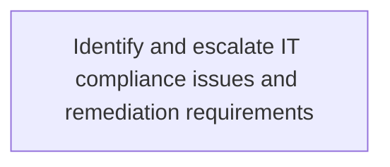
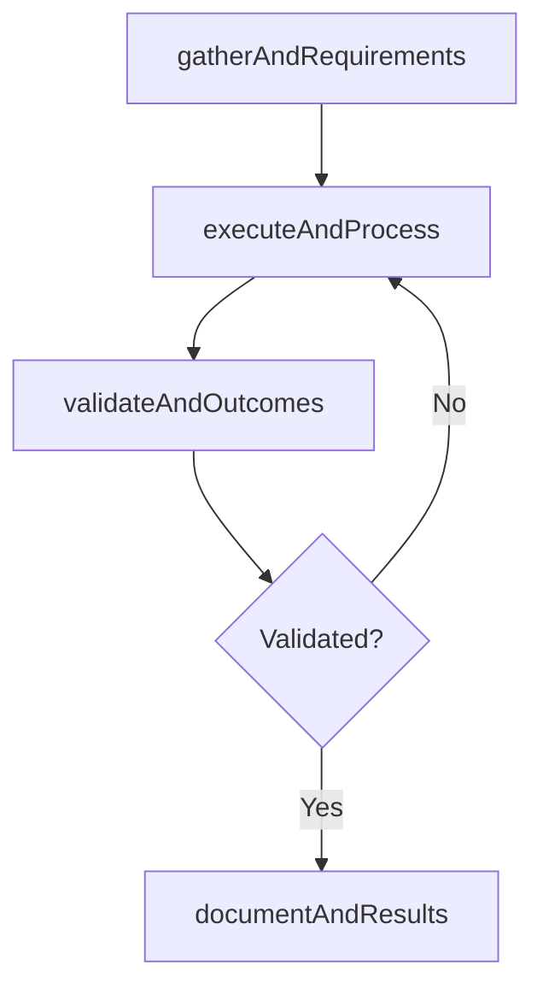

# Identify and escalate IT compliance issues and remediation requirements

> Business-as-Code definition for identify and escalate it compliance issues and remediation requirements. Models the process of identify and escalate issues related to it compliance to ensure that corrective measures are taken.

## Overview

Identify and escalate issues related to IT compliance to ensure that corrective measures are taken.

## Process Hierarchy



## GraphDL

```yaml
identify:
  object: And Escalate IT Compliance Issues And Remediation Requirements
  actor: ITComplianceAnalyst
  result: IdentifyAndEscalateItComplianceIssuesAndRemediationRequirements
```

## Actions

| Action | Description |
|--------|-------------|
| gatherAndRequirements | Collect requirements and inputs for identify and escalate it compliance issues and remediation requirements |
| executeAndProcess | Perform the core activities of identify and escalate it compliance issues and remediation requirements |
| validateAndOutcomes | Verify that outcomes meet defined criteria and standards |
| documentAndResults | Record findings and results for stakeholder review |

## Events

| Event | Description |
|-------|-------------|
| andRequirementsGathered | Requirements for identify and escalate it compliance issues and remediation requirements collected |
| andProcessExecuted | Core activities of identify and escalate it compliance issues and remediation requirements completed |
| andOutcomesValidated | Outcomes verified against defined criteria |
| andResultsDocumented | Results recorded and distributed to stakeholders |

## Searches

| Search | Description |
|--------|-------------|
| getAndStatus | Retrieve current status of identify and escalate it compliance issues and remediation requirements |
| findAndRecords | List records related to identify and escalate it compliance issues and remediation requirements by date or status |
| getAndReport | Retrieve summary report for identify and escalate it compliance issues and remediation requirements |

## Process Flow



## RACI Matrix

| Activity | Responsible | Accountable | Consulted | Informed |
|----------|-------------|-------------|-----------|----------|
| gatherAndRequirements | ITComplianceAnalyst | ITSecurityManager | BusinessUnitLeaders | CIO |
| executeAndProcess | ITComplianceAnalyst | ITSecurityManager | ITOperations | ITServiceManager |
| validateAndOutcomes | ITComplianceAnalyst | ITSecurityManager | QualityAssurance | ITServiceManager |

## Related Processes

| Process | Relationship |
|---------|-------------|
| 8.3.6 Parent process | Parent - provides context and governance |
| 8.3.6.5 Sibling activity | Parallel - complementary activity in the same process |

## Related Departments

| Department | Role |
|-----------|------|
| IT Risk and Compliance | Manages risk assessment and compliance |
| IT Security | Implements security controls and monitoring |
| Legal | Advises on regulatory requirements |

## Related Occupations

| Occupation | Involvement |
|-----------|-------------|
| IT Risk Analyst | Assesses and monitors IT risks |
| IT Compliance Analyst | Evaluates regulatory compliance |

## KPIs

| KPI | Description | Unit |
|-----|-------------|------|
| Completion Rate | Percentage of identify and escalate it compliance issues and remediation requirements activities completed on schedule | % |
| Quality Score | Quality assessment score for identify and escalate it compliance issues and remediation requirements outputs | Score (1-10) |
| Cycle Time | Average time to complete identify and escalate it compliance issues and remediation requirements | Days |

## Usage

```typescript
import { identifyAndEscalateItComplianceIssuesAndRemediationRequirements } from '@headlessly/identify-and-escalate-it-compliance-issues-and-remediation-requirements'

const process = identifyAndEscalateItComplianceIssuesAndRemediationRequirements()

// Execute the core process
const result = await process.executeAndProcess({
  scope: 'department',
  priority: 'high'
})

// Validate outcomes
const validation = await process.validateAndOutcomes({
  criteria: 'standard',
  period: 'Q4-2025'
})
```
