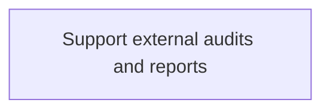
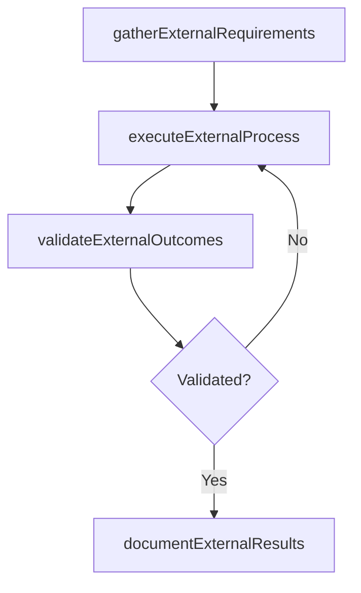

# Support external audits and reports

> Business-as-Code definition for support external audits and reports. Models the process of supporting audits and reports through external resources. this process requires the organization to follow all the regul.

## Overview

Supporting audits and reports through external resources. This process requires the organization to follow all the regulations set forth by external auditors.

## Process Hierarchy



## GraphDL

```yaml
support:
  object: External Audits And Reports
  actor: ITRiskAnalyst
  result: SupportExternalAuditsAndReports
```

## Actions

| Action | Description |
|--------|-------------|
| gatherExternalRequirements | Collect requirements and inputs for support external audits and reports |
| executeExternalProcess | Perform the core activities of support external audits and reports |
| validateExternalOutcomes | Verify that outcomes meet defined criteria and standards |
| documentExternalResults | Record findings and results for stakeholder review |

## Events

| Event | Description |
|-------|-------------|
| externalRequirementsGathered | Requirements for support external audits and reports collected |
| externalProcessExecuted | Core activities of support external audits and reports completed |
| externalOutcomesValidated | Outcomes verified against defined criteria |
| externalResultsDocumented | Results recorded and distributed to stakeholders |

## Searches

| Search | Description |
|--------|-------------|
| getExternalStatus | Retrieve current status of support external audits and reports |
| findExternalRecords | List records related to support external audits and reports by date or status |
| getExternalReport | Retrieve summary report for support external audits and reports |

## Process Flow



## RACI Matrix

| Activity | Responsible | Accountable | Consulted | Informed |
|----------|-------------|-------------|-----------|----------|
| gatherExternalRequirements | ITRiskAnalyst | ITComplianceAnalyst | BusinessUnitLeaders | CIO |
| executeExternalProcess | ITRiskAnalyst | ITComplianceAnalyst | ITOperations | ITServiceManager |
| validateExternalOutcomes | ITRiskAnalyst | ITComplianceAnalyst | QualityAssurance | ITServiceManager |

## Related Processes

| Process | Relationship |
|---------|-------------|
| 8.3.6 Parent process | Parent - provides context and governance |
| 8.3.6.6 Sibling activity | Parallel - complementary activity in the same process |

## Related Departments

| Department | Role |
|-----------|------|
| IT Risk and Compliance | Manages risk assessment and compliance |
| IT Security | Implements security controls and monitoring |
| Legal | Advises on regulatory requirements |

## Related Occupations

| Occupation | Involvement |
|-----------|-------------|
| IT Risk Analyst | Assesses and monitors IT risks |
| IT Compliance Analyst | Evaluates regulatory compliance |

## KPIs

| KPI | Description | Unit |
|-----|-------------|------|
| Completion Rate | Percentage of support external audits and reports activities completed on schedule | % |
| Quality Score | Quality assessment score for support external audits and reports outputs | Score (1-10) |
| Cycle Time | Average time to complete support external audits and reports | Days |

## Usage

```typescript
import { supportExternalAuditsAndReports } from '@headlessly/support-external-audits-and-reports'

const process = supportExternalAuditsAndReports()

// Execute the core process
const result = await process.executeExternalProcess({
  scope: 'department',
  priority: 'high'
})

// Validate outcomes
const validation = await process.validateExternalOutcomes({
  criteria: 'standard',
  period: 'Q4-2025'
})
```
